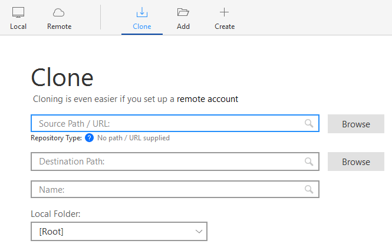
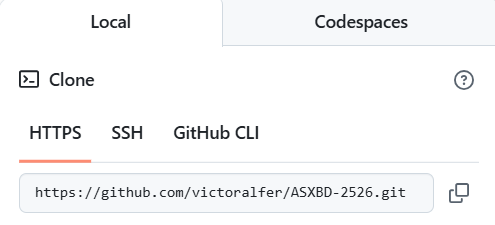
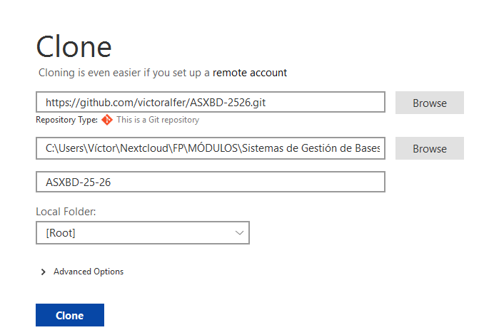
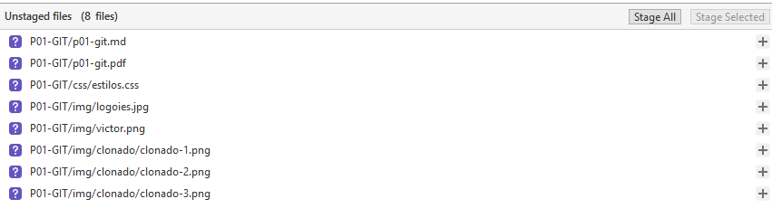
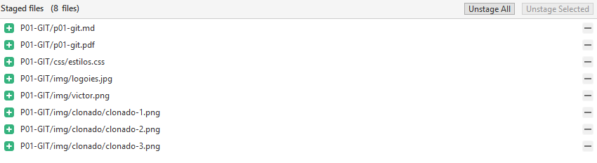
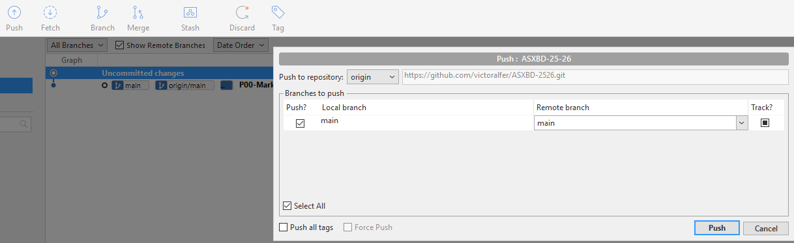
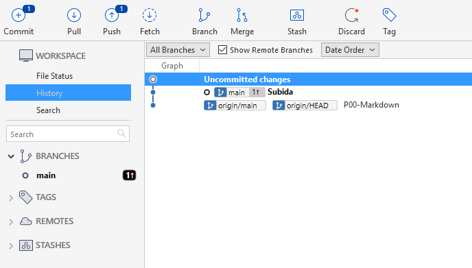

<!---------------- PÁGINA 1 ---------------->

<!-- Título Principal (** Texto en Negrita **) -->
  <!-- Los Títulos Principales incorporan 
  una línea debajo que ocupa todo el ancho -->
# **2º ASIR - ASXBD**

<!-- Imagen del IES Lois Peña Novo -->

  

<!-- Subtítulo -->
## VÍCTOR ÁLVAREZ FERNÁNDEZ

<!-- Subapartados -->

  <h3 class="titulos-subapartados">Unidad:</h3>
    <h3 class="texto-subapartados">Unidad 0 - Git & Markdown</h3>
  <h3 class="titulos-subapartados">Práctica:</h3>
    <h3 class="texto-subapartados">P01-GIT</h3>
  <h3 class="titulos-subapartados">Fecha:</h3>
    <h3 class="texto-subapartados">31 de Diciembre de 2025</h3>

<footer>
  <h6>Víctor Álvarez Fernández - ASXBD - 2º ASIR</h6>
</footer>

<!-- Salto de Página -->

<!---------------- PÁGINA 2 ---------------->

<!-- Imagen del IES Lois Peña Novo -->

  

<!-- Contiene anclajes a los diferentes ejercicios (están en siguientes páginas) -->
# **Índice**
- [Proceso de Clonado](#clonado)
- [Proceso de Descarga](#descarga-de-archivos)
- [Proceso de Subida](#subida-de-archivos)

<!-- Salto de Página -->

<!---------------- PÁGINA 3 ---------------->

<!-- Imagen del IES Lois Peña Novo -->

  

# **Clonado**

<ol>
  <li>Accedemos al programa Sourcetree. En la barra de tareas hacemos click en: File > Clone/New.</li>
  <li>Desde un navegador web accedemos a nuestra cuenta de GitHub y copiamos el código de enlace HTTPS.</li>
  <li>Volvemos Sourcetree:
    <ol>
      <li>Pegamos el código en el campo Source Path / URL</li>
      <li>Seleccionamos la ruta de destino en nuestro PC</li>
      <li>Nombramos nuestro repositorio</li>
      <li>Pulsamos en Clone</li>
    </ol>
  </li>
</ol>

  

<!-- Salto de Página -->

<!---------------- PÁGINA 4 ---------------->

<h1>Clonado</h1>

<!-- Imagen del IES Lois Peña Novo -->

  

  

  

<!-- Salto de Página -->

<!---------------- PÁGINA 5 ---------------->

<!-- Imagen del IES Lois Peña Novo -->

  

# **Descarga de Archivos**

<!-- Salto de Página -->

<!---------------- PÁGINA 6 ---------------->

<!-- Imagen del IES Lois Peña Novo -->

  

# **Subida de Archivos**

<ol>
  <li>Accedemos al programa Sourcetree. En la sección Unstaged files encontraremos los nuevos ficheros o aquellos que han sufrido modificaciones desde nuestra última sincronización.
    <ol>
      <li>Subida Parcial: Seleccionamos los ficheros que deseamos subir y pulsamos en Stage Selected.</li>
      <li>Subida Total: Pulsamos directamente a Stage All.</li>
    </ol>
  </li>
  <li>Los ficheros que hemos seleccionado se posicionarán en la sección Staged files.</li>
  <li>En la parte inferior del programa, podemos ver un campo donde tenemos que escribir un comentario/observación sobre la subida de ficheros que deseamos realizar. Pulsamos en el botón 'Commit'.</li>
  <li>En la parte superior del programa, encontramos una serie de iconos con las acciones que podemos ejecutar (Commit, Pull, Push, Fetch...). Pulsamos en el icono 'Push'.</li>
  <li>Se abrirá una ventana emergente. Pulsamos en el botón 'Push'.</li>
  <li>Comprobamos en nuestra cuenta de GitHub si se han cargado bien los ficheros y generado los directorios oportunos.</li>
</ol>

  

<!-- Salto de Página -->

<!---------------- PÁGINA 7 ---------------->

<!-- Imagen del IES Lois Peña Novo -->

  

<h1>Subida de Archivos</h1>

  

  

<!-- Salto de Página -->

<!---------------- PÁGINA 8 ---------------->

<!-- Imagen del IES Lois Peña Novo -->

  

<h1>Subida de Archivos</h1>

  

  

<!-- Salto de Página -->

<!---------------- PÁGINA 9 ---------------->

<!-- Imagen del IES Lois Peña Novo -->

  

<h1>Subida de Archivos</h1>

  

