<!---------------- PÁGINA 1 ---------------->

<!-- Título Principal (** Texto en Negrita **) -->
  <!-- Los Títulos Principales incorporan 
  una línea debajo que ocupa todo el ancho -->
# **2º ASIR - ASXBD**

<!-- Imagen del IES Lois Peña Novo -->

  

<!-- Subtítulo -->
## VÍCTOR ÁLVAREZ FERNÁNDEZ

<!-- Subapartados -->

  <h3 class="titulos-subapartados">Unidad:</h3>
    <h3 class="texto-subapartados">Unidad 0 - Git & Markdown</h3>
  <h3 class="titulos-subapartados">Práctica:</h3>
    <h3 class="texto-subapartados">P02-Conflictos</h3>
  <h3 class="titulos-subapartados">Fecha:</h3>
    <h3 class="texto-subapartados">1 de Enero de 2026</h3>

<footer>
  <h6>Víctor Álvarez Fernández - ASXBD - 2º ASIR</h6>
</footer>

<!-- Salto de Página -->

<!---------------- PÁGINA 2 ---------------->

<!-- Imagen del IES Lois Peña Novo -->

  

<!-- Contiene anclajes a los diferentes ejercicios (están en siguientes páginas) -->
# **Índice**
- [Instalación Tortoise-SVN](#instalación-tortoise-svn)
  - [Configuración Tortoise-SVN](#configuración-tortoise-svn)
  - [Subida de Archivos en el Servidor](#subida-de-archivos-en-el-servidor)
  - [Descarga de Archivos en el Cliente](#descarga-de-archivos-en-el-cliente)
- [Conflicto en GIT](#conflicto-en-git)
- [Herramienta de Resolución](#herramienta-de-resolución)
- [Análisis Proceso de Resolución](#análisis-proceso-de-resolución)
  - [Paso 1: Detección del Conflicto](#paso-1-detección-del-conflicto)
  - [Paso 2: Ejecución de la Herramienta de Resolución](#paso-2-ejecución-de-la-herramienta-de-resolución)
  - [Paso 3: Opciones de Resolución](#paso-3-opciones-de-resolución)
  - [Paso 4: Finalización y Marcado como Resuelto](#paso-4-finalización-y-marcado-como-resuelto)
  - [Paso 5: Commit final](#paso-5-commit-final)
  - [Paso 6: Descargar última versión respositorio](#paso-6-descargar-última-versión-en-el-resto-de-equipos)

<!-- Salto de Página -->

<!---------------- PÁGINA 3 ---------------->

<!-- Imagen del IES Lois Peña Novo -->

  

# **Instalación Tortoise-SVN**

Lo primero que vamos a realizar es la Instalación de Tortoise-SVN tanto en el equipo anfitrión con en la máquina virtual. La máquina virtual tiene su tarjeta de red configurada en modo Adaptador Puente, lo que le permite conectarse con su propia dirección IP a la misma LAN que el ordenador anfitrión.

#### **Configuración Tortoise-SVN** 

<ol>
  <li>Equipo Anfitrión: 
    <ol>
      <li>Creamos la carpeta ASXBD-2526-G1, la cual acogerá los ficheros de configuración.</li> 
      <li>Dentro de la carpeta creamos un nuevo repositorio: TortoiseSVN > Create respository here.</li>
    </ol>
  </li>
  <li>Equipo Anfitrión: nos aparecerá una ventana emergente con la URL física donde se ha creado el repositorio. Pulsamos en OK.</li>
  <li>Equipo Anfitrión: compartimos la carpeta ASXBD-2526-G1 en nuestra red para los usuarios deseados. En este caso para Todos, con el Nivel de Permisos: Lectura y Escritura.</li>
  <li>Máquina Virtual: creamos una carpeta que vamos a denominar con el mismo nombre: ASXDB-2526-G1.
    <ol>
      <li>Menú Contextual - TortoiseSVN > Checkout...</li>
      <li>Añadimos la URL del respositorio (recurso compartido en la LAN), incluyendo delante de la URL el protocolo 'file': file:\\VIC-WIN11\Users\Víctor\Nextcloud\FP\MÓDULOS\Sistemas de Gestión de Bases de Datos\ASXBD-2526-G1</li>
      <li>Pulsamos en el botón OK.</li>
    </ol>
  </li>
  <li>Máquina Virtual: nos emergerá una ventana indicando que el Checkout se ha realizado correctamente. Pulsamos en el botón OK.</li>
</ol>

<!-- Salto de Página -->

<!---------------- PÁGINA 4 ---------------->

<!-- Imagen del IES Lois Peña Novo -->

  

<h1>Instalación Tortoise-SVN</h1>

#### **Subida de Archivos en el Servidor** 

<ol start="6">
  <li>Equipo Anfitrión: 
    <ol>
      <li>Creamos una carpeta para alojar los trabajos realizados: 'Mi_Trabajo'.</li>
      <li>Menú contextual - TortoiseSVN > Checkout. Pulsamos en el botón OK.</li>
    </ol>
  </li>
  <li>Equipo Anfitrión: 
    <ol>
      <li>Añadimos la carpeta 'Plantilla' que hemos descargado del Aula Virtual.</li>
      <li>Menú contextual - TortoiseSVN > Add...</li>
    </ol>
  </li>
  <li>Equipo Anfitrión: en la ventana emergente, seleccionamos los ficheros/directorios que deseamos añadir al repositorio. Pulsamos en el botón OK.</li>
  <li>Equipo Anfitrión: nos aparecerá otra ventana emergente que nos indicará que el proceso se ha completado correctamente.</li>
  <li>Equipo Anfitrión: accedemos a la carpeta con los trabajos realizados 'Mi_Trabajo':
    <ol>
      <li>Menú contextual - TortoiseSVN > Commit...</li>
      <li>En la ventana emergente que aparece, podemos comprobar en la parte inferior los ficheros modificados o creados; y en la parte superior un campo para escribir un mensaje u observación de los ficheros que vamos a cargar en el Servidor.</li>
      <li>Pulsamos en el botón OK.</li>
    </ol>
  </li>
</ol>

<!-- Salto de Página -->

<!---------------- PÁGINA 5 ---------------->

<!-- Imagen del IES Lois Peña Novo -->

  

<h1>Instalación Tortoise-SVN</h1>

#### **Descarga de Archivos en el Cliente** 

<ol start="11">
  <li>Máquina Virtual: creamos una carpeta para alojar los trabajos 'Trabajo-SVN'.
    <ol>
      <li>Descargamos las últimas modifaciones: Menú contextual - TortoiseSVN > Update.</li>
      <li>Pulsamos en el botón OK.</li>
    </ol>
  </li>
  <li>Máquina Virtual: Comprobamos que se ha descargado la carpeta 'Plantilla'.</li>
</ol>

  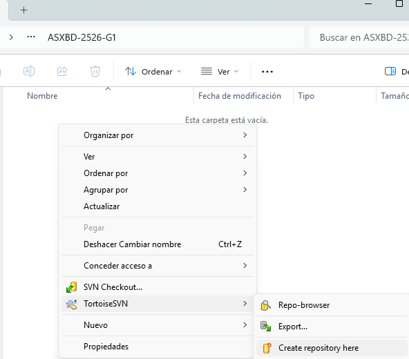
  
I

<!-- Salto de Página -->

<!---------------- PÁGINA 6 ---------------->

<!-- Imagen del IES Lois Peña Novo -->

  

<h1>Instalación Tortoise-SVN</h1>

  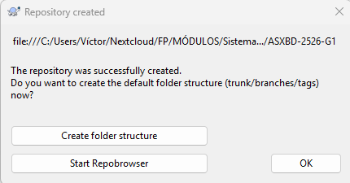
  
II

  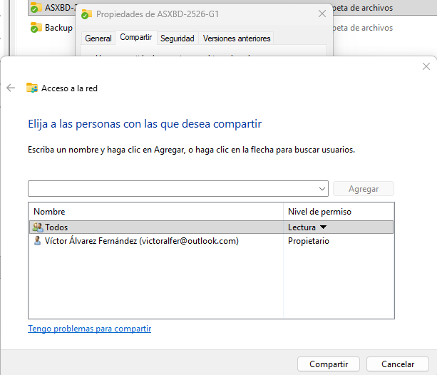
  
III

<!-- Salto de Página -->

<!---------------- PÁGINA 7 ---------------->

<!-- Imagen del IES Lois Peña Novo -->

  

<h1>Instalación Tortoise-SVN</h1>

  
  
IV

  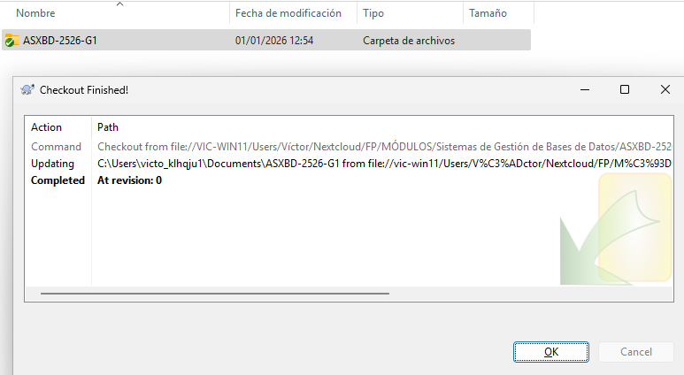
  
V

<!-- Salto de Página -->

<!---------------- PÁGINA 8 ---------------->

<!-- Imagen del IES Lois Peña Novo -->

  

<h1>Instalación Tortoise-SVN</h1>

  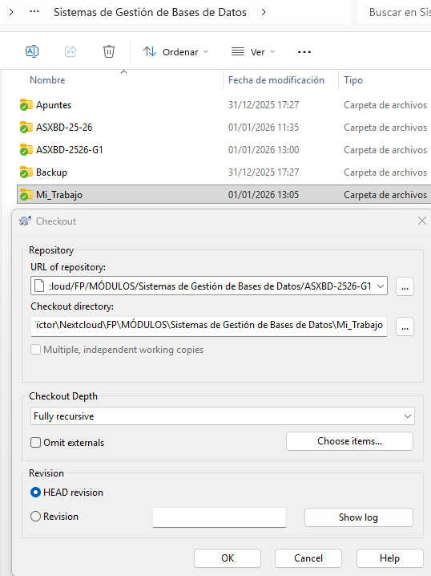
  
VI

<!-- Salto de Página -->

<!---------------- PÁGINA 9 ---------------->

<!-- Imagen del IES Lois Peña Novo -->

  

<h1>Instalación Tortoise-SVN</h1>

  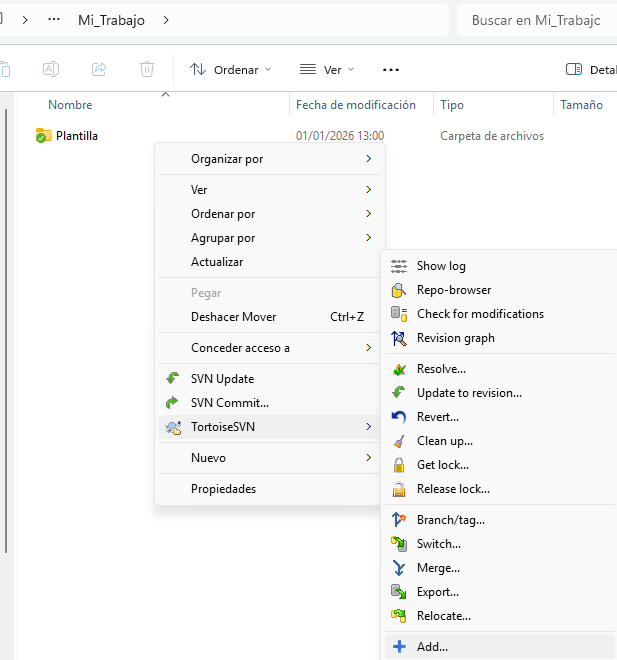
  
VII

<!-- Salto de Página -->

<!---------------- PÁGINA 10 ---------------->

<!-- Imagen del IES Lois Peña Novo -->

  

<h1>Instalación Tortoise-SVN</h1>

  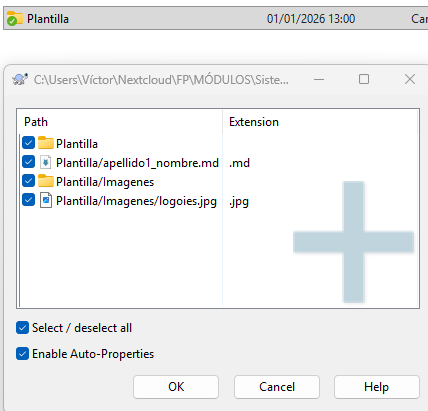
  
VIII

  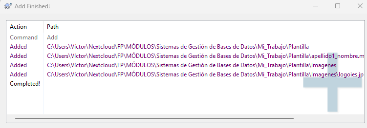
  
IX

<!-- Salto de Página -->

<!---------------- PÁGINA 11 ---------------->

<!-- Imagen del IES Lois Peña Novo -->

  

<h1>Instalación Tortoise-SVN</h1>

  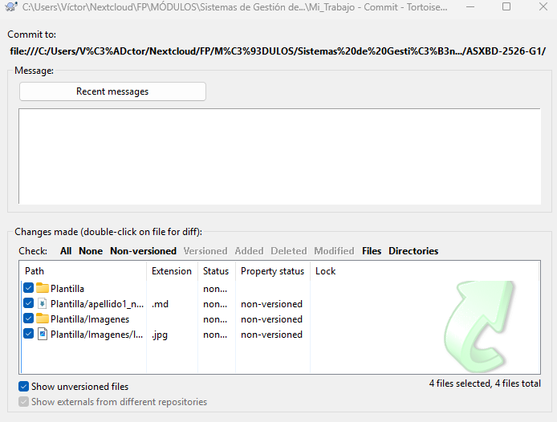
  
X

<!-- Salto de Página -->

<!---------------- PÁGINA 12 ---------------->

<!-- Imagen del IES Lois Peña Novo -->

  

<h1>Instalación Tortoise-SVN</h1>

  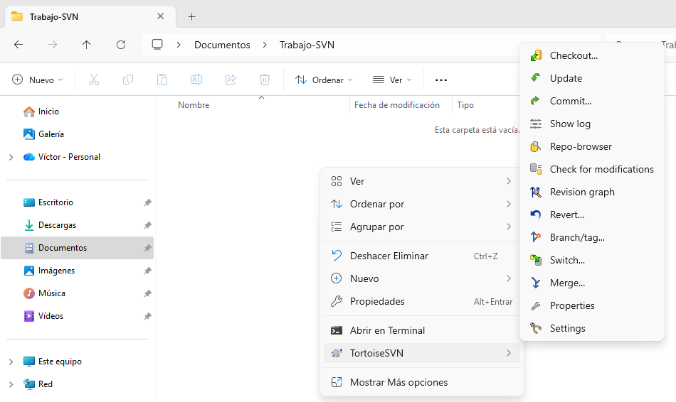
  
XI

  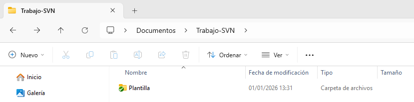
  
XII

<!-- Salto de Página -->

<!---------------- PÁGINA 13 ---------------->

<!-- Imagen del IES Lois Peña Novo -->

  

# **Conflicto en GIT**

Un conflicto es una situación en la que el sistema de control de versiones no puede fusionar automáticamente los cambios realizados en uno o varios archivos.

<h4>¿Cuándo se produce?</h4>

Cuando dos o más usuarios modifican las mismas líneas de un archivo y uno de ellos intenta subir sus cambios (opción 'Commit') sin haber incorporado previamente los realizados por otros usuarios, que además ya están cargados en el Servidor SVN.

<h4>¿Cuándo NO se produce?</h4>

No hay conflicto si los usuarios trabajan en archivos diferentes o si modifican partes distintas de un mismo archivo; en estos casos, el sistema realiza una fusión 'automática'.

<!-- Salto de Página -->

<!---------------- PÁGINA 14 ---------------->

<!-- Imagen del IES Lois Peña Novo -->

  

# **Herramienta de Resolución**

Para gestionar los conflictos de forma visual, TortoiseSVN incluye una herramienta llamada TortoiseMerge, la cual viene activada por defecto.

Menu Contextual - Setting > Diff Viewer > Merge Tool > TortoiseMerge.

  

<!-- Salto de Página -->

<!---------------- PÁGINA 15 ---------------->

<!-- Imagen del IES Lois Peña Novo -->

  

# **Análisis Proceso de Resolución**

#### Paso 1: Detección del conflicto

Cuando intentamos cargar en el Servidor SVN una modificación de nuestros archivos con la opción 'Commit', habiendo en el Servidor SVN una versión más reciente con respecto a lo que tenemos alojado localmente; se desplegará una ventana emergente alertando de un conflicto.

  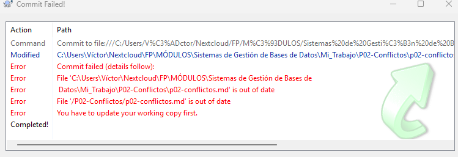

Tras la alerta, podremos continuar con el proceso de carga de los archivos modificados en nuestro equipo o cancelar el proceso de subida.

  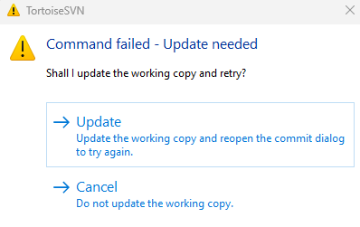

<!-- Salto de Página -->

<!---------------- PÁGINA 16 ---------------->

<!-- Imagen del IES Lois Peña Novo -->

  

# **Análisis Proceso de Resolución**

Si optamos por la opción de cargar los archivos modificados localmente; una nueva ventana emergente nos comunicará que estos se han subido, pero que se ha generado un conflicto.

  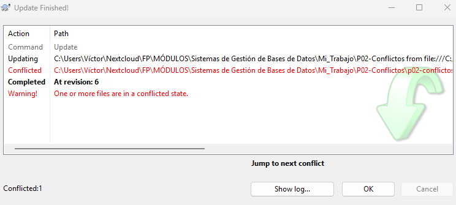

  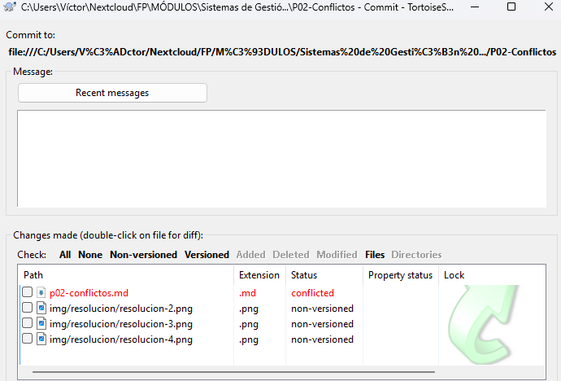

<!-- Salto de Página -->

<!---------------- PÁGINA 17 ---------------->

<!-- Imagen del IES Lois Peña Novo -->

  

# **Análisis Proceso de Resolución**

#### Paso 2: Ejecución de la Herramienta de Resolución

Si accedemos a una de las carpetas donde están cualquiera de los conflictos; veremos que se han generado una serie de archivos que comparten nombre, pero no extensión.

<ol class="ol-sin-padding-sup-inf">
  <li>.md: es la versión del archivo modificada localmente.</li>
  <li>.md.mine: es el archivo antes de realizar los cambios locales.</li>
  <li>.md.r5: es la versión 'base' del archivo. Es decir, la versión que tenía el archivo antes de que se hicieran modificaciones tanto en los equipos de otros usuarios como en el equipo local.</li>
  <li>.md.r6: es la versión que ahora mismo está en el Servidor.</li>
</ol>

Para poder acceder a la Herramienta de Resolución de Conflictos, tenemos que ejecutar desde el menú contextual del archivo con extension .md (versión local) la opción 'Edit conflicts'.

  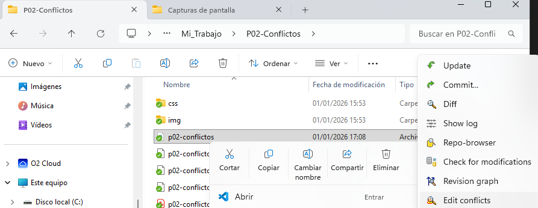

<!-- Salto de Página -->

<!---------------- PÁGINA 18 ---------------->

<!-- Imagen del IES Lois Peña Novo -->

  

# **Análisis Proceso de Resolución**

#### Paso 3: Opciones de Resolución

En la Herramienta de Resolución de Conflictos nos encontramos con una interfaz en la que podemos distinguir de manera clara tres secciones:

<ol class="ol-sin-padding-sup-inf">
  <li>Theirs (izquierda): son los cambios realizados por los otros usuarios en el Servidor.</li>
  <li>Mine (derecha): son los cambios realizados localmente y que se ha intentado subir.</li>
  <li>Merged (abajo): es el resultado final del archivo tras decidir si se opta por una de las otras dos opciones o por una alternativa que se puede editar directamente desde ahí.</li>
</ol>

  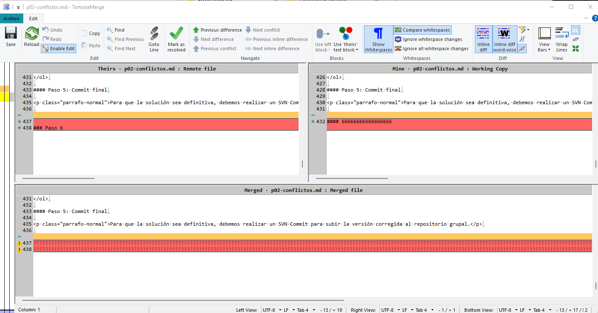

<!-- Salto de Página -->

<!---------------- PÁGINA 19 ---------------->

<!-- Imagen del IES Lois Peña Novo -->

  

# **Análisis Proceso de Resolución**

Dentro de la Herramienta de Resolución de Conflictos podemos hacer clic derecho tanto en los cambios realizados por los otros usuarios (Theirs) como localmente (Mine); y elegir entre estas cuatro opciones:

<ol class="ol-sin-padding-sup-inf">
  <li>Use this text block: Acepta la modificación sobre la que se ha hecho click (Theirs / Mine).</li>
   <li>Use this whole file: Acepta el fichero completo sobre el que se ha hecho click (Theirs / Mine).</li>
  <li>Use text block from 'mine' before 'theirs': Acepta ambos cambios, poniendo la modificación Local antes que la del Servidor.</li>
  <li>Use text block from 'mine' before 'theirs': Acepta ambos cambios, poniendo la modificación del Servidor antes que la Local.</li>
</ol>

  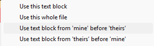

<!-- Salto de Página -->

<!---------------- PÁGINA 20 ---------------->

<!-- Imagen del IES Lois Peña Novo -->

  

# **Análisis Proceso de Resolución**

#### Paso 4: Finalización y Marcado como Resuelto

Una vez que el panel inferior (Merged) de la Herramienta de Resolución de Conflictos tiene el contenido deseado:

<ol class="ol-sin-padding-sup-inf">
  <li>Guardamos (Save) el archivo.</li>
  <li>Hacemos click en el icono 'Mark as Resolved'. Esto le indica a Servidor SVN que ya se ha resuelto el conflicto manualmente.</li>
</ol>

  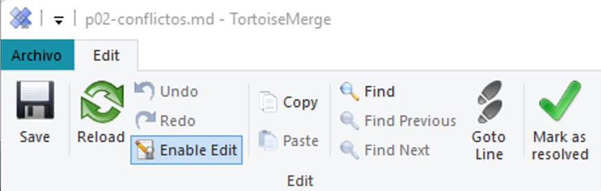

<!-- Salto de Página -->

<!---------------- PÁGINA 21 ---------------->

<!-- Imagen del IES Lois Peña Novo -->

  

# **Análisis Proceso de Resolución**

#### Paso 5: Commit final

Para que la solución sea definitiva, tenemos que cargar desde el equipo local los archivos en el Servidor SVN, utilizando como es habitual la opción 'Commit'.

  

  

<!-- Salto de Página -->

<!---------------- PÁGINA 22 ---------------->

<!-- Imagen del IES Lois Peña Novo -->

  

# **Análisis Proceso de Resolución**

#### Paso 6: Descargar última versión en el resto de equipos

Por supuesto, el resto de usuarios tendrán que actualizar sus copias locales descargando la última versión del repositorio utilizando la opción 'Update'.

  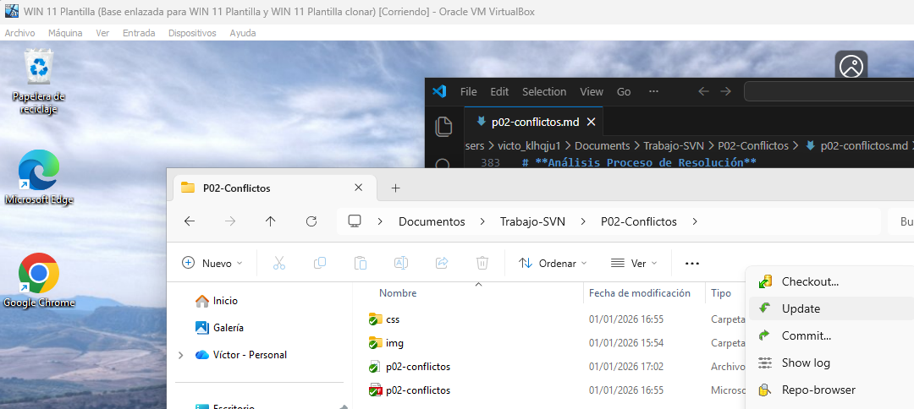

