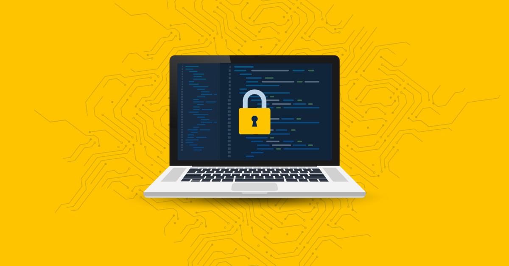
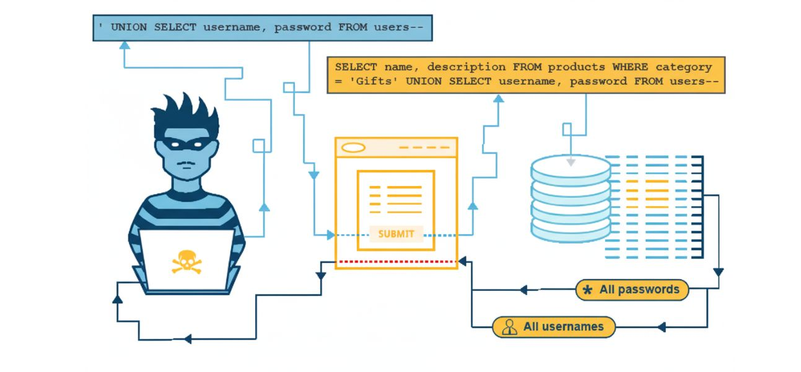
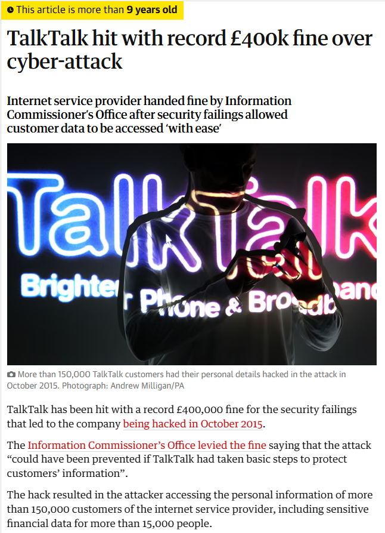

<!---------------- PÁGINA 1 ---------------->

<!-- Título Principal (** Texto en Negrita **) -->
  <!-- Los Títulos Principales incorporan 
  una línea debajo que ocupa todo el ancho -->
# **2º ASIR - ASXBD**

<!-- Imagen del IES Lois Peña Novo -->

  

<!-- Subtítulo -->
## VÍCTOR ÁLVAREZ FERNÁNDEZ

<!-- Subapartados -->

  <h3 class="titulos-subapartados">Unidad:</h3>
    <h3 class="texto-subapartados">Unidad 1 - Introducción a los SGBD</h3>
  <h3 class="titulos-subapartados">Práctica:</h3>
    <h3 class="texto-subapartados">P11-SQL-Injection</h3>
  <h3 class="titulos-subapartados">Fecha:</h3>
    <h3 class="texto-subapartados">3 de Enero de 2026</h3>

<footer>
  <h6>Víctor Álvarez Fernández - ASXBD - 2º ASIR</h6>
</footer>

<!-- Salto de Página -->

<!---------------- PÁGINA 2 ---------------->

<!-- Imagen del IES Lois Peña Novo -->

  

<!-- Contiene anclajes a los diferentes ejercicios (están en siguientes páginas) -->
# **Índice**
- [Introducción](#introduccion)
  - [¿Qué es una SQL Injection?](#sql-injection)
  - [¿Cuáles son sus objetivos?](#objetivos-principales-sql-injection)
- [¿En qué consiste y cómo se lleva a cabo este tipo de ataque?](#ataque)
  - [Ataque en la Autenticación de Usuarios](#autenticacion)
  - [Arquitectura de tres niveles: Ideal para Aplicaciones Web](#tres-niveles)
  - [Otras arquitecturas](#otros-niveles)
- [Caso Real: SQL Injection](#caso-real-sql-injection)
  - [Talk Talk Telecom Group](#talk-talk)
  - [Cronología de los hechos](#cronologia)
  - [Recorte de Prensa: 'The Guardian'](#prensa)
- [Medidas de Protección](#medidas-de-protección)
  - [Texto Plano en la Validación de Usuarios](#texto-plano)
  - [Importancia de la Seguridad Informática](#seguridad)

<!-- Salto de Página -->

<!---------------- PÁGINA 3 ---------------->

<!-- Imagen del IES Lois Peña Novo -->

  

<h1 id="introduccion">Introducción</h1>

  

<h4 id="sql-injection">¿Qué es una SQL Injection?</h4>

Es una vulnerabilidad de seguridad, que permite al atacante interferir en las consultas que una aplicación realiza a una Base de Datos.

#### **Objetivos Principales SQL Injection**

<ol class="ol-sin-padding-sup-inf">
    <li>Suplantación de Identidad</li>
    <li>Acceso a Datos Sensibles</li>
    <li>Alteración de Datos</li>
    <li>Escalada en Privilegios dentro la Aplicación Web</li>
</ol>

<!-- Salto de Página -->

<!---------------- PÁGINA 4 ---------------->

<!-- Imagen del IES Lois Peña Novo -->

  

<h1 id="ataque">¿En qué consiste una SQL Injection?</h1>

<h4 id="autenticacion">Ataque en la autenticación de usuarios</h4>

Este tipo de ataque se produce cuando en un servicio o aplicación vía web existe una validación de acceso para los usuarios mediante 'username/e-mail' y 'password'.

Si la configuración para este tipo de consultas de acceso no se ha realizado de manera correcta, un potencial 'usuario malicioso' podría acceder a la Base de Datos para utilizar, alterar o eliminar su contenido.

Ejemplo de mala configuración de una consulta de este tipo:

SELECT * FROM usuarios WHERE nombre = '" + usuario + "' AND clave = '" + password + "';.

El uso de comillas y concatenaciones abre la posibilidad a un programador de introducir código, que le dé acceso a una Base de Datos para consultarla y/o a realizar cualquier tipo de manipulación en ella.

  

<!-- Salto de Página -->

<!---------------- PÁGINA 5 ---------------->

<!-- Imagen del IES Lois Peña Novo -->

  

<h1>¿En qué consiste una SQL Injection?</h1>

<h4 id="tres-niveles">Arquitectura tres niveles: Ideal para Aplicaciones Web</h4>

Los ataques SQL Injection tienen una mayor probabilidad de producirse en arquitecturas SGBD de tres niveles. Estas arquitecturas utilizan un nivel intermedio entre el Servidor que acoge la Base de Datos y los equipos Cliente que realizan las consultas.

La arquitectura de tres niveles es la más utilizada para la implementación de aplicaciones web y requiere de un Servidor Intermedio (Servidor Web), que acoge la instalación de este tipo de aplicaciones.

Precisamente, el que esté pensada para albergar aplicaciones web, y por consiguiente conectada a Internet, aumenta la probabilidad de aparición de usuarios malintencionados.

<h4 id="otros-niveles">Otras arquitecturas</h4>

Por supuesto, un ataque SQL Injection se puede dar en arquitecturas de dos niveles, donde es bien sabido que no hay un Servidor Intermedio. Esta arquitectura está pensada para 'circuitos de usuarios cerrados' e incluso no expuestos a Internet; aunque esto no implica que puedan intentar acceder usuarios con fines maliciosos a través de esta vulnerabilidad, si es que existiera en el SGBD instalado y configurado en el Servidor.

De igual modo, se puede dar en una arquitectura de un sólo nivel, aunque la probabilidad de un ataque de este tipo es aún más reducida por muchas razones entre las que podemos esgrimir la dificultad de acceso al equipo que tiene instalado el SGBD; o incluso el interés que puede tener el acceso o manipulación a este tipo de datos.

Recordamos que la arquitectura de un solo nivel es utilizada por pequeñas empresas o usuarios domésticos, que aprovechan el mismo equipo para la instalación, configuración, y administración del SGBD, desde donde también acceden los usuarios finales.

<!-- Salto de Página -->

<!---------------- PÁGINA 6 ---------------->

<!-- Imagen del IES Lois Peña Novo -->

  

# **Caso Real SQL Injection**

<h4 id="talk-talk">TalkTalk Telecom Group</h4>

TalkTalk Telecom Group era una de las mayores empresas de telecomunicaciones en el Reino Unido. En octubre de 2015, la compañía sufrió una brecha de seguridad masiva que expuso los datos personales de más de 150.000 clientes.

El ataque no fue para nada sofisticado. Los atacantes utilizaron una técnica de Inyección SQL en las páginas de acceso de los clientes y en Bases de Datos heredadas de una adquisición previa (Tiscali).

<h4 id="cronologia">Cronología de los hechos</h4>

<ol class="ol-sin-padding-sup-inf">
    <li>El fallo: El personal encargado de la programación de los formularios web no tuvo la brillante idea de incluir campos de consulta más profesionales para la validación de usuarios. Esto permitió que un atacante insertara comandos SQL maliciosos en los campos de texto.</li>
    <li>La ejecución: El servidor, al no distinguir entre un dato (como un nombre de usuario) y una instrucción de código, ejecutó los comandos directamente en la base de datos.</li>
    <li>Herramientas: Se cree que los atacantes utilizaron herramientas automatizadas como sqlmap, que escanean y explotan estas vulnerabilidades de forma sistemática.</li>
</ol>

La brecha de seguridad provocó que los atacantes lograran extraer datos personales de miles de clientes, incluyendo nombres, domicilios y fechas de nacimiento; sin embargo, el daño más crítico fue la obtención de detalles bancarios y números de cuenta de más de 15.000 usuarios. Este incidente subrayó el peligro de no cifrar campos sensibles dentro de las tablas del SGBD, permitiendo que la información fuera legible de forma inmediata tras el éxito de la inyección SQL.

La respuesta institucional fue contundente, con una multa de 400.000 libras, debido a que la vulnerabilidad se consideró evitable con prácticas básicas de seguridad. Más allá de la sanción, TalkTalk enfrentó una crisis financiera con costes operativos y de reparación que ascendieron a los 77 millones de libras, sumado a una pérdida de reputación que provocó la fuga de más de 100.000 clientes.

<!-- Salto de Página -->

<!---------------- PÁGINA 7 ---------------->

<!-- Imagen del IES Lois Peña Novo -->

  

# **Caso Real SQL Injection: TalkTalk**

  

<!-- Salto de Página -->

<!---------------- PÁGINA 8 ---------------->

<!-- Imagen del IES Lois Peña Novo -->

  

# **Medidas de Protección**

<h4 id="texto-plano">Texto plano en la validación de usuarios</h4>

El configurar el SGBD para que sólo acepte texto plano en la validación de usuarios, elimina la posibilidad de incursión mediante SQL Injection. Por este motivo, el uso de concatenaciones y comillas (simples o dobles) es una mala práctica y debe evitarse.

En su lugar se recomienda utilizar el símbolo ?, que indica al SGBD que todo lo introducido por los campos de texto implicados se trate como texto plano.

Ejemplo de buena práctica de configuración de una consulta de este tipo:

SELECT * FROM usuarios WHERE nombre = ? AND password = ?;.

Además, el símbolo ? es un comodín de seguridad que habilita al usuario a introducir tantos caracteres, y el tipo de los mismos, como desee.

<h4 id="seguridad">Importancia de la Seguridad Informática</h4>

Es importante establecer otras medidas y prácticas de seguridad que dificulten el acceso malintencionado a través de métodos como el registro de pulsaciones (keylogger), ataques de fuerza bruta y/o diccionario.

Dentro de las buenas prácticas a la hora de realizar los registros, sería ideal configurar criterios para que los nuevos usuarios establezcan contraseñas más seguras que utilicen un número mínimo de caracteres; el uso de mayúsculas, minúsculas y caracteres especiales; e incluso fijar la caducidad de la contraseña para que esta se tenga que renovar cada cierto periodo de tiempo.

Almacenar las claves mediante algoritmos sería también algo muy interesante, sobre todo si la Base de Datos maneja información que se pueda considerar sensible.
