<!---------------- PÁGINA 1 ---------------->

<!-- Título Principal (** Texto en Negrita **) -->
  <!-- Los Títulos Principales incorporan 
  una línea debajo que ocupa todo el ancho -->
# **2º ASIR - ASXBD**

<!-- Imagen del IES Lois Peña Novo -->

  

<!-- Subtítulo -->
## VÍCTOR ÁLVAREZ FERNÁNDEZ

<!-- Subapartados -->

  <h3 class="titulos-subapartados">Unidad:</h3>
    <h3 class="texto-subapartados">Unidad 1 - Introducción a los SGBD</h3>
  <h3 class="titulos-subapartados">Práctica:</h3>
    <h3 class="texto-subapartados">P12-Instalación-MySQL</h3>
  <h3 class="titulos-subapartados">Fecha:</h3>
    <h3 class="texto-subapartados">7 de Enero de 2026</h3>

<footer>
  <h6>Víctor Álvarez Fernández - ASXBD - 2º ASIR</h6>
</footer>

<!-- Salto de Página -->

<!---------------- PÁGINA 2 ---------------->

<!-- Imagen del IES Lois Peña Novo -->

  

<!-- Contiene anclajes a los diferentes ejercicios (están en siguientes páginas) -->
# **Índice**

<ol class="indice">
  <li><a href="#descarga">Instalación en Windows 11: MySQL 8.0.44</a>
    <ol>
      <li><a href="#descarga">Descarga MySQL Installer 8.0.44</a></li>
      <li><a href="#instalacion">Instalación MySQL Installer 8.0.44</a></li>
      <li><a href="#configuracion">Configuración MySQL Server 8.0.44</a></li>
      <li><a href="#aplicar-configuracion">Aplicación de Configuración</a></li>
      <li><a href="#activacion-servicio">Activación Servicio MySQL en Windows</a></li>
      <li><a href="#productos-utilidades">Productos y Utilidades</a>
        <ol>
          <li><a href="#mysql-workbench">MySQL Workbench</a></li>
          <li><a href="#mysql-shell">MySQL Shell</a></li>
          <li><a href="#mysql-client">MySQL Command Line Client</a></li>
        </ol>
      </li>
      <li><a href="#mysql-directorios">Directorios de Instalación / Configuración</a>
        <ol>
          <li><a href="#directorio-bin">bin</a></li>
          <li><a href="#directorio-include">include</a></li>
          <li><a href="#directorio-lib">lib</a></li>
          <li><a href="#directorio-share">share</a></li>
          <li><a href="#directorio-data">Data</a></li>
        </ol>
      </li>
      <li><a href="#otras-instalaciones">Otras Instalaciones y Configuraciones</a>
        <ol>
          <li><a href="#visual-c++">Visual C++ v14 Redistributable</a></li>
          <li><a href="#variable-entorno-path">Configurar Variable de Entorno PATH</a></li>
        </ol>
      </li>
    </ol>
  </li>
  <li><a href="#descarga-5">Instalación en Windows 10: MySQL 5.7.44</a>
    <ol>
       <li><a href="#descarga-5">Descarga MySQL Installer 5.7.44</a></li>
       <li><a href="#instalacion-5">Instalación MySQL Installer 5.7.44</a></li>
       <li><a href="#configuracion-5">Configuración MySQL Server 5.7</a></li>
       <li><a href="#aplicar-configuracion-5">Aplicación Configuración</a></li>
       <li><a href="#reconfiguracion-5">Reconfiguración MySQL 5.7.44</a></li>
       <li><a href="#mysql-directorios-5">Directorios de Instalación / Configuración</a></li>
       <li><a href="#variable-entorno-path-5">Configuración Variable de Entorno PATH</a></li>
    </ol>
  </li>
</ol>

<!-- Salto de Página -->

<!---------------- PÁGINA 3 ---------------->

<!-- Imagen del IES Lois Peña Novo -->

  

<!-- Contiene anclajes a los diferentes ejercicios (están en siguientes páginas) -->
# **Índice**

<ol class="indice" start="3">
  <li><a href="#instalacion-ubuntu">Instalación MySQL en Ubuntu 20.04 LTS</a>
    <ol>
      <li><a href="#instalacion-ubuntu">Instalación MySQL Server</a></li>
      <li><a href="#anadir-usuarios">Añadir y Modificar Usuarios</a></li>
      <li><a href="#configuracion-remoto">Configuracion Acceso Remoto</a></li>
      <li><a href="#acceso-remoto">Acceso desde equipo Remoto</a></li>
      <li><a href="#workbench">Instalación MySQL Workbench</a></li>
      <li><a href="#directorios-ubuntu">Directorios MySQL en Ubuntu</a></li>
    </ol>
  </li>
  <li><a href="#descarga-xampp">MySQL con gestor phpMyAdmin en Windows</a>
    <ol>
      <li><a href="#descarga-xampp">Descarga XAMPP</a></li>
      <li><a href="#instalacion-xampp">Instalación XAMPP</a></li>
      <li><a href="#configuracion-puerto-xampp">Configuración Puerto XAMPP</a></li>
      <li><a href="#inicio-xampp">XAMPP: Inicio Apache y MySQL</a></li>
      <li><a href="#acceso-phpmyadmin">Acceso phpMyAdmin</a></li>
    </ol>
  </li>
  <li><a href="#instalacion-apache">MySQL con gestor phpMyAdmin en Linux</a>
    <ol>
      <li><a href="#instalacion-apache">Instalación Apache</a></li>
      <li><a href="#instalacion-mysql-server">Instalación MySQL Server</a></li>
      <li><a href="#instalacion-workbench">Instalación MySQL Workbench</a></li>
      <li><a href="#instalacion-phpmyadmin">Instalación phpMyAdmin</a></li>
      <li><a href="#acceso-phpmyadmin-linux">Acceso phpMyAdmin</a></li>
    </ol>
  </li>
  <li><a href="#segunda-instancia-windows">Instalación 2ª Instancia en Windows</a></li>
  <li><a href="#segunda-instancia-linux">Instalación 2ª Instancia en Linux</a></li>
</ol>

<!-- Salto de Página -->

<!---------------- PÁGINA 4 ---------------->

<!-- Imagen del IES Lois Peña Novo -->

  

<h1 id="descarga">Descarga MySQL Installer 8.0.44</h1>

Lo primero que tenemos que hacer antes de comenzar el proceso de instalación de MySQL en Windows, es descargar el paquete de archivos binarios deseado desde: <a href="https://dev.mysql.com/downloads/installer" target="_blank" class="blue">https://dev.mysql.com/downloads/installer</a>.

En este caso nos decantamos por la versión 8.0.44, que nos ofrecerá dos posibilidades:

<ol class="ol-sin-padding-sup-inf">
  <li>Web Community: instalación vía web. Descarga sólo los complementos que deseamos instalar posteriormente. Obviamente requiere conexión a Internet para poder continuar con el proceso de instalación.</li>
  <li>Community: instalación offline. Descarga todos los complementos que se ofertan. No requiere conexión a Internet para continuar con el proceso de instalación.</li>
</ol>

  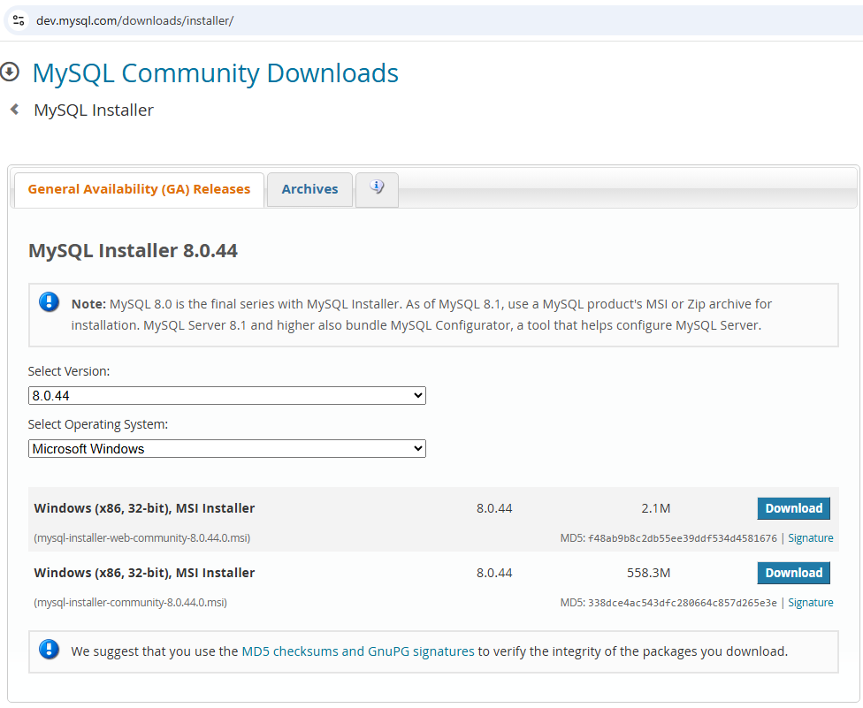

<!-- Salto de Página -->

<!---------------- PÁGINA 5 ---------------->

<!-- Imagen del IES Lois Peña Novo -->

  

<h1 id="instalacion">Instalación MySQL Installer 8.0.44</h1>

En esta práctica nos hemos decantado por instalación offline, que aunque requiere una descarga más pesada (558.3M), nos permitirá instalar MySQL en cualquier equipo sin depender de una conexión Internet.

El proceso se inicia con la selección del tipo de instalación que deseamos:

<ol class="ol-sin-padding-sup-inf">
  <li>Server Only: instalacion sólo de MySQL Server</li>
  <li>Client Only: instalacion sólo de las utilidades que se ofertan para los Clientes</li>
  <li>Full: instalacion completa</li>
  <li>Custom: instalacion personalizada</li>
</ol>

  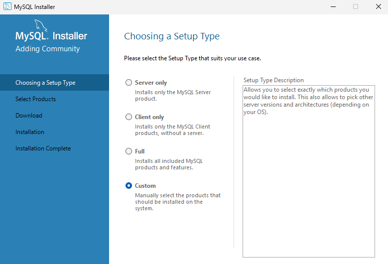
  
I

En nuestro caso, apostaremos por la Instalación personalizada (Custom).

<!-- Salto de Página -->

<!---------------- PÁGINA 6 ---------------->

<!-- Imagen del IES Lois Peña Novo -->

  

<h1>Instalación MySQL Installer 8.0.44</h1>

Continuamos con la selección de los productos que deseamos instalar, que serán los siguientes:

<ol class="ol-sin-padding-sup-inf">
  <li>MySQL Server 8.0.44: Servidor MySQL, que una vez configurado trabaja en segundo plano.</li>
  <li>MySQL Workbench 8.0.44: Cliente MySQL con interfaz gráfica que nos permite establecer conexiones con diferentes Bases de Datos (Locales o Remotas). Su panel de control nos permite gestionar usuarios (crear usuarios, gestionar roles, controlar accesos o limitar recursos). A través del Lenguaje SQL podemos crear Bases de Datos y Tablas, además de cargar datos.</li>
  <li>MySQL Shell 8.0.44: Cliente MySQL a través de línea de comandos, que nos ofrece la posibilidad de alternar entre lenguajes SQL, JavaScript y Python. Se utiliza en gestión de clústers y configuraciones más avanzadas.</li>
</ol>

  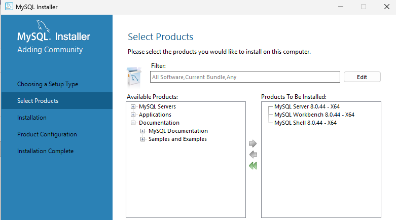
  
I

<!-- Salto de Página -->

<!---------------- PÁGINA 7 ---------------->

<!-- Imagen del IES Lois Peña Novo -->

  

<h1>Instalación MySQL Installer 8.0.44</h1>

  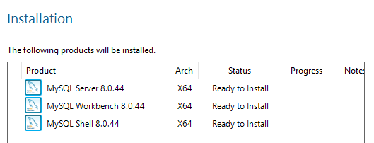
  
II

  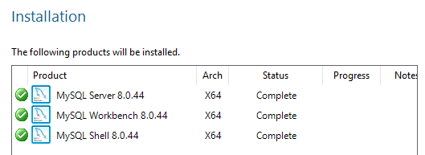
  
III

<!-- Salto de Página -->

<!---------------- PÁGINA 8 ---------------->

<!-- Imagen del IES Lois Peña Novo -->

  

<h1 id="configuracion">Configuración MySQL Installer 8.0.44</h1>

Una vez finalizado el proceso de instalación, es necesario configurar MySQL Server (el servidor que trabajará en segundo plano).

<h4>Tipo de Servidor y Redes</h4>

La primera elección con la que nos encontramos es la selección del tipo de servidor que deseamos configurar, así como el acceso a nuestro servidor local a través del puerto (TCP 3306 es el predeterminado).

<ol class="ol-sin-padding-sup-inf">
  <li>Ordenador de Desarrollo: permite la ejecución de varias aplicaciones en diferentes momentos. Consume muy pocos recursos ya que no es un servidor dedicado a la Gestión de Bases de Datos.</li>
  <li>Ordenador Servidor: ofrece el Servicio de Gestión de Base de Datos de manera dedicada, incluyendo la posibilidad de configuración de servicios web, servicios de correo electrónico...</li>
  <li>Ordenador Dedicado: ofrece el Servicio de Gestión de Bases de Datos de manera dedicada. El consumo de recursos es mayor, porque la calidad y potencia del servicio es total.</li>
</ol>

  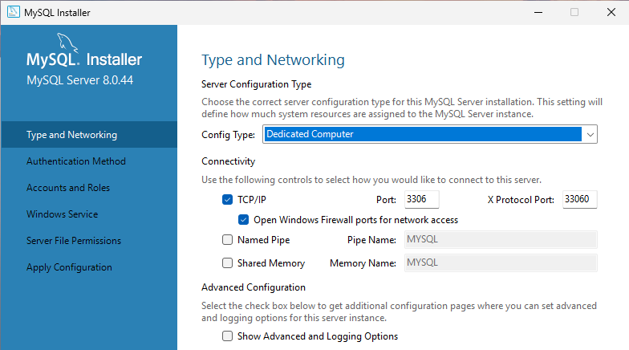

<!-- Salto de Página -->

<!---------------- PÁGINA 9 ---------------->

<!-- Imagen del IES Lois Peña Novo -->

  

<h1>Configuración MySQL Installer 8.0.44</h1>

<h4>Método de Autenticación</h4>

El instalador de MySQL nos plantea la posibilidad de elegir dos métodos de autenticación:

<ol class="ol-sin-padding-sup-inf">
  <li>Encriptado: es el recomendado para MySQL 8.0.44. Utiliza el algoritmo SHA-256.</li>
  <li>Legacy: en muchos casos es el ideal para integrar productos de terceros o PHP. Es el mótodo de autenticación utilizado en MySQL 5.x.</li>
</ol>

  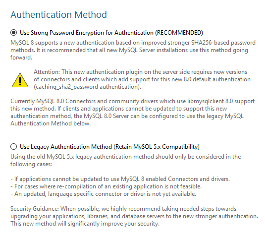

<!-- Salto de Página -->

<!---------------- PÁGINA 10 ---------------->

<!-- Imagen del IES Lois Peña Novo -->

  

<h1>Configuración MySQL Installer 8.0.44</h1>

<h4>Cuentas y Roles</h4>

En esta pantalla lo prioritario y fundamental es elegir la contraseña para el superusuario 'root'.

También se pueden añadir otros usuarios, asignándoles un rol determinado. En este ejemplo añadiremos al usuario 'estudiante' con un rol de Administrador de la Base de Datos (DB Admin).

  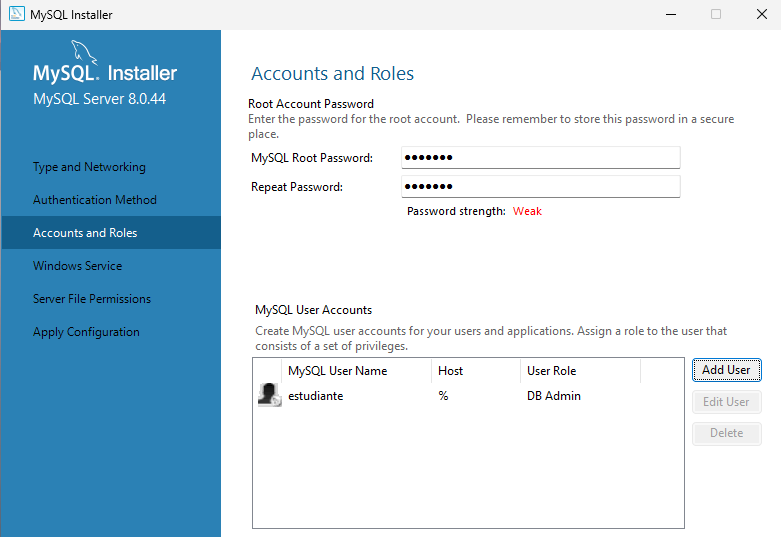

<!-- Salto de Página -->

<!---------------- PÁGINA 11 ---------------->

<!-- Imagen del IES Lois Peña Novo -->

  

<h1>Configuración MySQL Installer 8.0.44</h1>

<h4>Servicio de Windows</h4>

Esta pantalla nos permite configurar MySQL Server como un servicio de Windows, aplicándole el nombre que deseemos, que de manera predeterminada es MySQL80.

Además, podemos indicar si el servicio arranca con la puesta en marcha del sistema; e incluso la cuenta de usuario que ejecutará el servicio, que es recomendable que sea la cuenta de sistema estándar.

En este ejemplo nos decantamos por configurar el servicio para que arranque con el usuario de sistema estándar cuando se arranca el equipo.

  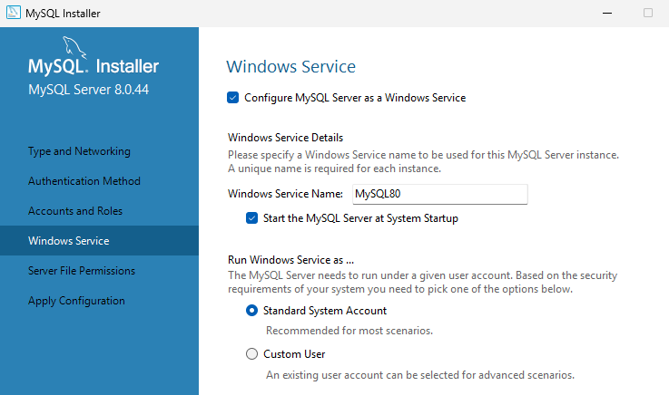

<!-- Salto de Página -->

<!---------------- PÁGINA 12 ---------------->

<!-- Imagen del IES Lois Peña Novo -->

  

<h1 id="aplicar-configuracion">Aplicación de la Configuración</h1>

Finalizamos la configuración básica aplicando esta a diversos apartados que dejan el servicio completamento operativo.

  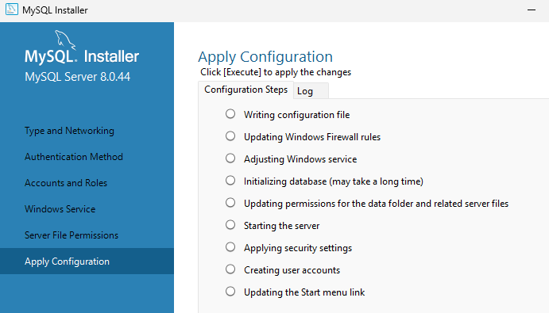
  
I

  
  
II

<!-- Salto de Página -->

<!---------------- PÁGINA 13 ---------------->

<!-- Imagen del IES Lois Peña Novo -->

  

<h1 id="activacion-servicio">Activación Servicio</h1>

<h4>Consola de Servicios (services.msc)</h4>

Aunque en la ventana 'Servicio de Windows' ya indicamos que este arrancaría de manera automática bajo el nombre MySQL80; esta configuración podemos modificarla desde la Consola de Servicios.

<h4>Línea de Comandos (CMD)</h4>

El servicio se pueda parar, arrancar o reiniciar desde la Línea de Comandos con net [stop/start/restart] MySQL80.

  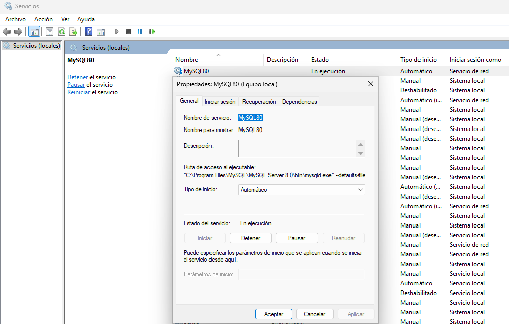

<!-- Salto de Página -->

<!---------------- PÁGINA 14 ---------------->

<!-- Imagen del IES Lois Peña Novo -->

  

<h1 id="productos-utilidades">Productos y Utilidades</h1>

<h4 id="mysql-workbench">MySQL Workbench</h4>

Es un cliente MySQL con interfaz gráfica que nos permite establecer conexiones con diferentes Bases de Datos (Locales o Remotas).

La conexión con el MySQL Server (servidor local) ya quedó configurada con anterioridad como podemos observar en la imagen inferior. El acceso a ella se realiza con los siguientes parámetros:

<ol class="ol-sin-padding-sup-inf">
  <li>Host: localhost(127.0.0.1)</li>
  <li>Puerto: 3306</li>
  <li>Usuario: root</li>
</ol>

  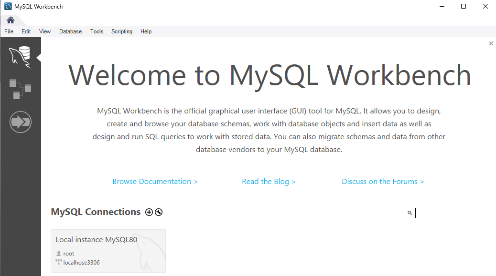

El interfaz (panel de control) de MySQL Workbench también nos permite gestionar usuarios (crear usuarios, gestionar roles, controlar accesos o limitar recursos).

<!-- Salto de Página -->

<!---------------- PÁGINA 15 ---------------->

<!-- Imagen del IES Lois Peña Novo -->

  

<h1>Productos y Utilidades</h1>

Pueden crearse todas las conexiones necesarias añadiendo un nombre a la conexión, el host y puerto que utiliza, además del usuario con el que se pretende acceder a ella.

  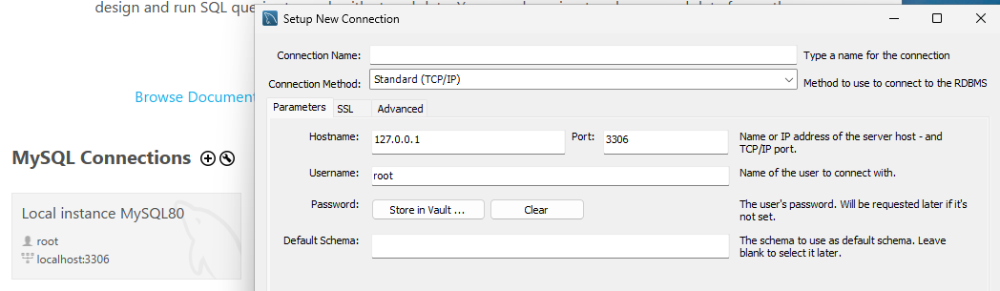

Accediendo al servidor deseado (local o remoto), mediante el lenguaje SQL podemos crear Bases de Datos y Tablas, cargar los datos y realizar la consultas necesarias.

  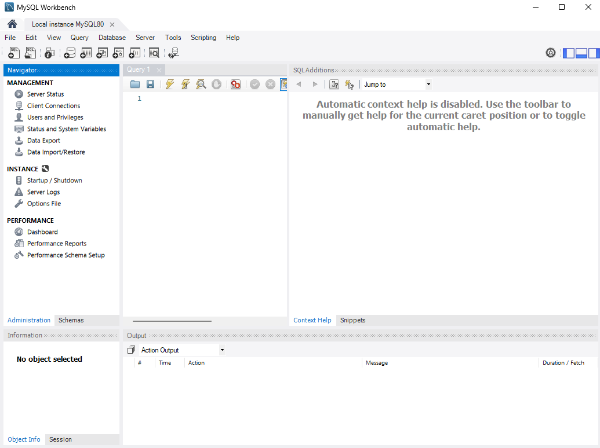

<!-- Salto de Página -->

<!---------------- PÁGINA 16 ---------------->

<!-- Imagen del IES Lois Peña Novo -->

  

<h1>Productos y Utilidades</h1>

<h4 id="mysql-shell">MySQL Shell</h4>

Es un cliente MySQL a través de línea de comandos, que nos ofrece la posibilidad de alternar entre lenguajes SQL, JavaScript y Python. Se utiliza en gestión de clústers, importación de grandes volúmenes de datos, así como otras configuraciones más avanzadas.

  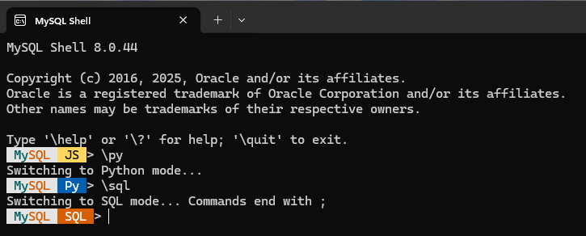

<!-- Salto de Página -->

<!---------------- PÁGINA 17 ---------------->

<!-- Imagen del IES Lois Peña Novo -->

  

<h1>Productos y Utilidades</h1>

<h4 id="mysql-client">MySQL Command Line Client</h4>

Es un cliente MySQL básico a través de línea de comandos, que nos permite utilizar el lenguaje SQL para crear bases de datos y tablas, además de cargar los datos que se deseen o realizar todo tipo de consultas. Requiere acceso como administrador.

  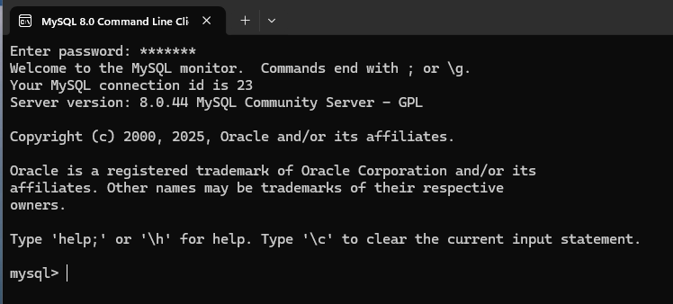

<!-- Salto de Página -->

<!---------------- PÁGINA 18 ---------------->

<!-- Imagen del IES Lois Peña Novo -->

  

<h1 id="mysql-directorios">Directorios Instalación / Configuración</h1>

<h4 id="directorio-bin">Directorio bin</h4>

C:\Archivos de Programa\MySQL\MySQL Server 8.0\bin

Este directorio almacena los programas ejecutables que permiten el funcionamiento del Servidor MySQL. Vamos a destacar los siguientes:

<ol class="ol-sin-padding-sup-inf">
  <li>mysqld: Motor del Servidor SQL. Trabajando en segundo plano se encarga entre otras cosas de la gestión de archivos, el procesamiento de consultas, la seguridad, los permisos y las conexiones múltiples al propio servidor.</li>
  <li>mysqldump: Cliente encargado de realizar las Copias de Seguridad. Trabaja en segundo plano.</li>
</ol>

  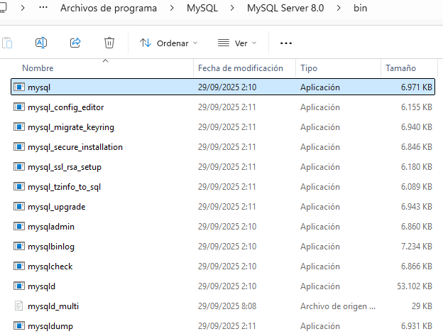

<!-- Salto de Página -->

<!---------------- PÁGINA 19 ---------------->

<!-- Imagen del IES Lois Peña Novo -->

  

<h1>Directorios Instalación / Configuración</h1>

<h4 id="directorio-include">Directorio include</h4>

C:\Archivos de Programa\MySQL\MySQL Server 8.0\include

La carpeta 'include' es fundamental si tenemos pensado desarrollar aplicaciones propias que se conecten directamente a MySQL utilizando lenguajes como C o C++.

<h4 id="directorio-lib">Directorio lib</h4>

C:\Archivos de Programa\MySQL\MySQL Server 8.0\lib

La carpeta 'lib' es el complemento directo de la carpeta include. Si include contiene los archivos que el programador lee para saber cómo escribir el código, 'lib' contiene los archivos que el ordenador utiliza para ejecutar ese código.

<h4 id="directorio-share">Directorio share</h4>

C:\Archivos de Programa\MySQL\MySQL Server 8.0\share

La carpeta 'share' es la biblioteca de recursos de MySQL. Mientras que 'bin' tiene los programas y 'lib' el código para que funcionen, share contiene toda la información de apoyo, principalmente textos y configuraciones que el servidor necesita consultar. Dentro podemos encontrar un directorio por cada idioma.

<!-- Salto de Página -->

<!---------------- PÁGINA 20 ---------------->

<!-- Imagen del IES Lois Peña Novo -->

  

<h1>Directorios Instalación / Configuración</h1>

<h4 id="directorio-data">Directorio Data</h4>

C:\ProgramData\MySQL\MySQL Server 8.0\Data

Es un directorio que permanece oculto y almacena las Bases de Datos, así como los archivos de registro y error.

  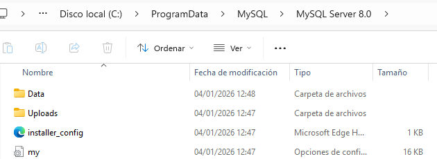

<h4 class="margen-superior-interior">Fichero my.ini</h4>

El fichero my.ini, que encontramos dentro del 'directorio Data', permite cambiar diferentes parámetros de la configuración.

Este fichero lo podemos modificar, accediendo como administrador con el programa 'Bloc de Notas'.

Puerto Predeterminado del Servidor Local (línea 61)

  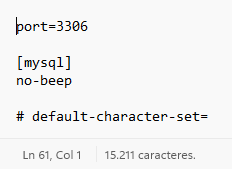

<!-- Salto de Página -->

<!---------------- PÁGINA 21 ---------------->

<!-- Imagen del IES Lois Peña Novo -->

  

<h1>Directorios Instalación / Configuración</h1>

Carpeta de almacenamiento de las Bases de Datos (línea 97) - Data

  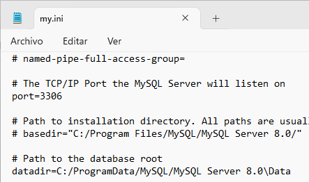

Carpeta de almacenamiento de las importaciones de datos (línea 167) - Uploads

  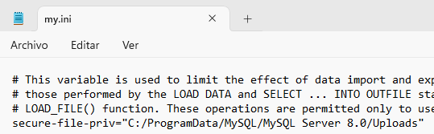

Cuando se hacen modificaciones en este fichero, es necesario reiniciar el Servicio MYSQL80: net restart MYSQL80

<!-- Salto de Página -->

<!---------------- PÁGINA 22 ---------------->

<!-- Imagen del IES Lois Peña Novo -->

  

<h1 id="otras-instalaciones">Otras Instalaciones y Configuraciones</h1>

<h4 id="visual-c++">Visual C++ v14 Redistributable</h4>

Si el equipo donde se pretende instalar y configurar MySQL Server no cuenta con el componente Visual C++ Redistributable, será necesario descargarlo e instalarlo.

<a href="https://aka.ms/vc14/vc_redist.x64.exe" target="_blank" class="blue">Descargar Versión Visual C++ v14 Redistributable</a>

Microsoft Visual C++ Redistributable es un paquete de librerías esenciales que permiten que aplicaciones desarrolladas con el lenguaje C++, como MySQL 8.0, funcionen correctamente en Windows.

  

<!-- Salto de Página -->

<!---------------- PÁGINA 23 ---------------->

<!-- Imagen del IES Lois Peña Novo -->

  

<h1>Otras Instalaciones y Configuraciones</h1>

<h4 id="variable-entorno-path">Configurar Variable de Entorno PATH</h4>

Configurar la variable de entorno PATH con la ruta de acceso a los programas de MySQL Server, permite al Símbolo de Sistema (CMD) utilizar esos programas sin tener que indicar la ruta completa cada vez que se quiere acceder a ellos.

Ruta: C:\Archivos de Programa\MySQL\MySQL Server 8.0\bin

  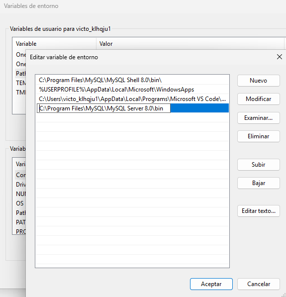

<!-- Salto de Página -->

<!---------------- PÁGINA 24 ---------------->

<!-- Imagen del IES Lois Peña Novo -->

  

<h1>Otras Instalaciones y Configuraciones</h1>

Comando: mysql -u root -p

<ol>
  <li>-u root: esta opción indica que el usuario con el que queremos acceder al programa mysql es 'root'.</li>
  <li>-p: esta opción solicita que se pida la contraseña que se configuró en la instalación.</li>
</ol>

  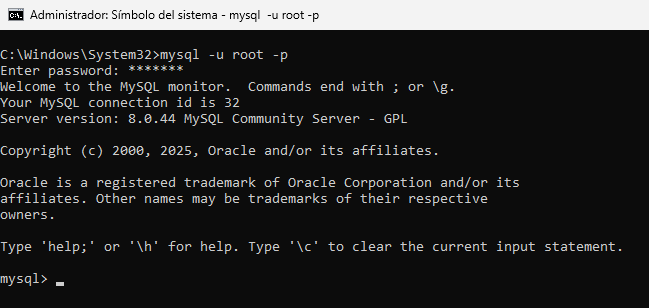

<!-- Salto de Página -->

<!---------------- PÁGINA 25 ---------------->

<!-- Imagen del IES Lois Peña Novo -->

  

<h1 id="descarga-5">Descarga MySQL Installer 5.7.44</h1>

Lo primero que tenemos que hacer antes de comenzar el proceso de instalación de MySQL en Windows, es descargar el paquete de archivos binarios deseado desde: <a href="https://dev.mysql.com/downloads/installer" target="_blank" class="blue">https://dev.mysql.com/downloads/installer</a>.

En este caso nos decantamos por la versión 5.7.44, que nos ofrecerá dos posibilidades:

<ol class="ol-sin-padding-sup-inf">
  <li>Web Community: instalación vía web. Descarga sólo los complementos que deseamos instalar posteriormente. Obviamente requiere conexión a Internet para poder continuar con el proceso de instalación.</li>
  <li>Community: instalación offline. Descarga todos los complementos que se ofertan. No requiere conexión a Internet para continuar con el proceso de instalación.</li>
</ol>

  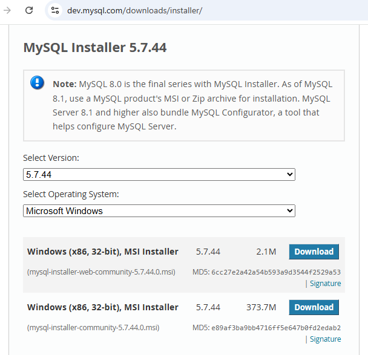

<!-- Salto de Página -->

<!---------------- PÁGINA 26 ---------------->

<!-- Imagen del IES Lois Peña Novo -->

  

<h1 id="instalacion-5">Instalación MySQL Installer 5.7.44</h1>

En esta práctica nos hemos decantado por instalación offline, que aunque requiere una descarga más pesada (373.7M), nos permitirá instalar MySQL en cualquier equipo sin depender de una conexión Internet.

El proceso se inicia con la selección del tipo de instalación que deseamos:

<ol class="ol-sin-padding-sup-inf">
  <li>Server Only: instalacion sólo de MySQL Server</li>
  <li>Client Only: instalacion sólo de las utilidades que se ofertan para los Clientes</li>
  <li>Full: instalacion completa</li>
  <li>Custom: instalacion personalizada</li>
</ol>

  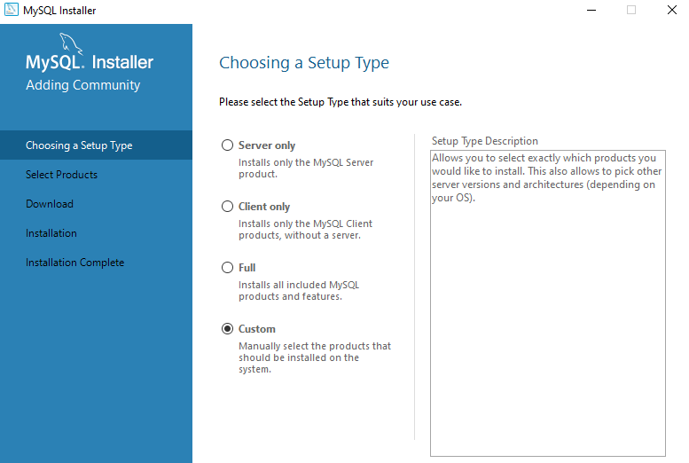
  
I

En nuestro caso, apostaremos por la Instalación personalizada (Custom).

<!-- Salto de Página -->

<!---------------- PÁGINA 27 ---------------->

<!-- Imagen del IES Lois Peña Novo -->

  

<h1>Instalación MySQL Installer 5.7.44</h1>

Continuamos con la selección de los productos que deseamos instalar, que serán los siguientes:

<ol class="ol-sin-padding-sup-inf">
  <li>MySQL Server 5.7.44: Servidor MySQL, que una vez configurado trabaja en segundo plano.</li>
  <li>MySQL Workbench 8.0.34: Cliente MySQL con interfaz gráfica que nos permite establecer conexiones con diferentes Bases de Datos (Locales o Remotas). Su panel de control nos permite gestionar usuarios (crear usuarios, gestionar roles, controlar accesos o limitar recursos). A través del Lenguaje SQL podemos crear Bases de Datos y Tablas, además de cargar datos.</li>
  <li>MySQL Shell 8.0.35: Cliente MySQL a través de línea de comandos, que nos ofrece la posibilidad de alternar entre lenguajes SQL, JavaScript y Python. Se utiliza en gestión de clústers y configuraciones más avanzadas.</li>
  <li>MySQL Documentation 5.7.44: es el manual de MySQL 5.7.44 con toda la documentación oficial de interés.</li>
  <li>Samples and Examples 5.7.44: muestras y ejemplos de la versión en cuestión.</li>
</ol>

  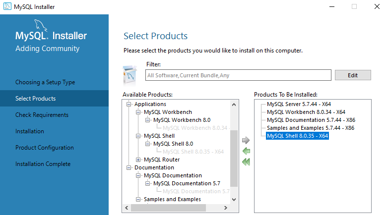
  
I

<!-- Salto de Página -->

<!---------------- PÁGINA 28 ---------------->

<!-- Imagen del IES Lois Peña Novo -->

  

<h1>Instalación MySQL Installer 5.7.44</h1>

<h4>Chequeo de Requirimientos</h4>

Antes de comenzar la instalación, MySQL Installer 5.7.44 realiza un chequeo para detectar necesidades de los programas que queremos instalar.

En nuestro caso, los tres programas que hemos seleccionado (MySQL Server, MySQL Workbench y MySQLShell) requieren del componente Microsoft Visual C++ 2019 Redistributable.

  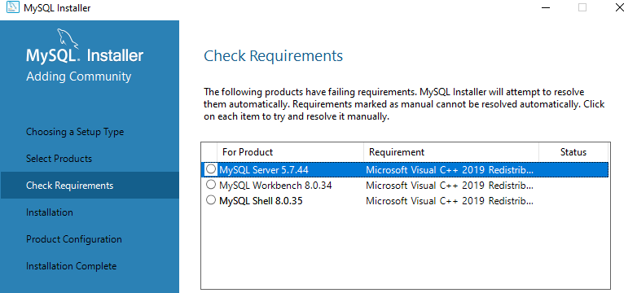
  
II

El componente Microsoft Visual C++ 2019 Redistributable, se podrá instalar desde el propio asistente de configuración.

  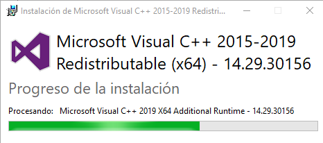
  
III

<!-- Salto de Página -->

<!---------------- PÁGINA 29 ---------------->

<!-- Imagen del IES Lois Peña Novo -->

  

<h1>Instalación MySQL Installer 5.7.44</h1>

Tras la instalación del componente solicitado, la instalación a través de MySQL Installer 5.7.44, continúa con total normalidad.

  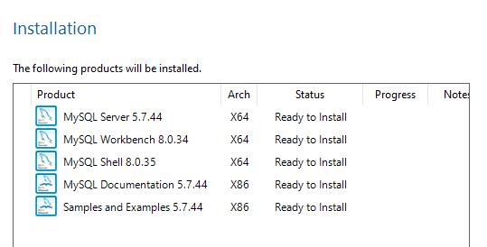
  
IV

  
  
V

<!-- Salto de Página -->

<!---------------- PÁGINA 30 ---------------->

<!-- Imagen del IES Lois Peña Novo -->

  

<h1 id="configuracion-5">Configuración MySQL Installer 5.7.44</h1>

Una vez finalizado el proceso de instalación, es necesario configurar MySQL Server (el servidor que trabajará en segundo plano).

  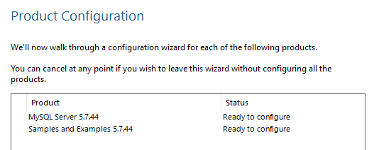

<h4 class="margen-superior-interior">Tipo de Servidor y Redes</h4>

La primera elección con la que nos encontramos es la selección del tipo de servidor que deseamos configurar, así como el acceso a nuestro servidor local a través del puerto (TCP 3306 es el predeterminado).

<ol class="ol-sin-padding-sup-inf">
  <li>Ordenador de Desarrollo: permite la ejecución de varias aplicaciones en diferentes momentos. Consume muy pocos recursos ya que no es un servidor dedicado a la Gestión de Bases de Datos.</li>
  <li>Ordenador Servidor: ofrece el Servicio de Gestión de Base de Datos de manera dedicada, incluyendo la posibilidad de configuración de servicios web, servicios de correo electrónico...</li>
  <li>Ordenador Dedicado: ofrece el Servicio de Gestión de Bases de Datos de manera dedicada. El consumo de recursos es mayor, porque la calidad y potencia del servicio es total.</li>
</ol>

<!-- Salto de Página -->

<!---------------- PÁGINA 31 ---------------->

<!-- Imagen del IES Lois Peña Novo -->

  

<h1>Configuración MySQL Installer 5.7.44</h1>

  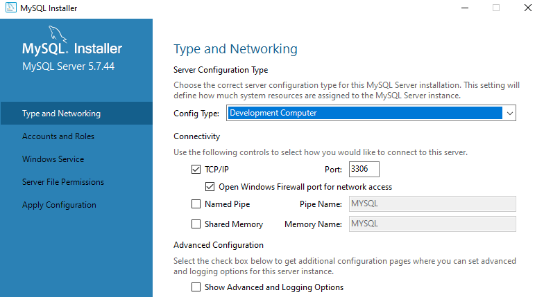

<!-- Salto de Página -->

<!---------------- PÁGINA 32 ---------------->

<!-- Imagen del IES Lois Peña Novo -->

  

<h1>Configuración MySQL Installer 5.7.44</h1>

<h4>Cuentas y Roles</h4>

En esta pantalla lo prioritario y fundamental es elegir la contraseña para el superusuario 'root'.

También se pueden añadir otros usuarios, asignándoles un rol determinado.

  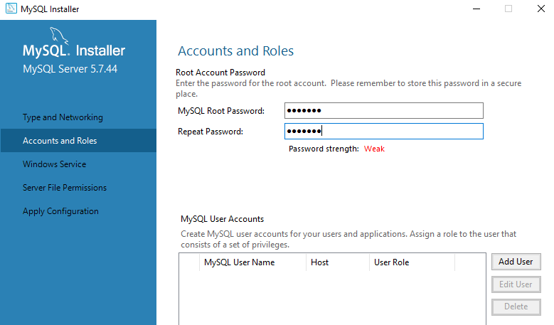

<!-- Salto de Página -->

<!---------------- PÁGINA 33 ---------------->

<!-- Imagen del IES Lois Peña Novo -->

  

<h1>Configuración MySQL Installer 5.7.44</h1>

<h4>Servicio de Windows</h4>

Esta pantalla nos permite configurar MySQL Server como un servicio de Windows, aplicándole el nombre que deseemos, que de manera predeterminada es MySQL57.

Además, podemos indicar si el servicio arranca con la puesta en marcha del sistema; e incluso la cuenta de usuario que ejecutará el servicio, que es recomendable que sea la cuenta de sistema estándar.

En este ejemplo nos decantamos por configurar el servicio para que arranque con el usuario de sistema estándar cuando se arranca el equipo.

  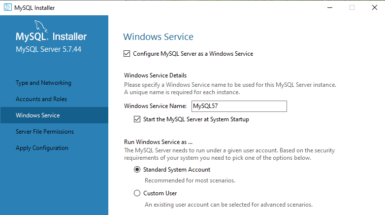

<!-- Salto de Página -->

<!---------------- PÁGINA 34 ---------------->

<!-- Imagen del IES Lois Peña Novo -->

  

<h1>Configuración MySQL Installer 5.7.44</h1>

<h4>Permisos de los Archivos del Servidor</h4>

En esta ventana, marcamos la casillas que nos dice: "Sí, conceder acceso total únicamente al usuario que ejecuta el servicio de Windows (si aplica) y al grupo de administradores. Otros usuarios y grupos no tendrán acceso.".

  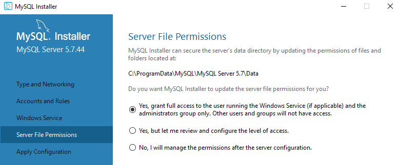

<!-- Salto de Página -->

<!---------------- PÁGINA 35 ---------------->

<!-- Imagen del IES Lois Peña Novo -->

  

<h1 id="aplicar-configuracion-5">Aplicar Configuración</h1>

Finalizamos la configuración básica aplicando esta a diversos apartados que dejan el servicio completamento operativo.

  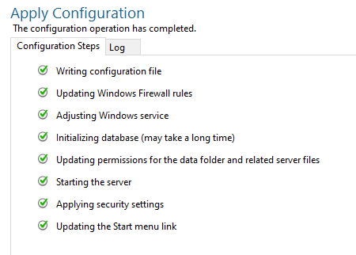
  
I

  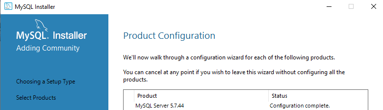
  
II

<!-- Salto de Página -->

<!---------------- PÁGINA 36 ---------------->

<!-- Imagen del IES Lois Peña Novo -->

  

<h1 id="reconfiguracion-5">Reconfiguración MySQL Server 5.7.44</h1>

Anteriormente el proceso de reconfiguración se realizaba desde MySQLInstanceConfig, que podiamos encontrar en el directorio 'bin'. Actualmente, la versión MySQL Installer, tanto para MySQL 5.x como para MySQL 8.x, se encarga del proceso de reconfiguración.

Desde el asistente se puede reconfigurar el tipo de servidor (menor a mayor dedicación de recursos del equipo), la conexión de red y si queremos que MySQL Server actue como un servicio o un programa más en el S.0.

  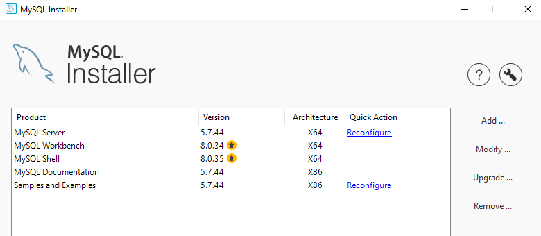

Una vez creada la nueva configuración, se genera un archivo (a modo copia de seguridad) con la antigua configuración. Tanto la configuración actual, como las copias de seguridad anteriores se almacenan en: C:\ProgramData\MySQL\MySQL Server 5.7.

  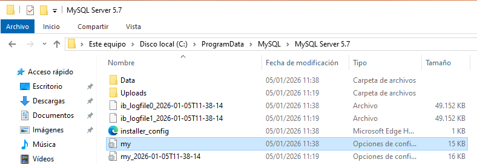

<!-- Salto de Página -->

<!---------------- PÁGINA 37 ---------------->

<!-- Imagen del IES Lois Peña Novo -->

  

<h1>Reconfiguración MySQL Server 5.7.44</h1>

El resto de criterios se deben reconfigurar manualmente desde el fichero my.ini que podemos encontrar en: C:\ProgramData\MySQL\MySQL Server 5.7.

<ol class="ol-sin-padding-sup-inf">
  <li>port: es el puerto del Servidor Local. Línea 61 del fichero my.ini.</li>
  <li>datadir: directorio donde se almacenan las Bases de Datos creadas. Línea 97 del fichero my.ini.</li>
  <li>secure-file-priv: directorio desde el que se importan los datos. Línea 161 del fichero my.ini.</li>
  <li>default-storage-engine: motor por defecto. Línea 104 del fichero my.ini.</li>
  <li>max_connections: número máximo de conexiones simultáneas. Línea 167 del fichero my.ini.</li>
  <li>character-set-server: juego de caracteres (utf8mb4 es el habitual). Línea 101 del fichero my.ini.</li>
</ol>

  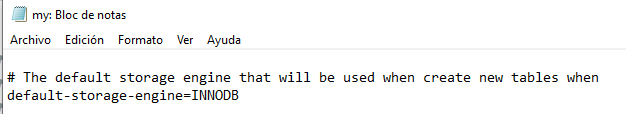

<!-- Salto de Página -->

<!---------------- PÁGINA 38 ---------------->

<!-- Imagen del IES Lois Peña Novo -->

  

<h1 id="mysql-directorios-5">Directorios de Instalación / Configuración</h1>

<h4>Directorios 'bin', 'include', 'lib' y 'share'</h4>

En estos directorios encontramos configuración relacionada con el servidor (MySQL Server).

C:\Archivos de Programa\MySQL\MySQL Server 5.7

<h4>Directorio 'Data' (oculto)</h4>

En este directorio se encuentran las Bases de Datos creadas.

C:\ProgramData\MySQL\MySQL Server 5.7\Data

<!-- Salto de Página -->

<!---------------- PÁGINA 39 ---------------->

<!-- Imagen del IES Lois Peña Novo -->

  

<h1 id="variable-entorno-path-5">Configuración Variable Entorno PATH</h1>

Configurar la variable de entorno PATH con la ruta de acceso a los programas de MySQL Server, permite al Símbolo de Sistema (CMD) utilizar esos programas sin tener que indicar la ruta completa cada vez que se quiere acceder a ellos.

Ruta: C:\Archivos de Programa\MySQL\MySQL Server 5.7\bin

  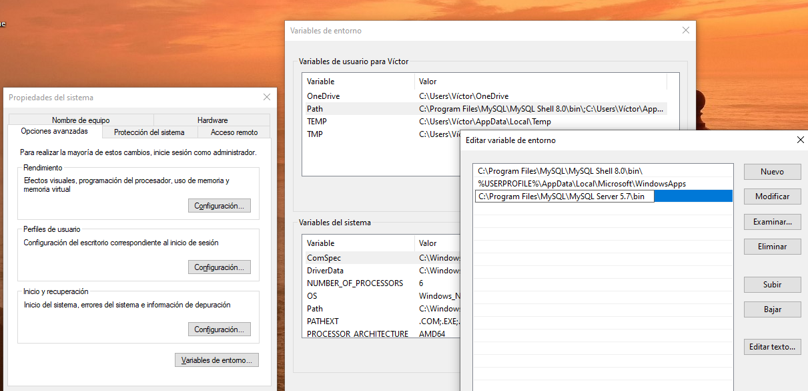
  
I

<h4 class="margen-superior-interior">Acceso desde CMD</h4>

Comando: mysql -u root -p

  
  
II

<!-- Salto de Página -->

<!---------------- PÁGINA 40 ---------------->

<!-- Imagen del IES Lois Peña Novo -->

  

<h1 id="instalacion-ubuntu">Instalación MySQL en Ubuntu</h1>

Como con cualquier otra instalación, se recomienda realizar con anterioridad una actualización de los paquetes que pueden ser instalados en el equipo:

apt update

Tras esta recomendación, procedemos a la instalación del MySQL Server:

  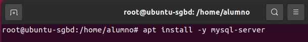

<h4>Comprobación Estado del Servicio MySQL</h4>

  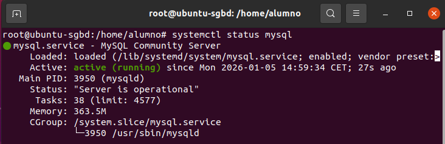

<h4>Comprobación Acceso al Servicio</h4>

  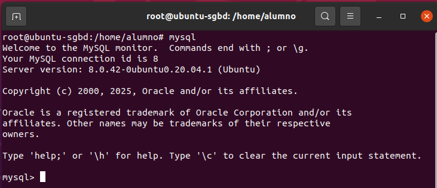

<!-- Salto de Página -->

<!---------------- PÁGINA 41 ---------------->

<!-- Imagen del IES Lois Peña Novo -->

  

<h1 id="anadir-usuarios">Añadir y Modificar Usuarios</h1>

<h4>Añadir un Usuario Local</h4>

Para añadir un usuario en MySQL Server, primeramente ingresamos en el propio servidor con el comando mysql. Posteriormente, introducimos la sentencia SQL requerida.

create user alumno@localhost identified by 'abc123.';

<ol class="ol-sin-padding-sup-inf">
  <li>create user: permite crear un usuario.</li>
  <li>alumno@localhost: se introduce el nombre del usuario deseado, acompañado del símbolo @ y una dirección IP. Al ser el usuario local se puede utilizar 'localhost'.</li>
  <li>identified by: permite añadir una contraseña de identificación para el usuario que estamos creando.</li>
</ol>

  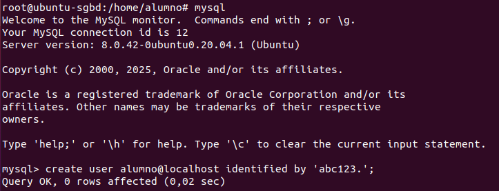

Tras la creación del nuevo usuario, será necesario actualizar privilegios.

  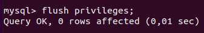

<!-- Salto de Página -->

<!---------------- PÁGINA 42 ---------------->

<!-- Imagen del IES Lois Peña Novo -->

  

<h1>Añadir y Modificar Usuarios</h1>

<h4>Acceso Usuarios Locales</h4>

Para acceder en Ubuntu con cualquiera de los usuarios locales a MySQL Server, utilizamos el comando:

mysql -u alumno p

  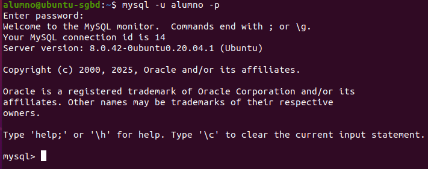

<h4>Modificación Usuarios</h4>

Para modificar un usuario en MySQL Server, ingresamos primero en el propio servidor con el comando mysql. Posteriormente, introducimos la sentencia SQL requerida.

Aprovechamos este ejemplo para asignarle una contraseña al usuario 'root', la cual será solicitada a partir de ahora para acceder a MySQL Server.

alter user root@localhost identified with mysql_native_password by 'abc123.';

Tras la modificación, será necesario actualizar privilegios.

  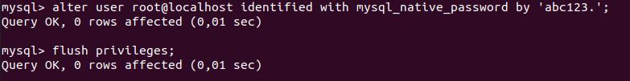

<!-- Salto de Página -->

<!---------------- PÁGINA 43 ---------------->

<!-- Imagen del IES Lois Peña Novo -->

  

<h1>Añadir y Modificar Usuarios</h1>

<h4>Acceso Usuarios Remotos</h4>

Para añadir un usuario remoto en MySQL Server, ingresamos en el propio servidor con el comando mysql. Posteriormente, introducimos la sentencia SQL requerida.

create user externo@'%' identified by 'abc123.';

<ol class="ol-sin-padding-sup-inf">
  <li>create user: permite crear un usuario.</li>
  <li>externo@'%': se introduce el nombre del usuario deseado, acompañado del símbolo @ y el símbolo '%' entrecomillado. Esta sintaxis se utiliza para que ese usuario pueda acceder desde cualquier dirección IP que pertenenza a la LAN.</li>
  <li>identified by: permite añadir una contraseña de identificación para el usuario que estamos creando.</li>
</ol>

  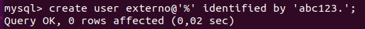

Tras la modificación, será necesario actualizar privilegios.

  

<!-- Salto de Página -->

<!---------------- PÁGINA 44 ---------------->

<!-- Imagen del IES Lois Peña Novo -->

  

<h1 id="configuracion-remoto">Configuración Acceso Remoto</h1>

Para poder acceder de manera remota a MySQL con otro equipo de la LAN, será necesario realizar una modificación en el fichero de configuración principal de MySQL Server:

nano /etc/mysql/mysql.conf.d/mysqld.cnf

Concretamente se debe modificar la directiva bind-address cuya IP apunta a Localhost (127.0.0.1) y establecer 0.0.0.0. Este nuevo parámetro permitirá acceder de manera remota a MySQL Server desde cualquier equipo de la red local.

  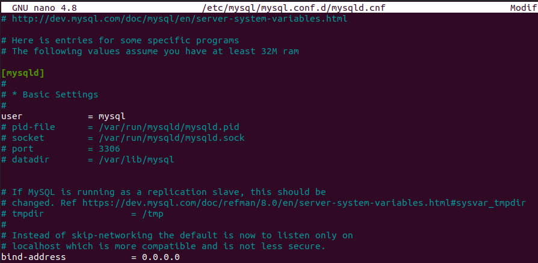

<!-- Salto de Página -->

<!---------------- PÁGINA 45 ---------------->

<!-- Imagen del IES Lois Peña Novo -->

  

<h1 id="acceso-remoto">Acceso desde Equipo Remoto</h1>

<h4>Instalación de Cliente MySQL</h4>

Para poder acceder de manera remota desde un equipo de la red local, este deberá tener instalado un Cliente MySQL.

En este ejemplo instalaremos un cliente MySQL es un equipo Debian 12, pero se podría acceder desde un equipo Windows con los clientes 'Command Lines Client' o 'MySQL Workbench'.

apt install default-mysql-client

  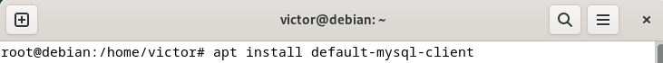

<h4>Prueba de Acceso Remoto</h4>

Desde la terminal, y una vez instalado el Cliente MySQL, utilizamos el siguiente comando:

mysql -h 192.168.1.82 -u externo -p

<ol class="ol-sin-padding-sup-inf">
  <li>-h 192.168.1.82: esta opción permite introducir la dirección IP o el nombre del host donde se encuentra instalado MySQL Server.</li>
  <li>-u externo: esta opción indica el usuario con el que se pretende acceder a MySQL Server.</li>
  <li>-p: esta opción se utiliza para pedir la contraseña de acceso del usuario mencionado anteriormente.</li>
</ol>

  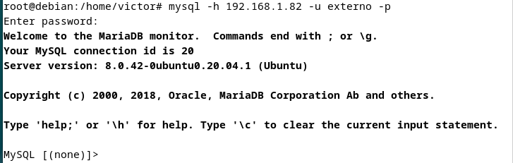

<!-- Salto de Página -->

<!---------------- PÁGINA 46 ---------------->

<!-- Imagen del IES Lois Peña Novo -->

  

<h1 id="workbench">Instalación MySQL Workbench</h1>

El paquete con la utilidad MySQL Workbench no se encuentra en los respositorios de APT ni de APT-GET por lo que tendremos que instalar SNAPD.

apt install spapd

Una vez instalado SNAPD, procedemos a instalar MySQL Workbench:

snapd install mysql-workbench-community

  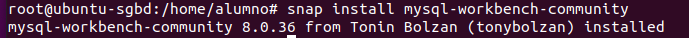

<h4>Acceso MySQL Workbench</h4>

El acceso a MySQL Workbench se podrá realizar desde el entorno gráfico de Ubuntu 20.04 LTS, como podemos observar en la imagen.

  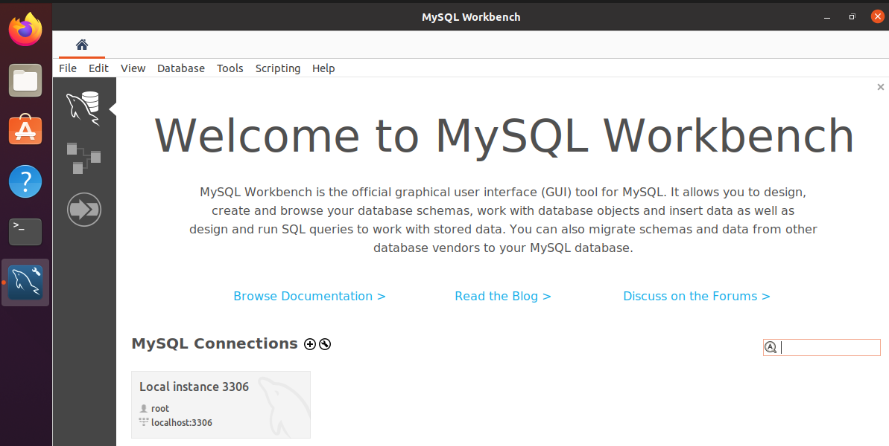

<!-- Salto de Página -->

<!---------------- PÁGINA 47 ---------------->

<!-- Imagen del IES Lois Peña Novo -->

  

<h1 id="directorios-ubuntu">Directorios MySQL en Ubuntu</h1>

<h4>Almacén de las Bases de Datos</h4>

/var/lib/mysql

Almacena las Bases de Datos creadas en el Servidor.

  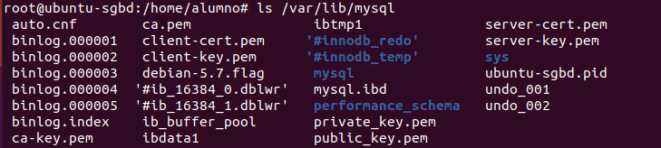

<h4>Registros de Errores y Alertas</h4>

/var/log/mysql

Registros y alertas del Servicio MySQL.

  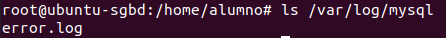

<!-- Salto de Página -->

<!---------------- PÁGINA 48 ---------------->

<!-- Imagen del IES Lois Peña Novo -->

  

<h1>Directorios MySQL en Ubuntu</h1>

<h4>Directorio con Ficheros de Configuración</h4>

/etc/mysql

Contiene todos los ficheros de configuración. Mención especial para my.cnf que nos mostrará entre otros el fichero de configuración principal /etc/mysql/mysql.conf.d/mysqld.cnf en el que ya realizamos modificaciones anteriormente para permitir el acceso remoto.

  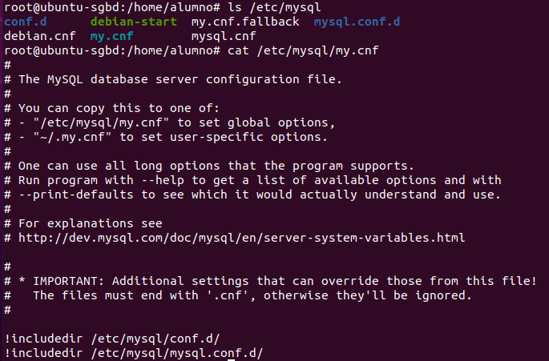

<!-- Salto de Página -->

<!---------------- PÁGINA 49 ---------------->

<!-- Imagen del IES Lois Peña Novo -->

  

<h1 id="descarga-xampp">MySQL con phpMyAdmin - Windows</h1>

<h4>Descarga XAMPP</h4>

Lo primero que haremos es descargar e instalar la aplicación XAMPP para que actue de servidor web local, algo fundamental para utilizar el gestor web phpMyAdmin.

Web Descarga: <a href="https://www.apachefriends.org/es/download.html" target="_blank" class="blue">https://www.apachefriends.org/es/download.html</a>

  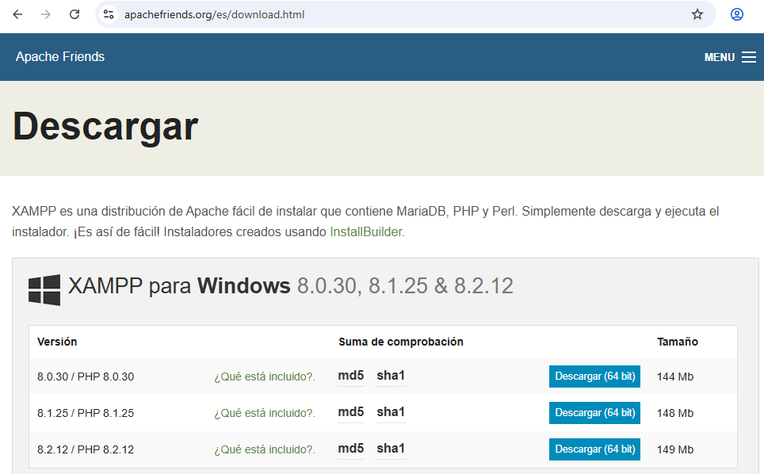

Nos decantaremos por descargar la última versión publicada para el Sistema Operativo Windows, que es la 8.2.12.

<!-- Salto de Página -->

<!---------------- PÁGINA 50 ---------------->

<!-- Imagen del IES Lois Peña Novo -->

  

<h1>MySQL con phpMyAdmin - Windows</h1>

<h4 id="instalacion-xampp">Instalación XAMPP</h4>

Una vez descargado el paquete de instalación de XAMPP, procedemos a ejecutarlo para que comience el proceso.

  
  
I

Seleccionamos los componentes necesarios para nuestro objetivo que son MySQL y phpMyAdmin:

  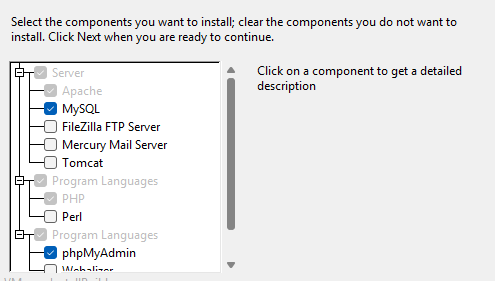
  
II

Seleccionamos la ruta de instalación de XAMPP:

  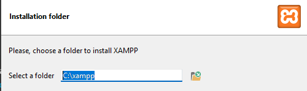
  
III

<!-- Salto de Página -->

<!---------------- PÁGINA 51 ---------------->

<!-- Imagen del IES Lois Peña Novo -->

  

<h1>MySQL con phpMyAdmin - Windows</h1>

<h4 id="configuracion-puerto-xampp">Configuración Puerto XAMPP</h4>

Como en este equipo Windows ya tenemos instalado MySQL en el puerto 3306, tendremos que realizar una serie de modificaciones en XAMPP para poder arrancar phpMyAdmin de manera correcta.

Abrimos el Panel de Control de XAMPP. Pulsamos en el botón 'Config' correspondiente al servicio MySQL. Al pulsarlo, se despliega un menú contextual con la opción my.ini, en la que haremos click.

  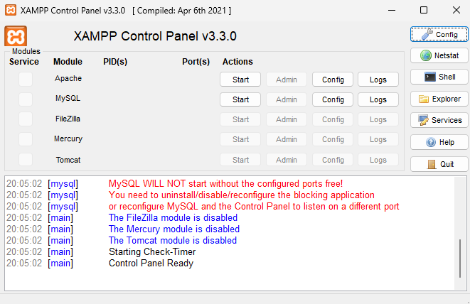
  
I

  
  
II

<!-- Salto de Página -->

<!---------------- PÁGINA 52 ---------------->

<!-- Imagen del IES Lois Peña Novo -->

  

<h1>MySQL con phpMyAdmin - Windows</h1>

El fichero my.ini se abrirá en un Bloc de Notas. Tendremos que modificar tanto en la sección [client] como en [mysqld] el puerto. En nuestro caso, nos hemos decantado por el 3310.

  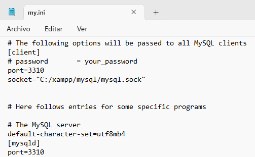
  
III

También tendremos que modificar el puerto en la Configuración General de XAMPP. Dentro del Panel de Control clickamos en el botón 'Config' (tiene una llave inglesa al lado). Se abrirá una nueva ventana en la que haremos click en 'Service and Port Settings'. Para finalizar en la ventana emergente seleccionamos la pestaña MySQL y cambiamos el puerto a 3310.

  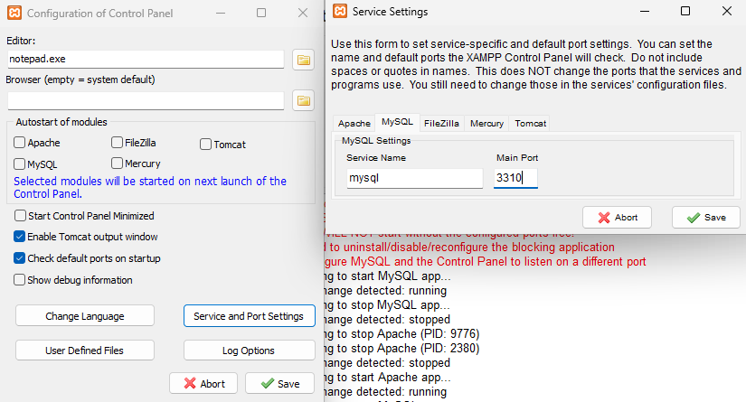
  
IV

<!-- Salto de Página -->

<!---------------- PÁGINA 53 ---------------->

<!-- Imagen del IES Lois Peña Novo -->

  

<h1>MySQL con phpMyAdmin - Windows</h1>

Por último, tendremos que añadir el puerto en el servidor local modificando el fichero config.inc (desde el Bloc de Notas y como administrador) que localizaremos en la siguiente ruta:

C:\xampp\phpMyAdmin\config.inic.

  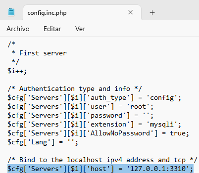
  
V

<!-- Salto de Página -->

<!---------------- PÁGINA 54 ---------------->

<!-- Imagen del IES Lois Peña Novo -->

  

<h1>MySQL con phpMyAdmin - Windows</h1>

<h4 id="inicio-xampp">XAMPP: Inicio Apache y MySQL</h4>

Ya tenemos todo preparado para poder arrancar tanto el Servidor Web (Apache) como el Servidor MySQL. Para ello, abrimos el Panel de Control de XAMPP e iniciamos los servicios Apache y MySQL.

  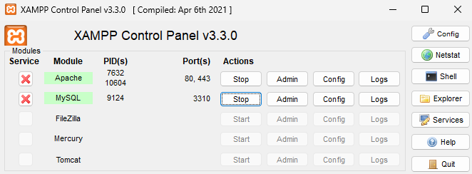

<h4 id="acceso-phpmyadmin">Acceso phpMyAdmin</h4>

Una vez iniciado Apache y MySQL, desde cualquiera de los navegadores que tengamos instalado (Chrome, Firefox...), podremos acceder al gestor phpMyAdmin tecleando la siguiente URL:

https://localhost/phpmyadmin

  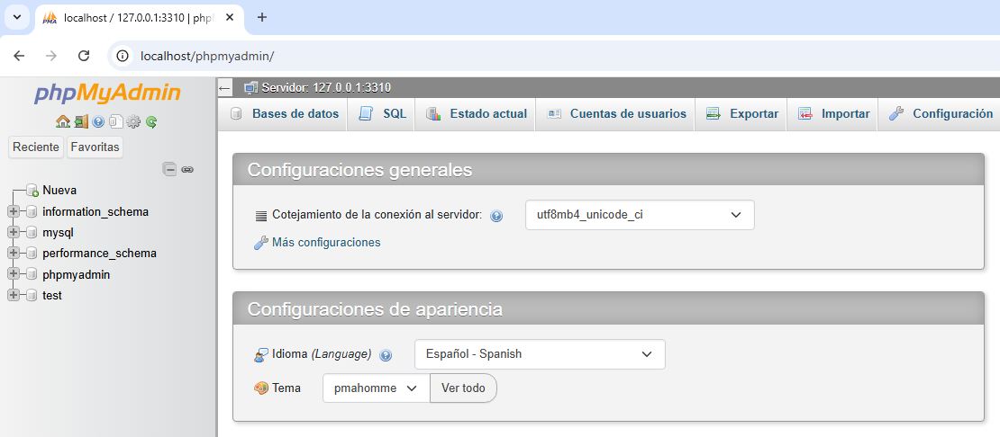

<!-- Salto de Página -->

<!---------------- PÁGINA 55 ---------------->

<!-- Imagen del IES Lois Peña Novo -->

  

<h1 id="instalacion-apache">MySQL con phpMyAdmin - Linux</h1>

<h4>Instalación Apache</h4>

Para afrontar cualquier instalación de manera adecuada en Linux, se recomienda primeramente actualizar los paquetes disponibles:

apt update

Una vez actualizados los paquetes, comenzaremos con la instalación del Servidor Web Apache, fundamental para poder acceder al gestor phpMyAdmin en Linux.

  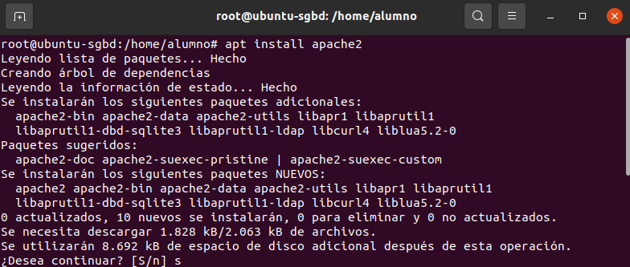

Ahora es el momento de comprobar que el Servidor Web Apache se ha instalado correctamente. Para ello, accedemos desde una navegador web a la dirección del localhost (Servidor Local).

  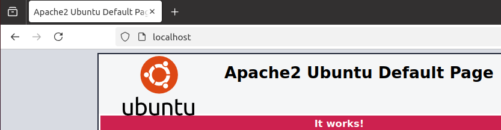

<!-- Salto de Página -->

<!---------------- PÁGINA 56 ---------------->

<!-- Imagen del IES Lois Peña Novo -->

  

<h1>MySQL con phpMyAdmin - Linux</h1>

<h4 id="instalacion-mysql-server">Instalación MySQL Server</h4>

Una vez que se ha instalado el Servidor Web Apache, el siguiente paso será instalar desde la terminal el Servidor MySQL (MySQL Server).

  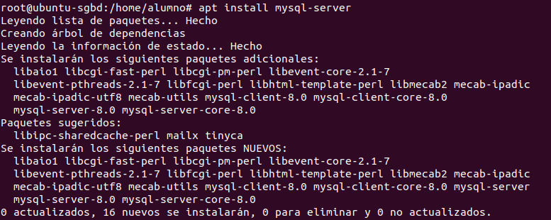

Para mayor seguridad, modificamos el usuario 'root' con el objetivo de que al acceder a MySQL Server nos pida su contraseña.

  

<!-- Salto de Página -->

<!---------------- PÁGINA 57 ---------------->

<!-- Imagen del IES Lois Peña Novo -->

  

<h1>MySQL con phpMyAdmin - Linux</h1>

Comprobamos que los cambios se han realizado correctamente, intentando acceder con el usuario 'root' a MySQL.

mysql -u root -p

  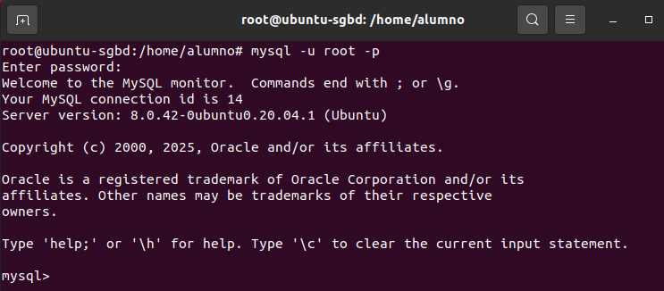

<h4 id="instalacion-workbench">Instalación MySQL Workbench</h4>

Procedemos a instalar el cliente MySQL Workbench. Este paquete no se encuentra ni en APT ni en APT-GET, por lo que su instalación se llevará a cabo desde SNAP.

snap install mysql-worbench-community

  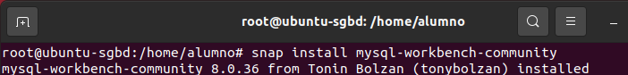

<!-- Salto de Página -->

<!---------------- PÁGINA 58 ---------------->

<!-- Imagen del IES Lois Peña Novo -->

  

<h1>MySQL con phpMyAdmin - Linux</h1>

<h4 id="instalacion-phpmyadmin">Instalación phpMyAdmin</h4>

El último paquete que instalaremos será el del gestor phpMyAdmin, que nos permitirá gestionar nuestras Bases de Datos.

apt install phpmyadmin

  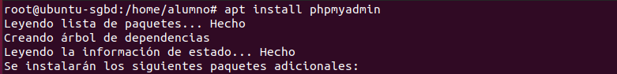
  
I

Durante el proceso de instalación, nos pedirá seleccionar el Servidor Web que deseamos utilizar. En nuestro caso, nos decanteremos por Apache (apache2).

  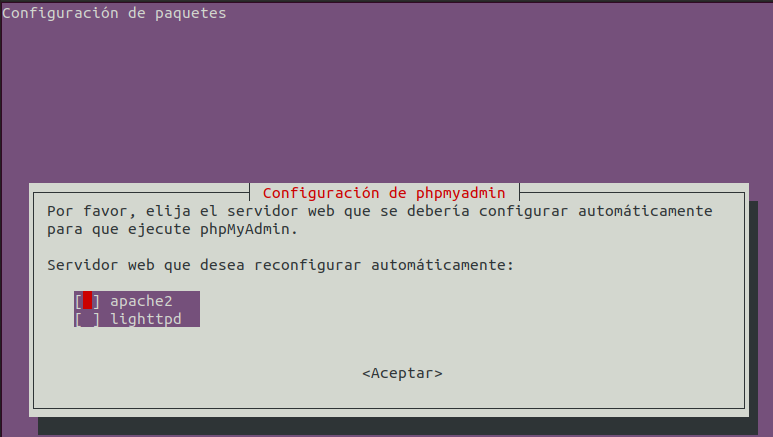
  
II

<!-- Salto de Página -->

<!---------------- PÁGINA 59 ---------------->

<!-- Imagen del IES Lois Peña Novo -->

  

<h1>MySQL con phpMyAdmin - Linux</h1>

Otro de los pasos en el proceso de instalación será configurar la Base de Datos para phpMyAdmin, algo a lo que responderemos afirmativamente. La instalación también nos pedirá una contraseña para que phpMyAdmin se registre con el Servidor de Bases de Datos (dejaremos este campo sin rellenar).

  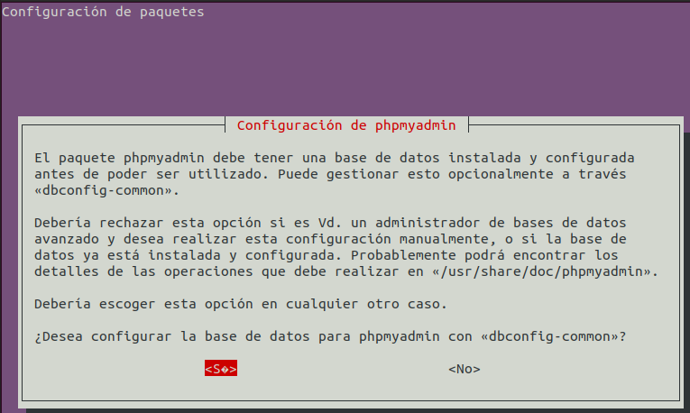
  
III

  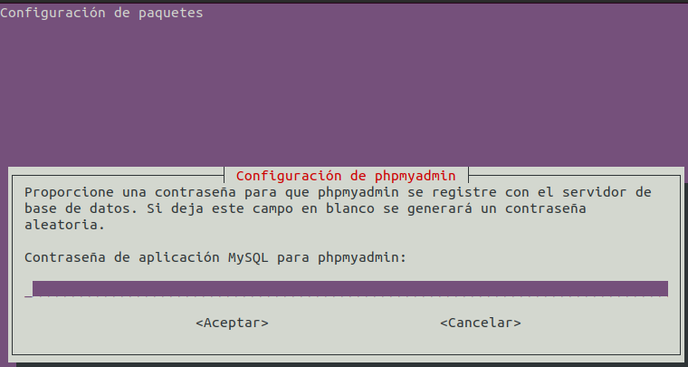
  
IV

<!-- Salto de Página -->

<!---------------- PÁGINA 60 ---------------->

<!-- Imagen del IES Lois Peña Novo -->

  

<h1>MySQL con phpMyAdmin - Linux</h1>

<h4 id="acceso-phpmyadmin-linux">Acceso phpMyAdmin</h4>

Tras la finalizar la instalación de phpMyAdmin, desde un navegador web accedemos al gestor web desde la URL: https://localhost/phpmyadmin

  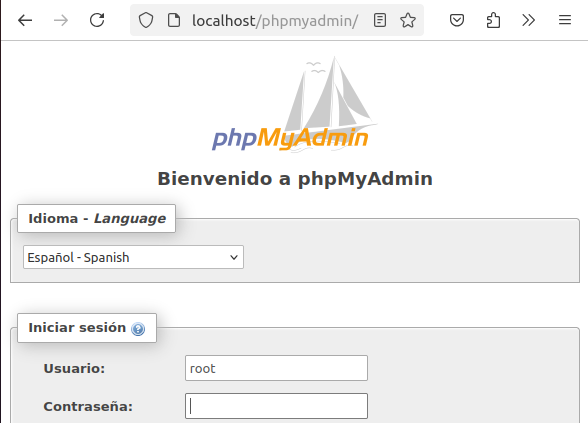
  
I

Introducimos el usuario 'root' y su contraseña:

  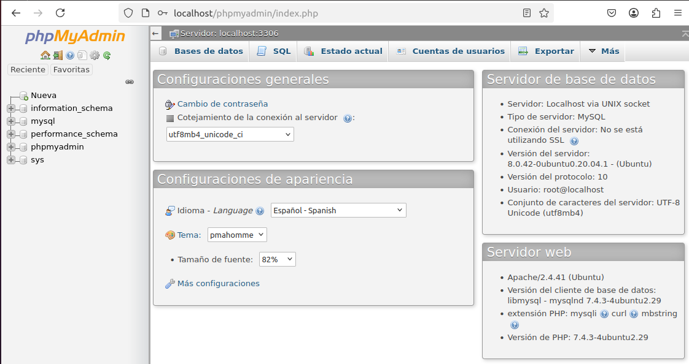
  
II

<!-- Salto de Página -->

<!---------------- PÁGINA 61 ---------------->

<!-- Imagen del IES Lois Peña Novo -->

  

<h1 id="segunda-instancia-windows">Instalación 2ª Instancia - Windows</h1>

<h4>Descargar MySQL Community Server</h4>

Desde la página oficial de MySQL, descargamos la versión ZIP de MySQL Community Server 8.4.7 LTS.

  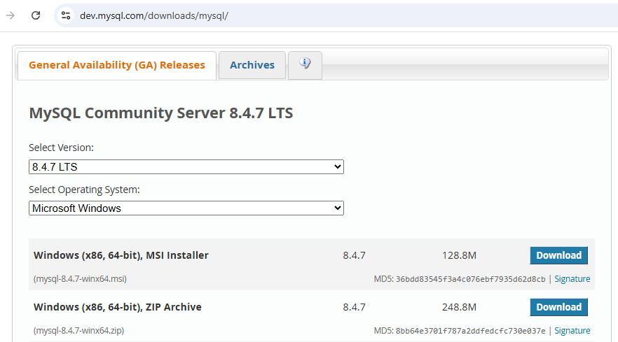

<h4>Extraer contenido a una carpeta</h4>

Extraemos el contenido del ZIP a una carpeta, en nuestro caso hemos elegido la ruta: C:\mysql_segunda_instancia

  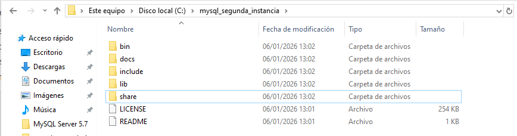

<!-- Salto de Página -->

<!---------------- PÁGINA 62 ---------------->

<!-- Imagen del IES Lois Peña Novo -->

  

<h1>Instalación 2ª Instancia - Windows</h1>

<h4>Crear fichero de configuración my.ini</h4>

Creamos el fichero de configuración my.ini. Deberá contener al menos:

<ol class="ol-sin-padding-sup-inf">
  <li>Ruta de la Carpeta (basedir)</li>
  <li>Ruta donde se guardarán las Bases de Datos (datadir)</li>
  <li>Puerto (port)</li>
  <li>ID de Servicio único (server-id)</li>
</ol>

  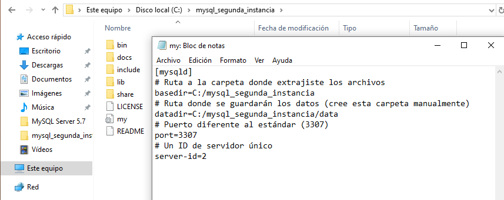

<!-- Salto de Página -->

<!---------------- PÁGINA 63 ---------------->

<!-- Imagen del IES Lois Peña Novo -->

  

<h1>Instalación 2ª Instancia - Windows</h1>

<h4>Inicializar Directorio de Datos</h4>

Ahora es el momento de inicializar el directorios de datos (data) desde la Línea de Comandos. Primeramente, accedemos a la carpeta 'bin' (ubicación programas binarios). Después ejecutamos el comando mysqld con la ruta del fichero my.ini y la opción --initialize-insecure.

mysqld --defaults-file=C:\mysql_segunda_instancia\my.ini --initialize-insecure

  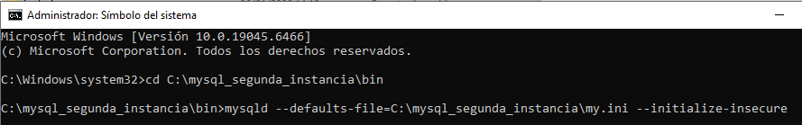

<h4>Instalamos el Servicio</h4>

Desde la línea de comandos, instalamos el servicio asociado a la nueva instancia. El comando se debe ejecutar también desde el directorio 'bin'. El comando incluye el nombre que le damos al nuevo servicio "MySQL_Segunda" y la ruta donde se encuentra el fichero de configuración my.ini.

mysqld --install "MySQL_Segunda" --default-file="C:\mysql_segunda_instancia\my.ini"

  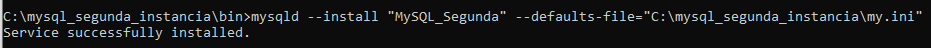

<!-- Salto de Página -->

<!---------------- PÁGINA 64 ---------------->

<!-- Imagen del IES Lois Peña Novo -->

  

<h1>Instalación 2ª Instancia - Windows</h1>

<h4>Iniciamos el Servicio</h4>

El servicio se puede iniciar desde la Consola de Servicios (services.msc).

  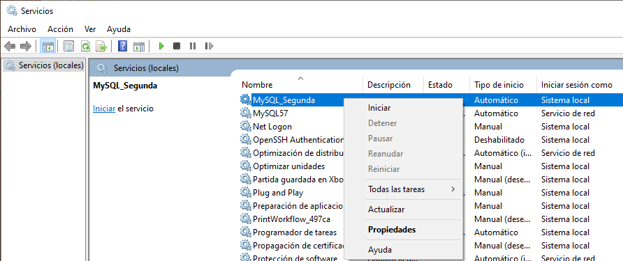

<h4>Configuración MySQL Workbench</h4>

Accedemos al cliente MySQL Workbench para agregar la nueva conexión (MySQL Connections) a la segunda instancia.

<ol class="ol-sin-padding-sup-inf">
  <li>Dirección IP: 127.0.0.1 (la del localhost)</li>
  <li>Puerto: 3307 (el puerto que utiliza la nueva instancia)</li>
</ol>

  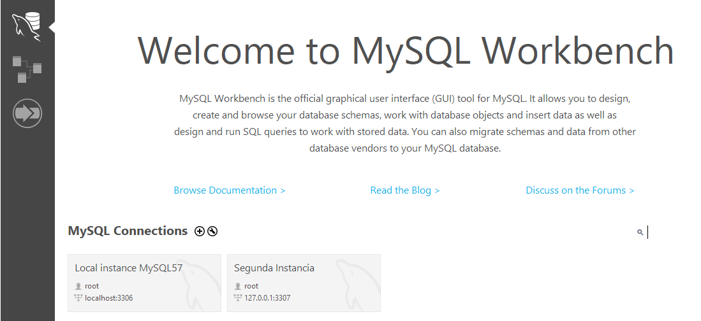

<!-- Salto de Página -->

<!---------------- PÁGINA 65 ---------------->

<!-- Imagen del IES Lois Peña Novo -->

  

<h1 id="segunda-instancia-linux">Instalación 2ª Instancia - Linux</h1>

<h4>Creación del Directorio de Datos</h4>

Primeramente, crearemos el Directorio de Datos para la segunda instancia. Además, le asignamos como usuario y grupo propietario 'mysql'. También establecemos permisos 750 (RWX-R-X----) a ese directorio.

  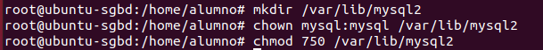

<h4>Instalar Utilidades de AppArmor</h4>

Después varias horas de pelea con la configuración de la segunda instancia y realizar una interesante labor de investigación, he tenido que recurrir a Instalar las Utilidades de AppArmor.

Hasta este momento, fue imposible poder iniciar la segunda instancia, a pesar de estar bien configurada, porque AppArmor bloqueaba los accesos a varios directorios.

  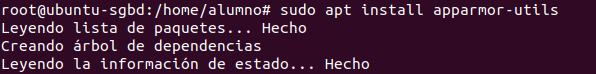

Una vez ejecutada la instalación de las Utilidades de AppArmor, y gracias al uso del comando aa-complain sobre el directorio /usr/sbin/mysqld, el proceso por fin pudo avanzar.

  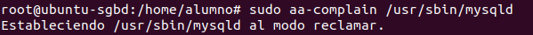

<!-- Salto de Página -->

<!---------------- PÁGINA 66 ---------------->

<!-- Imagen del IES Lois Peña Novo -->

  

<h1>Instalación 2ª Instancia - Linux</h1>

<h4>Configuración de las Instancias</h4>

Tras crear el Directorio de Datos /var/lib/mysql2, llegó el momento de configurar MySQL Server para incluir una segunda instancia. Dentro de esta configuración es importante destacar la creación de la sección [mysqld_multi], que permitirá el uso de varias instancias.

Para configurar el resto de instancias al menos hay que incluir las siguientes directivas con sus parámetros correspondientes:

<ol class="ol-sin-padding-sup-inf">
  <li>user: usuario creador de la Base de Datos (mysql para todos)</li>
  <li>port: puerto asignado a la instancia (diferente)</li>
  <li>datadir: ruta del Directorio de Datos (cada instancia tendrá que tener su ruta correspondiente)</li>
  <li>socket: es un archivo que permite la conexión local cliente-servidor (deberá ser diferente y estar alojado en la misma carpeta)</li>
  <li>pid-file: es un archivo que almacena los procesos del servidor (deberá ser diferente y estar alojado en la misma carpeta)</li>
</ol>

  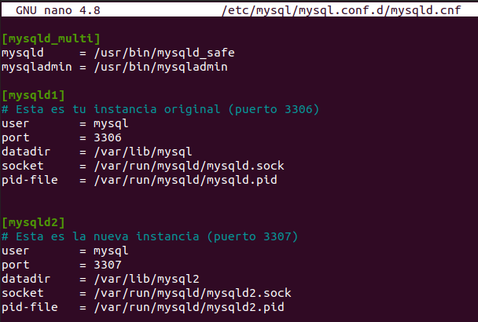

<!-- Salto de Página -->

<!---------------- PÁGINA 67 ---------------->

<!-- Imagen del IES Lois Peña Novo -->

  

<h1>Instalación 2ª Instancia - Linux</h1>

<h4>Inicializar la Base de Datos</h4>

Para inicializar la Base de Datos, he utilizado el comando mysqld con las opciones --initilize-insecure (sin contraseña), --user (usuario creador) y --datadir (dirección del directorio de datos).

Me decanté por esta alternativa porque tras investigar el problema que surgía con AppArmor, recomendaban esta opción antes que la de pegar el contenido del Directorio de Datos de la primera instancia en el Directorio de Datos de la segunda instancia.

  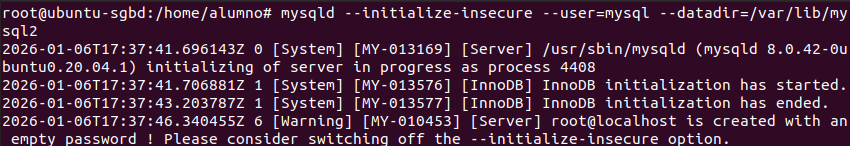

<h4>Iniciar Instancias</h4>

Aunque apliqué el comando aa-complain con anterioridad, para no encontrarme con más problemas decidí parar el servicio AppArmor mientras procedía a activar las instancias con el comando mysqld_multi.

Tuve que utilizar la opción --defaults-file, porque por si solo no encontraba la ruta del fichero de configuración de MySQL, y por consiguiente no activaba las instancias.

<ol class="ol-sin-padding-sup-inf">
  <li>report: muestra el estado de las instancias de MySQL.</li>
  <li>start/stop: seguido del número de la instancia, permite su inicio/parada.</li>
</ol>

  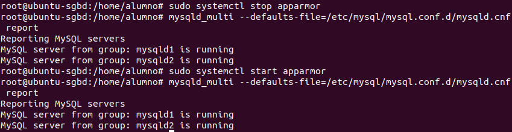

<!-- Salto de Página -->

<!---------------- PÁGINA 68 ---------------->

<!-- Imagen del IES Lois Peña Novo -->

  

<h1>Instalación 2ª Instancia - Linux</h1>

<h4>Configuración de MySQL Workbench</h4>

Accedemos al cliente MySQL Workbench para agregar la nueva conexión (MySQL Connections) a la segunda instancia.

<ol class="ol-sin-padding-sup-inf">
  <li>Dirección IP: 127.0.0.1 (la del localhost)</li>
  <li>Puerto: 3307 (el puerto que utiliza la nueva instancia)</li>
</ol>

  

