<!---------------- PÁGINA 1 ---------------->

<!-- Título Principal (** Texto en Negrita **) -->
  <!-- Los Títulos Principales incorporan 
  una línea debajo que ocupa todo el ancho -->
# **2º ASIR - ASXBD**

<!-- Imagen del IES Lois Peña Novo -->

  

<!-- Subtítulo -->
## VÍCTOR ÁLVAREZ FERNÁNDEZ

<!-- Subapartados -->

  <h3 class="titulos-subapartados">Unidad:</h3>
    <h3 class="texto-subapartados">Unidad 2 - Configuración de un SGBD</h3>
  <h3 class="titulos-subapartados">Práctica:</h3>
    <h3 class="texto-subapartados">P21-Configuración-MySQL</h3>
  <h3 class="titulos-subapartados">Fecha:</h3>
    <h3 class="texto-subapartados">24 de Enero de 2026</h3>

<footer>
  <h6>Víctor Álvarez Fernández - ASXBD - 2º ASIR</h6>
</footer>

<!-- Salto de Página -->

<!---------------- PÁGINA 2 ---------------->

<!-- Contiene anclajes a los diferentes ejercicios (están en siguientes páginas) -->
# **Índice**

<ol class="indice">
  <li><a href="#procesos">Procesos y Servicios</a>
    <ul>
      <li><a href="#cierre">Proceso de Cierre</a></li>
      <li><a href="#inicio">Proceso de Inicio</a></li>
      <li><a href="#servicios">Servicios que MySQL proporciona</a>
        <ul>
          <li><a href="#clientemysql">Cliente mysql</a></li>
          <li><a href="#mysqladmin">Utilidad mysqladmin (Administrador)</a></li>
          <li><a href="#mysqlcheck">Utilidad mysqlcheck (Chequeador)</a></li>
          <li><a href="#mysqldump">Utilidad mysqldump (Backup Secuencial)</a></li>
          <li><a href="#mysqlpump">Utilidad mysqlpump (Backup Multi-Hilo)</a></li>
          <li><a href="#mysqlimport">Utilidad mysqlimport (Importador)</a></li>
          <li><a href="#mysqlshow">Utilidad mysqlshow (Información)</a></li>
          <li><a href="#mysqlslap">Utilidad mysqlslap (Diagnóstico)</a></li>
        </ul>
      </li>
    </ul>
  </li>
  <li><a href="#configuracion">Configuración del Servidor</a>
    <ul>
      <li><a href="#lineacomandos">Uso de Opciones en Línea de Comandos</a></li>
      <li><a href="#ficherosconfiguracion">Uso de los Ficheros de Configuración</a></li>
      <li><a href="#variablesentorno">Uso de Variables de Entorno</a></li>
      <li><a href="#opcionesmysqld">Opciones Servidor mysqld</a></li>
      <li><a href="#modossql">Modos SQL del Servidor</a></li>
      <li><a href="#variablessistema">Variables de Sistema</a></li>
      <li><a href="#variablesestado">Variables de Estado</a></li>
    </ul>
  </li>
  <li><a href="#parametrosdestacables">Configuración Parámetros Destacables</a>
    <ul>  
      <li><a href="#espacio">Espacios de Almacenamiento</a>
        <ul>
          <li><a href="#myisam">MyISAM</a></li>
          <li><a href="#merge">MERGE</a>
          <li><a href="#memory">Memory</a>
          <li><a href="#innodb">InnoDB</a>
          <li><a href="#blackhole">Blackhole</a>
          <li><a href="#otrosmotores">Otros Motores</a>
        </ul>
      </li>
    </ul>
  </li>
</ol>

<!-- Salto de Página -->

<!---------------- PÁGINA 3 ---------------->

<!-- Contiene anclajes a los diferentes ejercicios (están en siguientes páginas) -->
# **Índice**

<ul style="list-style: none; margin-bottom: 0; padding-bottom: 0; margin-top: 5px; padding-top: 10px;">
  <li>
    <ul>
      <li><a href="#confespacios">Configuracion Espacios</a></li>
      <li><a href="#confinnodb">Configuracion InnoDB</a></li>
      <li><a href="#confmyisam">Configuracion MyISAM</a></li>
      <li><a href="#pordefecto">Definir Característica por Defecto</a></li>
      <li><a href="#accesoremoto">Acceso Remoto</a></li>
      <li><a href="#politica">Política de Contraseñas</a></li>
    </ul>
  </li>
</ul>
<ol class="indice" start="4" style="margin-top: 0; padding-top: 0;">
  <li><a href="#diccionario">Estructura del Diccionario de Datos</a></li>
  <li><a href="#ficheroslog">Ficheros Logs</a></li>
  <li><a href="#documentacion">Documentación Configuración</a></li>
  <li><a href="#resumen">Resumen Variables más Importantes</a></li>
  <li><a href="#usuarios">Consulta de Usuarios y Privilegios</a></li>
</ol>

<!-- Salto de Página -->

<!---------------- PÁGINA 4 ---------------->

<h1 id="procesos">Procesos y Servicios SGBD</h1>

Los procesos más importantes en un Sistema Gestor de Bases de Datos (SGBD) son los de inicio y cierre (parada).

<h4 id="cierre">Proceso de Cierre</h4>

<h5>1º/ Inicio del Proceso de Cierre</h5>

El proceso de cierre 'seguro' se puede ralizar de varias maneras:

<ol class="ol-sin-padding-sup-inf">
  <li>Utilidad mysqladmin: ejecutando la utilidad mysqladmin desde una consola (válido tanto para Linux como para Windows)</li>
  <li>Realizando una parada del Servicio: 
    <ol>
      <li>S.O. Windows: net stop MySQL80 o desde la Consola de Servicios</li>
      <li>S.O. Linux: systemctl stop mysql</li>
    </ol>
  </li>
  <li>Cliente MySQL Workbench: pulsando dentro del menú INSTANCE en Startup/Shutdown (esta opción es menos recomendable, porque aunque ejecutemos el cliente como administrador, este a veces se queda "trabado" y no procede al cierre)</li>
  </ol>

  
  
I

  
  
II

  
  
III

<h5 class="margen-superior-interior">2º/ Creación de Subproceso de Apagado</h5>

El subproceso de apagado es necesario si el cierre se hace desde el Cliente MySQL Workbench o desde la utilidad mysqladmin (línea de comandos). Todo esto se realiza de manera automática y no se requiere ninguna configuración adicional.

<!-- Salto de Página -->

<!---------------- PÁGINA 5 ---------------->

<h1>Procesos y Servicios SGBD</h1>

<h5 class="margen-superior-interior">3º/ Servidor no acepta más conexiones</h5>

Cuando se realiza el proceso de cierre, el Servidor deja de aceptar conexiones: Cierra los puertos (TCP/IP), los sockets (si estamos en un S.O. Linux), las tuberías (si estamos en un S.O. Windows) y la memoria compartida.

<h5>4º/ Servidor cancela las conexiones con los Clientes</h5>

Cualquier subproceso asociado pasa al estado de "muerto".

<ol class="ol-sin-padding-sup-inf">
  <li>Transacciones Abiertas: se cancelan y se deshacen para no generar conflictos.</li>
  <li>Procesos UPDATE o INSERT: se realiza una actualización parcial, hasta donde le haya dado tiempo a realizar la última inserción o actualización.</li>
  <li>Parada de un Maestro: se realiza el mismo tratamiento tanto a los procesos asociados al maestro, como a los esclavos.</li>
  <li>Parada de un Esclavo (Servidor Replicación): 
    <ol>
      <li>Se paran los subprocesos de E/S y SQL</li>
      <li>Se marcan como "muertos" los subprocesos en el Cliente</li>
      <li>Se permite la finalización de la Consulta SQL</li>
      <li>Se cancelan y deshacen las Transacciones Abiertas</li>
    </ol>
  </li>
</ol>

<h5 class="margen-superior-interior red">VER LISTA DE PROCESOS</h5>

Para ver la lista de procesos bastará con utilizar dentro del servidor la orden SHOW PROCESSLIST;.

Otra alternativa es el uso de la utilidad mysqladmin -u root -p proc en la línea de comandos. El resultado en ambos casos será el mismo.

  

<!-- Salto de Página -->

<!---------------- PÁGINA 6 ---------------->

<h1>Procesos y Servicios SGBD</h1>

<h4 id="inicio" class="margen-superior-interior">Proceso de Inicio</h4>

El proceso para iniciar el servicio asociado a MySQL se puede realizar desde:

<ol class="ol-sin-padding-sup-inf">
  <li>Línea de Comandos: 
    <ol>
      <li>S.O. Windows: net start MySQL80 o desde la Consola de Servicios</li>
      <li>S.O. Linux: systemctl start mysql</li>
    </ol>
  </li>
  <li>Reiniciando / Iniciando el equipo que acoge el Servidor MySQL.</li>
</ol>

  

<h4 id="servicios" class="margen-superior-interior">Servicios que MySQL proporciona</h4>

<h5 id="clientemysql" class="red">Cliente mysql</h5>

Permite la ejecución de diferentes maneras:

<ol class="ol-sin-padding-sup-inf">
  <li>Interactiva: utilizando la opción -e para ejecutar una orden: mysql -u root -p -e "SELECT * FROM asxbd.clientes;"</li>
  <li>Desde un fichero: mysql -u root -p < fichero-prueba1.sql"</li>
</ol>

  
  
I

  
  
II

  

<!-- Salto de Página -->

<!---------------- PÁGINA 7 ---------------->

<h1>Procesos y Servicios SGBD</h1>

<h5 id="mysqladmin" class="red margen-superior-interior">Utilidad mysqladmin (Administrador MySQL)</h5>

Esta utilidad permite desde la línea de comandos:

<ol class="ol-sin-padding-sup-inf">
  <li>Crear / Borrar Bases de Datos: mysqladmin -u root -p CREATE prueba | mysqladmin -u root -p DROP prueba</li>
  <li>Recargar Permisos: mysqladmin -u root -p FLUSH-PRIVILEGES</li>
  <li>Volcar Tablas a Disco: mysqladmin -u root -p FLUSH-TABLES</li>
  <li>Volcar Ficheros Log: mysqladmin -u root -p FLUSH-LOG</li>
  <li>Consultar la Versión Instalada: mysqladmin -u root -p VERSION</li>
  <li>Ver los Subprocesos: mysqladmin -u root -p PROCESSLIST</li>
  <li>Ver el estado del Servidor: mysqladmin -u root -p STATUS</li>
  <li>Apagar el Servidor: mysqladmin -u root -p SHUTDOWN</li>
</ol>

  
  
I

  
  
II

  
  
V

<!-- Salto de Página -->

<!---------------- PÁGINA 8 ---------------->

<h1>Procesos y Servicios SGBD</h1>

  
  
VI

  
  
VII

<h5 id="mysqlcheck" class="red margen-superior-interior">Utilidad mysqlcheck (Chequeador MySQL)</h5>

<ol class="ol-sin-padding-sup-inf">
  <li>Verifica Tablas buscando errores: mysqlcheck -u root -p -c asxbd</li>
  <li>Analiza Tablas: mysqlcheck -u root -p -a asxbd</li>
  <li>Repara Tablas (no habilitada en InnoDB)</li>
  <li>Optimiza Tablas (no habilitada en InnoDB)</li>
</ol>

  
  
I

  
  
II

<!-- Salto de Página -->

<!---------------- PÁGINA 9 ---------------->

<h1>Procesos y Servicios SGBD</h1>

<h5 id="mysqldump" class="red margen-superior-interior">Utilidad mysqldump (Backup Secuencial)</h5>

Trabaja de forma secuencial (un solo hilo). Esto significa que procesa una tabla detrás de otra. Si tenemos una tabla con mucha información, todas las demás tendrán que esperar su turno.

<ol class="ol-sin-padding-sup-inf">
  <li>Backup Esquema y Datos: mysqldump -u root -p asxbd > esquema-datos.sql</li>
  <li>Backup Sólo del Esquema: mysqldump -u root -p -d asxbd > esquema.sql</li>
  <li>Backup Sólo de los Datos: mysqldump -u root -p -t asxbd > datos.sql</li>
</ol>

  

<h5 id="mysqlpump" class="red margen-superior-interior">Utilidad mysqlpump (Backup Multi-Hilo)</h5>

Es multihilo, lo que se traduce en que realiza el volcado de varias tablas en paralelo, reduciendo drásticamente el tiempo de exportación en servidores con muchos núcleos de CPU.

Su filtro es mucho más potente para realizar backups personalizados. También, permite comprimir la salida (output) mientras se genera, ahorrando tiempo de escritura en disco.

mysqlpump -u root -p asxbd > backup-pump.sql

  

Antes de comenzar el proceso de backup, nos hace una advertencia para decirnos que Oracle dejará pronto de dar soporte a esta utilidad para sustituirla por MySQL Shell.

<!-- Salto de Página -->

<!---------------- PÁGINA 10 ---------------->

<h1>Procesos y Servicios SGBD</h1>

<h5 id="mysqlimport" class="red margen-superior-interior">Utilidad mysqlimport (Importador de Datos)</h5>

<ol class="ol-sin-romanos">
  <li>El fichero tiene que llamarse igual que la tabla donde se insertarán los datos.</li>
  <li>El fichero tiene que estar almacenado en la ruta UPLOADS del Servidor MySQL.</li>
  <li>Debe estar habilitada la directiva local_infile=1 en el Fichero de Configuración de Opciones (Sección [mysqld]).</li>
</ol>

Cuando se habilita la directiva local_infile=1, es recomendable tener los Clientes cerrados (MySQL Workbench, MySQL Shell o el cliente MySQL a través de la Línea de Comandos).

  

También, será necesario ejecutar dentro de uno de los Clientes MySQL la orden SET GLOBAL local_infile = 1;.

  

Realizamos la importación: mysqlimport -u root -p --local --fields-terminated-by="," --lines-terminated-by="\r\n" --columns=nombre,apellidos,email,telefono asxbd "C:\ProgramData\MySQL\MySQL Server 8.0\Uploads\clientes.txt".

  

Para poder hacer la importación de manera satisfactoria, he tenido que realizar una labor de investigación que me ha llevado a incluir las opciones --lines-terminated-by="\r\n" (mueve el cursor al principio de la línea y baja de línea), --fields-terminated-by="," (indica el separador de campos del fichero) y --columns= (indica los nombre de las columnas de la tabla).

<!-- Salto de Página -->

<!---------------- PÁGINA 11 ---------------->

<h1>Procesos y Servicios SGBD</h1>

  

<h5 id="mysqlshow" class="red margen-superior-interior">Utilidad mysqlshow (Información BD)</h5>

Muestra información sobre Bases de Datos, Tablas, Columnas, Índices, ...

Si nuestra intención es ver las bases de datos de nuestro Servidor MySQL, ejecutamos el siguiente comando: mysqlshow -u root -p .

  

Para el resto de posibilidades la sintaxis es jerárquica: base de datos - tabla. Por ejemplo, para ver la base de datos asxbd: mysqlshow -u root -p asxbd.

  

<!-- Salto de Página -->

<!---------------- PÁGINA 12 ---------------->

<h1>Procesos y Servicios SGBD</h1>

Vamos a ver ahora la tabla stock de la base de datos asxbd: mysqlshow -u root -p asxbd stock.

  

Si nuestra intención es ver los índices creados en una tabla se añade la opción -k. Por ejemplo: mysqlshow -u root -p -k asxbd clientes.

<h5 id="mysqlslap" class="red margen-superior-interior">Utilidad mysqlslap (Diagnóstico)</h5>

Es un programa de diagnóstico, que emula la carga de datos desde diferentes clientes y con múltiples interacciones desde cada uno de ellos.

Ejemplo 1: Simulación de la creación de tablas, inserción de contenido y la realización de consultas por parte de 50 clientes, cada uno con 200 interacciones. mysqlslap -u root -p --delimiter=";" --create="CREATE TABLE a (b INT); INSERT INTO a VALUES (23)" --query="SELECT * FROM a" --concurrency=50 --iterations=200.

  

<!-- Salto de Página -->

<!---------------- PÁGINA 13 ---------------->

<h1>Procesos y Servicios SGBD</h1>

Ejemplo 2: Simulación de la creación de una tabla con 2 columnas de tipo numérico y 3 columnas de tipo carácter. El emulador autogenerará el contenido. La concurrencia será de 5 clientes y 200 interacciones/cliente. mysqlslap -u root -p --number-int-cols=2 --number-char-cols=3 --auto-generate-sql --concurrency=5 --iterations=20.

  

Ejemplo 3: Simulación de la carga de contenido desde dos ficheros sql con instrucciones de creación y consulta respectivamente. mysqlslap -u root -p --delimiter=";" --create=C:\Users\victo_klhqju1\Desktop\ficheros-prueba\create.sql --query=C:\Users\victo_klhqju1\Desktop\ficheros-prueba\query.sql --concurrency=5 --iterations=5.

  

Resumen de las Opciones más utilizadas

<ol class="ol-sin-romanos">
  <li>--create: se utiliza para añadir o actualizar contenido de manera directa o a través de un fichero.</li>
  <li>--query: se utiliza para realizar consultas de manera directa o a través de un fichero.</li>
  <li>--delimiter: indica el delimitador que se utilizará para crear o actualizar el contenido.</li>
  <li>--auto-generate-sql: se utiliza para autogenerar el contenido. Será necesario complementarlo con los tipos de datos que se desean.</li>
  <li>--number-int-cols: indica el número de datos de tipo numérico.</li>
   <li>--number-char-cols: indica el número de datos de tipo carácer.</li>
  <li>--concurrency: indica el número de clientes que concurrirán.</li>
  <li>--iterations: indica el número de interacciones por cliente.</li>
</ol>

<!-- Salto de Página -->

<!---------------- PÁGINA 14 ---------------->

<h1 id="configuracion">Configuración del Servidor</h1>

La Configuración del Servidor se puede realizar desde la Línea de Comandos, desde el Fichero de Configuración de Opciones del Servidor ("my.ini" en Windows y "my.cnf" en Linux) y por supuesto desde las Variables de Entorno.

<h5>Orden de Comprobación para el Inicio del Servicio MySQL</h5>

<ol class="ol-sin-numero">
  <li>1º/ Variables de Entorno</li>
  <li>2º/ Fichero de Configuración de Opciones</li>
  <li>3º/ Línea de Comandos</li>
</ol>

<h5>Orden de Prioridad de los Métodos de Configuración</h5>

<ol class="ol-sin-numero">
  <li>1º/ Línea de Comandos</li>
  <li>2º/ Ficheros de Configuración de Opciones</li>
  <li>3º/ Variables de Entorno</li>
</ol>

Recomendación: lo adecuado sería realizar la configuración en el Fichero de Configuración ("my.ini" o "my.cnf"). Si durante la sesión se requiere alguna modificación puntual, se debe acudir a la Línea de Comandos.

<h4 id="lineacomandos">Uso de Opciones en Línea de Comandos</h4>

<ol class="ol-sin-romanos">
  <li>Las opciones pueden comenzar por - o por -- (estas van seguidas de un = y el valor que se quiere asignar a dicha opción)</li>
  <li>Lista de opciones de un programa: nombrePrograma --help</li>
  <li>Valores relacionados con bytes: K (KB) - M (MB) - G (GB)</li>
  <li>Espaces: \b (Retroceso) - \t (Tabulador) - \n (Salto de Línea) - \r (Principio de Línea) - \\ (Barra) - \s (Espacio en Blanco) </li>
  <li>Opciones para Deshabilitar:
    <ol>
      <li>-disable: -disable-column-names</li>
      <li>-skip: -skip-networking</li>
      <li>Valor 0: flush-time=0</li>
    </ol>
  </li>
    <li>Opciones para Habilitar:
    <ol>
      <li>-enable: -enable-column-names</li>
      <li>Valor 1: flush-time=1</li>
    </ol>
  </li>
</ol>

<!-- Salto de Página -->

<!---------------- PÁGINA 15 ---------------->

<h1 id="configuracion">Configuración del Servidor</h1>

<ol class="ol-sin-romanos margen-superior-interior">
  <li>Prefijo --loose: se utiiza para evitar que el servidor de MySQL se detenga si no reconoce una opción</li>
</ol>

<h4 id="ficherosconfiguracion">Uso de Fichero de Configuración de Opciones</h4>

Este es el lugar donde se debe realizar la configuración principal del Servidor MySQL. En Windows, si no se ha modificado la ruta, podemos encontrarlo habitualmente en: C:\ProgramData\MySQL\MySQL Server 8.0\my.ini; y en Linux en /etc/mysql/my.cnf.

<ol class="ol-sin-romanos">
  <li>No usa prefijos iniciales: port = 3306</li>
  <li>[] indican el inicio de una sección y llevan dentro el nombre de un programa: [mysqld]</li>
  <li>Permite espacios alrededor del = cuando se va a asignar un valor: host = localhost</li>
  <li>Las opciones con nombres compuestos a las cuales se les asigna un valor utilizan _: max_connections = 255</li>
  <li>Las opciones activación/desactivación utilizan -: skip-networking</li>
  <li>Las líneas vacías y/o que utilicen # se ignoran: # socket=MySQL</li>
</ol>

<h5>Inclusión de Ficheros de Configuración dentro de otros</h5>

MySQL permite incluir líneas dentro de los ficheros de comunicación que llamen a otros ficheros o directorios para implementar otras opciones.

<ol class="ol-sin-romanos">
  <li>Llamamiento a Ficheros (!include rutaFichero): !include /home/alumno/miconf.cnf</li>
  <li>Llamamiento a Directorios (!include rutaDirectorio): !include /home/alumno/configuraciones/</li>
</ol>

<h5>Otras Opciones en Línea de Comandos</h>

<ol class="ol-sin-romanos">
  <li>Indicarle a un Programa que no lea la configuración por defecto (--no-defaults): mysqladmin --no-defaults</li>
  <li>Indicarle a un Programa que use un Fichero de Configuración Concreto (--default-file="ruta"): mysqladmin --defaults-file=C:\ProgramData\MySQL\MySQL Server 8.0\configuracion.ini</li>
  <li>Impresión de Valores por Defecto: mysql --print-defaults</li>
</ol>

<!-- Salto de Página -->

<!---------------- PÁGINA 16 ---------------->

<h1 id="configuracion">Configuración del Servidor</h1>

<h4 id="variablesentorno">Uso de Variables de Entorno</h4>

Las Variables de Entorno, aunque tienen menor prioridad que los Ficheros de Configuración y la Línea de Comandos; en el orden de comprobación cuando se inicia el Servidor MySQL son el 'primer espada'.

Es decir, si en los ficheros de configuración no se indica ningún valor, los que se cargarán serán los que aporten las Variables de Entorno.

Estos valores se pueden fijar de manera permanente o mientras el Servidor y/o Clientes estén activos.

  

<h5 class="margen-superior-interior">Variables de Entorno más utilizadas en MySQL</h5>

<ol class="ol-sin-romanos">
  <li>MYSQL_HOST: Nombre del equipo que acoge el Servidor</li>
  <li>USER: Usuario que se conecta en el Cliente</li>
  <li>MYSQL_PWD: Contraseña del Cliente</li>
  <li>MYSQL_TCP_PORT: Puerto de Conexión</li>
  <li>PATH: Programas que usa MySQL</li>
</ol>

<!-- Salto de Página -->

<!---------------- PÁGINA 17 ---------------->

<h1 id="configuracion">Configuración del Servidor</h1>

<h4 id="opcionesmysqld">Opciones Servidor (mysqld)</h4>

El servidor (mysqld) lee las opciones introducidas desde la Línea de Comandos, las habilitadas en los Ficheros de Configuración y por supuesto las establecidas en las Variables.

En lo referente a los ficheros de configuración, se centra únicamente en las secciones [mysqld] y [server].

Si queremos ver una lista de las Variables con las que trabaja nuestro Servidor MySQL, basta con acceder desde un cliente y teclear la orden: SHOW VARIABLES \G;

  

<h5 class="margen-superior-interior">Opciones de Configuración para mysqld</h5>

Las opciones introducidas desde la Línea de Comandos son temporales y se realizan de manera muy puntual para obtener un resultado durante un periodo concreto.

<ol class="ol-sin-romanos">
  <li>Ruta de Instalación: --basedir="ruta"</li>
  <li>Ruta de Almacenaje BDs: --datadir="ruta"</li>
  <li>Motor de Almacenamiento por Defecto: --default-storage-engine="tipo"</li>
  <li>Escritura en Disco de todos los Datos de cada sentencia SQL: --flush</li>
  <li>Lista de Tareas para Ejecutar al Arrancar/Reiniciar el Servidor: --init-file="rutaFichero"
    <ol>
      <li class="cursiva">Útil para insertar datos en una tabla</li>
      <li class="cursiva">Cambiar contraseña del usuario "root"</li>
    </ol>
  </li>
</ol>

<!-- Salto de Página -->

<!---------------- PÁGINA 18 ---------------->

<h1 id="configuracion">Configuración del Servidor</h1>

<ol class="ol-sin-romanos margen-superior-interior">
  <li>Idioma de los Mensajes de Error: --lc-messages="idioma" (es_ES)</li>
  <li>Puerto de Escucha: --port="puerto"</li>
  <li>Restricción para crear usuarios: --safe-user-create</li>
  <li>Desactivar Tablas de Permisos (útil para cambiar contraseña al root): --skip-grant-tables</li>
  <li>Deshabilitar Escucha de Puerto: --skip-networking</li>
  <li>Establecer Ruta al Socket (Linux): --socket="ruta"</li>
  <li>Establecer una Ruta para las Tablas Temporales: --temp-dir="ruta"</li>
  <li>Permitir que se ejecute el Servidor MySQL como el usuario del S.O. (Sólo Linux): --user="usuario"</li>
  <li>Habilitar Importación Datos Masivos desde un Fichero: --local-infile</li>
</ol>

Ejemplo Cambio de Idioma Mensajes de Error: Accedemos al Fichero de Configuración e incluímos en la sección [mysqld] la opción lc-messages=es_ES para establecer el idioma español, ya que predefinidamente está en inglés.

  

  

<!-- Salto de Página -->

<!---------------- PÁGINA 19 ---------------->

<h1 id="configuracion">Configuración del Servidor</h1>

<h4 id="modossql">Modos SQL del Servidor</h4>

Definen el tipo de sintaxis que debe usar el Servidor MySQL. Esta característica permite que MySQL se pueda usar en entornos diferentes. Es decir, puede hacer compatible MySQL con otros entornos.

<ol class="ol-sin-romanos">
  <li>El servidor puede trabajar en diferentes modos</li>
  <li>El servidor permite hacer combinaciones de varios modos</li>
  <li>El servidor permite que cada cliente tenga su propia configuración</li>
</ol>

Los modos se puede establecer a través de la opción --sql-mode="modos" en la Línea de Comandos, sql-mode = "modos" en el Fichero de Configuración o con el comando SET [SESSION|GLOBAL] sql_mode="modos"; en las Variables.

Para poder ver los modos que están activos en el Servidor MySQL se puede teclear la sentencia SHOW VARIABLES LIKE 'sql_mode'.

  

<h4 id="variablessistema">Variables del Sistema del Servidor</h4>

Las Variables del Sistema del Servidor son el lugar donde el Servidor MySQL (mysqld) almacena la configuración. Los nombres de estas opciones suelen coincidir tanto en la Línea de Comandos, como en los Ficheros de Configuración, e incluso en las Variables; pero no siempre es así.

Por ejemplo, el Motor de Almacenamiento se puede asignar a través de las opciones --default-storage-engine (Línea de Comandos), default_storage_engine (Ficheros de Configuración) y default_storage_engine (Variable).

  

<!-- Salto de Página -->

<!---------------- PÁGINA 20 ---------------->

<h1 id="configuracion">Configuración del Servidor</h1>

<h5 class="margen-superior-interior">Variables Dinámicas</h5>

Como ya vimos anteriormente, la modificación de los valores de la variables se puede realizar de manera distinta en Windows y en Linux. Linux ofrece la posibilidad de modificar el valor desde la propia Línea de Comandos sin tener que acceder a un Cliente MySQL, mientras que en Windows esta operación sólo se puede realizar desde un Cliente MySQL con la instrucción SET [SESSION|GLOBAL] VARIABLE = valor;

Esta instrucción no permite que se añadan sufijos en el caso de tener que introducir cantidades para referirnos a KB, MB o GB; teniendo que expresar estas cantidades en bytes o utilizando múltiplos para alcanzar el resultado deseado.

Ejemplo Asignación Tamaño del Buffer de Lectura: si queremos establecer en la variable read_buffer_size la cantidad de 2MB, tendremos que expresarla en bytes: 2*1024*1024. El resultado de la orden sería: SET GLOBAL read_buffer_size=2*1024*1024;

<h5>Tipos de Variables Dinámicas</h5>

<ol class="ol-sin-romanos">
  <li>Globales: afectan al comportamiento general del Servidor MySQL.
    <ol>
      <li>Obtienen los valores en el Proceso de Inicio del servicio</li>
      <li>Para modificar estos valores se requiere tener privilegios</li>
      <li>Los cambios afectarán a todos los Clientes</li>
      <li>Los nuevos valores tendrán efecto en los Clientes que ya estaban conectados cuando se abra una nueva sesión</li>
    </ol>
  </li>
  <li>Sesión: afectan al comportamiento del Cliente que se conecta.
    <ol>
      <li>Obtienen los valores de las Variables Globales</li>
      <li>No se requieren permisos especiales para su modificación</li>
      <li>Los nuevos valores tendrán efecto inmediato en todos los Clientes</li>
    </ol>
  </li>
</ol>

Si cuando se introduce la orden en el Cliente MySQL no se indica el tipo de variable, por defecto se entiende que es de 'SESSION'.

Valor Default: muchas variables permiten su uso volver a los valores por defecto.

<!-- Salto de Página -->

<!---------------- PÁGINA 21 ---------------->

<h1 id="configuracion">Configuración del Servidor</h1>

<h5 class="margen-superior-interior">Orden de Lectura Variables Globales</h5>

<ol class="ol-sin-numero">
  <li>1º/ Valor por Defecto (Inicio del Servicio)</li>
  <li>2º/ Valor establecido en el fichero de configuración</li>
  <li>3º/ Valor introducido por Línea de Comandos</li>
  <li>4º/ Valor modificado con la orden SET GLOBAL</li>
</ol>

<h5>Prioridad Variables Globales</h5>

<ol class="ol-sin-numero">
  <li>1º/ Valor modificado con la orden SET GLOBAL</li>
  <li>2º/ Valor introducido por Línea de Comandos</li>
  <li>3º/ Valor establecido en el fichero de configuración</li>
  <li>4º/ Valor por Defecto (Inicio del Servicio)</li>
</ol>

<h5 class="margen-superior-interior">Orden de Lectura Variables de Sesión</h5>

<ol class="ol-sin-numero">
  <li>1º/ Valor de la Variable Global</li>
  <li>2º/ Valor modificado con la orden SET SESSION</li>
</ol>

<h5>Prioridad Variables de Sesión</h5>

<ol class="ol-sin-romanos">
  <li>1º/ Valor modificado con la orden SET SESSION</li>
  <li>2º/ Valor de la Variable Global</li>
</ol>

<h5 class="margen-superior-interior">Valores Máximos</h5>

Se pueden utilizar en variables que permitan modificación en tiempo de ejecucion, aplicando en ellas el prefijo --maximum.

Ejemplo: --maximum-net-buffer-length

Esta variable controla el tamaño máximo del buffer que MySQL utiliza para enviar y recibir datos a través de la red.

  

<!-- Salto de Página -->

<!---------------- PÁGINA 22 ---------------->

<h1 id="configuracion">Configuración del Servidor</h1>

<h4 id="variablesestado">Variables de Estado del Servidor</h4>

Estas variables proporcionan información del estado del Servidor MySQL. Hay dos tipos: de Sesión y Globales.

  

Orden FLUSH STATUS;: es una herramienta fundamental para la depuración de rendimiento. Su función es resetar los contadores de las variables de etado, permitiendo iniciar las mediciones desde cero.

  

<h4 class="margen-superior-interior">Conclusiones de la Gestión del Servidor MySQL (mysqld)</h4>

En entornos Windows, la gestión del servidor MySQL se realiza de forma óptima a través del servicio MYSQL80, lo que impide la ejecución directa del comando mysqld desde la línea de comando.

Por este motivo, la metodología adecuada para aplicar configuraciones permanentes se debe realizar en el Fichero de Configuración, donde se permite el uso de múltiplos (K, M, G) y prefijos como maximum para limitar recursos.

Para modificaciones temporales sin reinicio, se debe emplear el comando SET desde el cliente MySQL: el nivel GLOBAL afecta a todas las conexiones futuras, mientras que el nivel SESSION permite realizar ajustes temporales en el usuario actual.

<!-- Salto de Página -->

<!---------------- PÁGINA 23 ---------------->

<h1 id="configuracion">Configuración del Servidor</h1>

<h4>Variables: Distinción y Usos</h4>

La administración de un Servidor de MySQL requiere distinguir cuatro categorías de variables según su naturaleza y propósito.

En primer lugar, las Variables de Entorno, que pertenecen al sistema operativo y configuran el contexto previo al inicio del programa.

Una vez en ejecución, el motor utiliza Variables de Sistema para realizar ajustes, las cuales se dividen en estáticas (ejemplos: basedir, port, ...) que exigen un reinicio para su aplicación; y dinámicas, que permiten ajustes en caliente mediante comandos SET a nivel Global o de Sesión.

Por último, existen las Variables de Estado, que a diferencia de las anteriores son indicadores de solo lectura que actúan como contadores en tiempo real para la monitorización del rendimiento.

<!-- Salto de Página -->

<!---------------- PÁGINA 24 ---------------->

<h1 id="parametrosdestacables">Configuración Parámetros Destacables</h1>

<h4 id="espacio">Espacio de Almacenamiento</h4>

Los Motores de Almacenamiento controlan la forma en la que se implemetan las tablas. MySQL permite almacenar tablas de distintos motores en la misma Base de Datos.

Orden SHOW ENGINES \G: Ver los Motores de Almacenamiento Disponibles. El campo "Support" nos indica si están o no habilitados.

  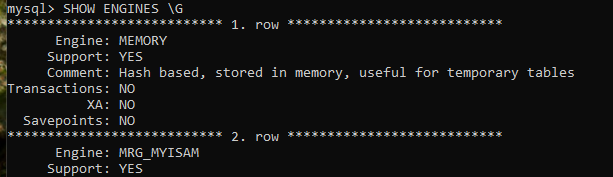

<h5 id="myisam" class="h5-especial margen-superior-interior">Motor Almacenamiento MyISAM Uso desaconsejado en la actualidad</h5>

Es una versión mejorada del Motor ISAM. MyISAM no permite transacciones, ni bloqueos menores a los realizados por una tabla completa. Tampoco permite restricciones de clave foránea entre tablas.

<ol class="ol-sin-romanos">
  <li>Más eficiente con número elevado de lecturas</li>
  <li>La Gestión de Almacenamiento se realiza con tres ficheros:
    <ol>
      <li>Fichero de Datos (.MYD)</li>
      <li>Fichero de Índices (.MYI)</li>
      <li>Fichero de Metadatos (.SDI)</li>
    </ol>
  </li>
  <li>Cada tabla va en un fichero: el tamaño máximo de la tabla es el que permita el sistema de ficheros de la partición, así como el número máximo de filas lo marca la capacidad del disco duro</li>
  <li>Opción de Reparación Automática (--myisam-recover-options=BACKUP,FORCE): esta opción permite reparar tablas si encuentran fallos cuando se inicia el servicio, algo que puede retardar la puesta en marcha</li>
</ol>

<!-- Salto de Página -->

<!---------------- PÁGINA 25 ---------------->

<h1>Configuración Parámetros Destacables</h1>

<ol class="ol-sin-romanos margen-superior-interior">
  <li>Opciones de Reparación Manual: 
    <ol>
      <li>Orden CHECK TABLE;</li>
      <li>Orden REPAIR TABLE;</li>
      <li>Utilidad myisamchk</li>
    </ol>
  </li>
  <li>Permite la inserción de filas mientras se realizan consultas de lectura</li>
  <li>Permite indexación de texto completo (FULLTEXT)
    <ol>
      <li>Tipos de Datos: CHAR, VARCHAR, TEXT y FULLTEXT</li>
      <li>Límite 500 caracteres</li>
      <li>No permite búsquedas con patrones (LIKE)</li>
    </ol>  
  </li>
  <li>Escrituras retrasadas de clave DELAY_KEY_WRITE
    <ol>
      <li>Los cambios de índices se almacenan en "buffer de índices"</li>
      <li>Mejora rendimiento en tablas con muchos accesos</li>
    </ol>  
  </li>
  <li>Compresión de Clave: almacena valores de cadenas similares sucesivas</li>
  <li>Opción Compresión de Tablas (Utilidad myisampack): las tablas se convierten en Sólo Lectura</li>
  <li>Tiene más funciones para columnas AUTO_INCREMENT</li>
</ol>

<h5 id="merge" class="h5-especial margen-superior-interior">MRG_MyISAM (MERGE) Uso desaconsejado en la actualidad</h5>

Agrupa varias tablas MyISAM en 'una tabla virtual'. La ventaja de este motor es que permite superar los límites en las tablas del motor MyISAM. Cabe destacar, que cuando se realiza una consulta a una tabla, esta actúa en toda la agrupación.

Ejemplo de Uso: Registro de Datos de Acceso a una Página Web, donde la información crece de manera exponencial. 'MERGE' permite optar por la creación de tablas mensuales, medida que reducirá el almacenamiento y el tiempo en las consultas. Al estar las doce tablas agrupadas, se podrá realizar una estadística anual teniendo en cuenta todas y cada una de las tablas.

<!-- Salto de Página -->

<!---------------- PÁGINA 26 ---------------->

<h1>Configuración Parámetros Destacables</h1>

<h5 id="memory" class="h5-especial margen-superior-interior">MEMORY</h5>

El motor MEMORY destaca por su alta velocidad al gestionar los datos directamente en la Memoria RAM, siendo útil para tablas de consulta rápida o almacenamiento temporal de datos no críticos.

<ol class="ol-sin-romanos">
  <li>Las tablas se almacenan en la Memoria RAM</li>
  <li>Las tablas se inician siempre limpias, porque residen en una memoria volátil</li>
  <li>Las filas de datos son de longitud fija, según lo indicado por la definición del tipo de dato utilizado (Ejemplo: Para una fila con tipo de dato VARCHAR(100), se reservan los 100 caracteres)</li>
</ol>

<h5 id="innodb" class="h5-especial margen-superior-interior">InnoDB</h5>

El motor de almacenamiento InnoDB es el más utilizado en la actualidad y el que aporta un máximo rendimiento al permitir procesar gran número de datos.

<ol class="ol-sin-romanos">
  <li>Permite búsquedas de texto con datos del tipo FULLTEXT</li>
  <li>Es muy eficiente con operaciones de grabación elevadas ya que los bloqueos se realizan a nivel de fila, permitiendo mucha más concurrencia</li>
  <li>Detecta automáticamente las Transacciones Sólo Lectura:
    <ol>
      <li>Transacciones Lectura-Escritura: llevan asignada una ID</li>
      <li>Transacciones Sólo Lectura: NO llevan asignada una ID</li>
    </ol>
  </li>
</ol>

<h5 class="margen-superior-interior">Estado de Transacciones Sólo Lectura</h5>

InnoDB permite habilitar el estado de "Transacciones Sólo Lectura" para un Cliente, para ello se deben realizar los siguientes pasos:

<ol class="ol-numerico">
  <li>Iniciar el estado 'Transacciones Sólo Lectura' con la orden: START TRANSACTION READ ONLY;</li>
  <li>Mientras dure este "paréntesis", se permitirán consultas, pero no creaciones ni inserciones de contenido</li>
  <li>Finalizar el estado 'Transacciones Sólo Lectura' con la orden: COMMIT;</li>
</ol>

<!-- Salto de Página -->

<!---------------- PÁGINA 27 ---------------->

<h1>Configuración Parámetros Destacables</h1>

Ejemplo "Transacciones Sólo Lectura": en las dos próximas imágenes se puede ver en el Cliente MySQL Workbench como al habilitar el estado de "Transacciones de Sólo Lectura", queda bloqueada la inserción de datos. Una vez cerrado este estado, la inserción vuelve a estar operativa.

<h5 align="center">Activación Transacciones Sólo Lectura</h5>

  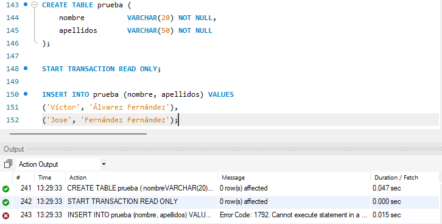

<h5 align="center" class="margen-superior-interior">Desactivación Transacciones Sólo Lectura</h5>

  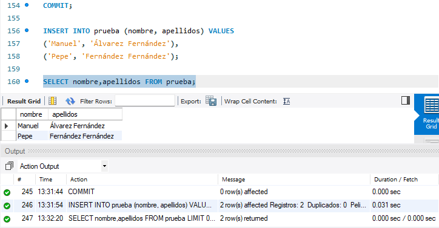

<!-- Salto de Página -->

<!---------------- PÁGINA 28 ---------------->

<h1>Configuración Parámetros Destacables</h1>

<h5 class="margen-superior-interior">Almacenamiento en InnoDB (Tablespace)</h5>

En el motor InnoDB las Tablas e Índices se almacenan en uno o varios conjuntos de archivos denominados "Tablespace" (TS), que el propio motor se encarga de gestionar.

Si en el equipo que actúa como servidor MySQL hay particiones de disco libres, estas se pueden destinar a este propósito.

En las versiones antiguas de MySQL, todo el Servidor se almacenaba por defecto en una única Tablespace (TS) que se encontraba ubicada en el directorio Data con el nombre ibdata1: C:\ProgramData\MySQL\MySQL Server 8.0\Data\ibdata1. El tamaño inicial de este fichero es de 12 MB.

  

Las versiones más recientes de MySQL tienen activada por defecto la opción innodb_file_per_table (innodb_file_per_table = 1). Esta característica habilita la creación de una Tablaspace (TS) por cada tabla contenida en el Servidor MySQL.

<ol class="ol-sin-romanos">
  <li>El contenido se clasifica por Bases de Datos</li>
  <li>Cada tabla tendrá su propio archivo con formato .ibd</li>
  <li>El archivo ibdata1 no dejará de existir, ya que es el encargado de cohesionar todas las Tablaspace (TS)</li>
</ol>

<!-- Salto de Página -->

<!---------------- PÁGINA 29 ---------------->

<h1>Configuración Parámetros Destacables</h1>

  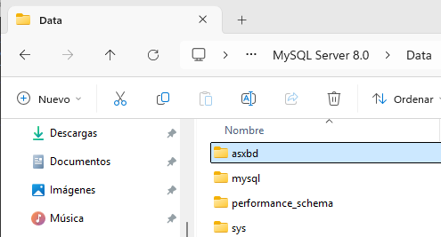

  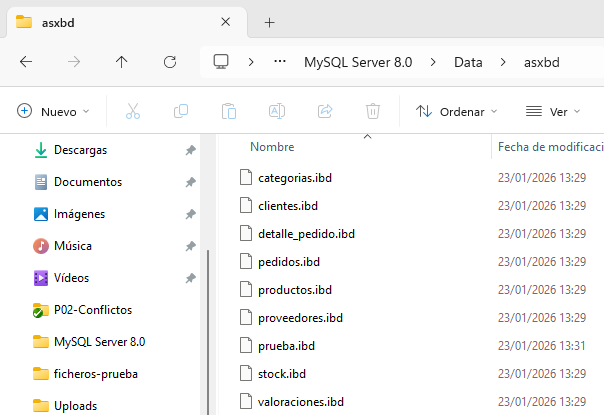

<!-- Salto de Página -->

<!---------------- PÁGINA 30 ---------------->

<h1>Configuración Parámetros Destacables</h1>

<h5 class="margen-superior-interior">Estado Transacciones Seguras</h5>

InnoDB permite habilitar el estado de "Transacciones Seguras" para que un cliente realice transacciones con la total tranquilidad de poder revertir los cambios en caso de error.

<ol class="ol-numerico">
  <li>Iniciar el estado 'Transacciones Seguras' con la orden: START TRANSACTION;</li>
  <li>Mientras el estado esté activo, se podrán realizar creaciones e inserciones</li>
  <li>Para finalizar este estado se deben confirmar las transacciones o deshacer los cambios:
    <ol class="ol-circle">
      <li>Deshacer cambios: ROLLBACK;</li>
      <li>Confirmar cambios: COMMIT;</li>
    </ol>
  </li>
</ol>

<h5 align="center">Deshacer Cambios en Transacciones Seguras</h5>

  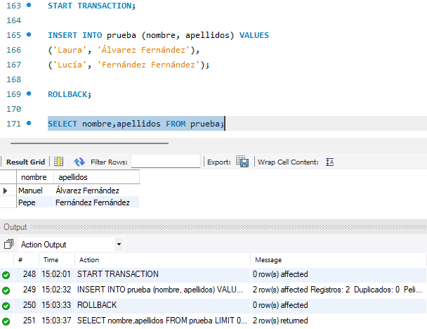

<!-- Salto de Página -->

<!---------------- PÁGINA 31 ---------------->

<h1>Configuración Parámetros Destacables</h1>

<h5 align="center" class="margen-superior-interior">Confirmar Cambios en Transacciones Seguras</h5>

  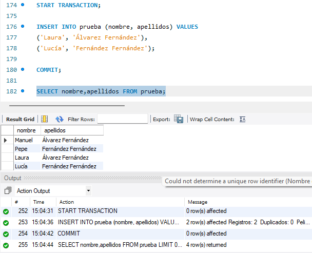

<h5 class="margen-superior-interior">InnoDB: Bloqueos Explícitos en Filas</h5>

InnoDB permite asegurar resgistros específicos sin impedir que otros usuarios trabajen con el resto de la tabla, mientras se realiza una consulta en el ámbito transaccional.

<ol class="ol-sin-romanos">
  <li>Bloqueo Compartido (FOR SHARE): Permite que otros lean la fila, pero nadie puede modificarla.</li>
  <li>Bloqueo Exclusivo (FOR UPDATE): Es un bloqueo total. Solo tú puedes leer y modificar esa fila. Los demás deben esperar a que tú termines (COMMIT o ROLLBACK) para poder acceder a ella.</li>
</ol>

<!-- Salto de Página -->

<!---------------- PÁGINA 32 ---------------->

<h1>Configuración Parámetros Destacables</h1>

<h5 align="center" class="margen-superior-interior">Bloqueo Compartido</h5>

  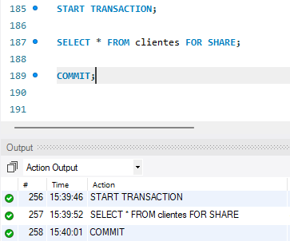

<h5 align="center" class="margen-superior-interior">Bloqueo Exclusivo</h5>

  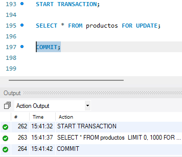

<!-- Salto de Página -->

<!---------------- PÁGINA 33 ---------------->

<h1>Configuración Parámetros Destacables</h1>

<h5 class="margen-superior-interior">InnoDB: Claves Foráneas</h5>

InnoDb permite las Claves Foráneas, que son columnas en una tabla "hija" que apuntan a la Clave Primaria de otra tabla "padre".

  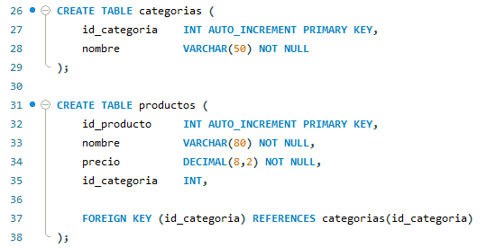

<h5 class="margen-superior-interior">InnoDB: Acciones en Cascada</h5>

Define qué debe pasar con los "hijos" cuando el "padre" cambia o desaparece. Se configuran con estas reglas:

<ol class="ol-sin-romanos">
  <li>ON DELETE CASCADE: Si borras al padre, MySQL borra automáticamente a todos sus hijos. Es ideal para limpiezas profundas</li>
  <li>ON UPDATE CASCADE: Si cambias el ID del padre, los IDs en las tablas hijas se actualizan solos para no perder la conexión</li>
  <li>ON DELETE SET NULL: Si borras al padre, los hijos se quedan, pero su columna de referencia se pone a NULL (quedan "huérfanos" pero no se borran)</li>
</ol>

<!-- Salto de Página -->

<!---------------- PÁGINA 34 ---------------->

<h1>Configuración Parámetros Destacables</h1>

<h5 align="center" class="margen-superior-interior">Inclusión de Acción en Cascada en Tabla "Hija"</h5>

  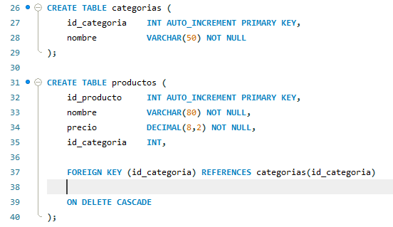

<h5 align="center" class="margen-superior-interior">Inserción de Datos en Tablas "Padre" e "Hija"</h5>

  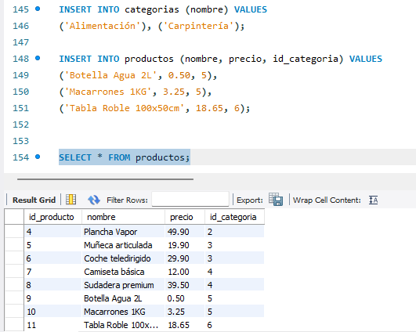

<!-- Salto de Página -->

<!---------------- PÁGINA 35 ---------------->

<h1>Configuración Parámetros Destacables</h1>

<h5 align="center" class="margen-superior-interior">Eliminación Datos en Tabla "Padre"</h5>

En la imagen se puede observar como al eliminar la categoría "5" de la tabla "categorias" (asociada a Alimentación), se han borrado los productos "Botella Agua 2L" y "Macarrones 1KG"; los cuales estaban vinculados con esa categoría.

  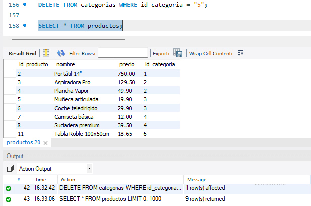

<h5 id="blackhole" class="h5-especial margen-superior-interior">BLACKHOLE</h5>

El motor BLACKHOLE se utiliza en escenarios específicos de replicación y auditoría, donde es necesario capturar operaciones de escritura sin persistir los datos localmente. Este motor descarta la información almacenada, pero registra todas las operaciones en el binary log.

<ol class="ol-sin-romanos">
  <li>Servidor BLACKHOLE: es el servidor MySQL que recibe las operaciones de escritura (INSERT, UPDATE, DELETE), pero no almacena los datos. Su función es generar eventos en el binary log que serán utilizados por otros servidores para reconstruir la información.</li>
</ol>

<!-- Salto de Página -->

<!---------------- PÁGINA 36 ---------------->

<h1>Configuración Parámetros Destacables</h1>

<ol class="ol-sin-romanos margen-superior-interior">
  <li>Servidor Real (InnoDB): replica desde el servidor BLACKHOLE y aplica los eventos del binary log, reconstruyendo los datos de forma persistente. Este servidor puede ser utilizado para consultas o como origen de nuevas réplicas.</li>
</ol>

  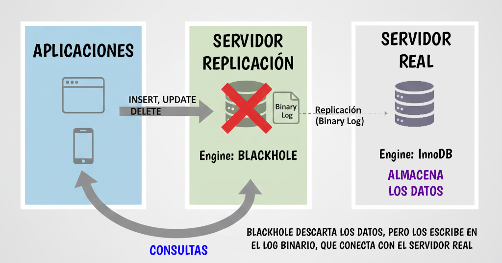

<h5 class="h5-especial margen-superior-interior">Otros Motores de Almacenamiento</h5>

<ol id="otrosmotores" class="ol-sin-romanos">
  <li>FEDERATED: NO está habilitado por defecto en MySQL (--federated). Este motor permite accesos a tablas remotas que gestionan otros motores.</li>
  <li>ARCHIVE: almacena filas que se escriben una vez y nunca se modifican.</li>
  <li>CSV: valores separados por comas. Este motor almacena cada tabla en un fichero con extensión .csv. Cada fila de la tabla ocupa una línea dentro de los ficheros.</li>
</ol>

<!-- Salto de Página -->

<!---------------- PÁGINA 37 ---------------->

<h1>Configuración Parámetros Destacables</h1>

<h4 id="confespacios">Configuración de Espacios de Almacenamiento</h4>

<h5 class="h5-especial">Directorio de Datos</h5>

MySQL guarda las Bases de Datos que se crean en el proceso de instalación del Servidor y por supuesto, las que se crean a posteriori.

El directorio de almacenamiento se suele establecer en el proceso de instalación, aunque también se puede añadir/modificar posteriormente en la directiva datadir dentro del Fichero de Configuración.

<h5 id="confinnodb" class="h5-especial">Motor InnoDB</h5>

Gestiona tres recursos: los Espacios para Tablas "Tablespace" (TS), la Caché y los Logs.

Los valores por defecto asociados a estos recursos son:

<ol class="ol-sin-romanos">
  <li>Espacios de Tablas (TS): 12 MB (autoextensible) - ibdata1</li>
  <li>Ficheros Log: 5 MB - ib_logfile0 - ib_logfile1</li>
</ol>

<h5 class="h5-especial margen-superior-interior">Configuración InnoDB (Fichero de Configuración)</h5>

<h5>Espacio para Tablas Compartido</h5>

innodb_data_file_path: define el nombre del fichero, el tamaño y los atributos de los Espacios para Tablas (TS).

Configuración por defecto: innodb_data_file_path = ibdata1:12M:autoextend

<h5>Espacio Temporal Global</h5>

innodb_temp_data_file_path: define el nombre del fichero, el tamaño y los atributos del Espacio Temporal para las Tablas.

Configuración por defecto: innodb_data_file_path = ibtmp1:12M:autoextend

<!-- Salto de Página -->

<!---------------- PÁGINA 38 ---------------->

<h1>Configuración Parámetros Destacables</h1>

<h5 class="margen-superior-interior">Tamaño de Página</h5>

innodb_page_size: define el tamaño de las páginas (la unidad mínimo de lectura-escritura).

Configuración por defecto (16 KB): innodb_page_size = 16384

<ol class="ol-sin-romanos">
  <li>16 KB: ideal para la mayoría de aplicaciones web</li>
  <li>4-8 KB: útil para cargas de trabajo con muchas escrituras pequeñas o ante la coincidencia con un tamaño de bloque del sistema de ficheros de la partición</li>
</ol>

  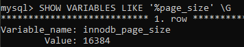

<h5>Tamaño de Caché</h5>

innodb_buffer_pool_size: define el área de la memoria RAM donde InnoDB almacena en caché tanto los datos de las tablas como sus índices.

Configuración por defecto: innodb_buffer_pool_size = 128M

<ol class="ol-sin-romanos">
  <li>Equipos con < 4GB RAM: 50% del tamaño de la RAM</li>
  <li>Equipos con 8-32 GB: 50-70% del tamaño de la RAM</li>
  <li>Equipos con más 32 GB: 75% del tamaño de la RAM</li>
</ol>

En la configuración de mi servidor he optado por establecer un valor de 2 GB. Aunque la MV tiene 6 GB, al ser un laboratorio de pequeñas pruebas he entendido que es una cantidad más que suficiente (33% de la RAM).

  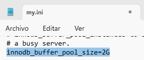

  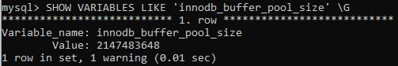

<!-- Salto de Página -->

<!---------------- PÁGINA 39 ---------------->

<h1>Configuración Parámetros Destacables</h1>

<h5 class="margen-superior-interior">Ficheros Log</h5>

innodb_log_files_in_group: define el número de ficheros log que utilziará InnoDB.

Configuración por defecto: innodb_log_files_in_group = 2

<ol class="ol-sin-romanos">
  <li>Tamaño del Buffer 1-8 GB: 1 Fichero Log / GB</li>
  <li>Tamaño del Buffer + 8 GB: 0,75 Ficheros Log / GB</li>
</ol>

  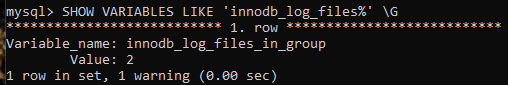

<h5 class="margen-superior-interior">Tamaño del Registro de Transacciones (Ficheros Log)</h5>

innodb_redo_log_capacity: define el tamaño del registro de transaccines (de los ficheros log).

Configuración por defecto (100 MB): innodb_redo_log_capacity = 100663296

Lo ideal es establecer un 25% del Tamaño del Buffer.

En la configuración de mi servidor he optado por establecer un tamaño de 1000MB para los dos Ficheros Log con los que contará.

  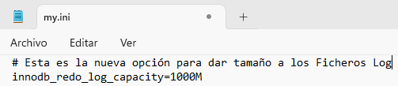

  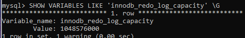

<!-- Salto de Página -->

<!---------------- PÁGINA 40 ---------------->

<h1>Configuración Parámetros Destacables</h1>

<h5 class="margen-superior-interior">Ruta del Directorio de los Ficheros Log</h5>

innodb_log_group_home_dir: define la ruta donde se almacenan los ficheros log.

Lo ideal es establecer una ruta distinta (a poder ser en otro disco duro) para aumentar el rendimiento.

En la configuración de mi servidor he optado por añadir un disco de 2 GB (recordamos que tenemos un máximo de 1000MB para los ficheros) y establecer ahí el directorio de los Ficheros Log.

También será necesario mover el directorio <#innodb_redo (ubicado en C:\ProgramData\MySQL\MySQL Server 8.0\Data\) con su contenido a la nueva ubicación, ya que MySQL no lo hace automáticamente. Esta acción es fundamental para poder iniciar el servicio con la nueva configuración.

  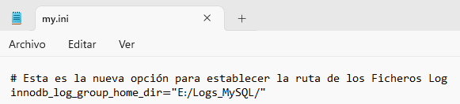

  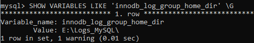

<!-- Salto de Página -->

<!---------------- PÁGINA 41 ---------------->

<h1>Configuración Parámetros Destacables</h1>

<h5 class="margen-superior-interior">Ver Espacio Reutilizable</h5>

Utilizando dentro de la Base de Datos deseada la orden SHOW TABLE STATUS \G, se obtiene información de interés sobre cada una de las tablas que contiene.

El campo Data_free nos indica el espacio reutilizable que tiene cada tabla.

  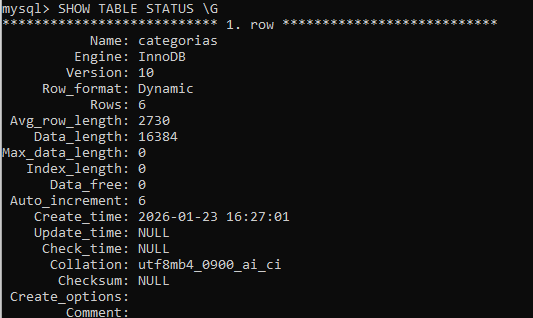

<h4 id="confmyisam" class="margen-superior-interior">Configuración MyISAM</h4>

Aunque no se recomienda el uso de este motor de almacenamiento, haremos alguna apreciación sobre su configuración.

La gestión del almacenamiento se realiza con tres ficheros, aunque nos centraremos en los Ficheros de Datos (.MYD) y de Índices (.MYI).

Con respecto a la Caché, utiliza la del Sistema Operativo donde está instalado el Servidor MySQL.

<!-- Salto de Página -->

<!---------------- PÁGINA 42 ---------------->

<h1>Configuración Parámetros Destacables</h1>

<h5 class="margen-superior-interior">Tamaño de Caché de Claves (Índices)</h5>

La opción key_buffer_size, indica el espacio de memoria RAM que MySQL reserva para almacenar los índices de las tablas MyISAM. Se recomienda establecer una cantidad que no supere el 25% de la Memoria RAM.

Si el valor de key_buffer_size es el adecuado, el servidor mostrará valores muy próximos a 0 en las siguientes variables:

<ol class="ol-sin-romanos">
  <li>key_reads: Lectura de Disco</li>
  <li>key_reads_request: Solicitudes Lectura de Disco</li>
  <li>key_write: Escritura de Disco</li>
  <li>key_write_request: Solicitudes de Escritura de Disco</li>
</ol>

<h5>Tamaño de cada Bloque de la Caché</h5>

La opción key_cache_block_size, es el tamaño de cada bloque de la caché. Por defecto esta cantidad es de 1024. Cuanto más grande sea el tamaño de los bloques, habrá menos desperdicio de caché de índices, pero se incrementará el número de bloques que no se leen, por eso es necesario equilibrarlo.

<h5>Cachés Diferenciadas</h5>

Se considera una buena práctica crear una caché diferenciada para las tablas que tengan más uso. Cada caché se asociará a un conjunto de variables del sistema:

<ol class="ol-sin-romanos">
  <li>key_buffer_size</li>
  <li>key_cache_block_size</li>
  <li>key_cache_limits</li>
  <li>key_cache_threshold</li>
</ol>

En el Fichero de Configuración será necesario hacer referencia a esas nuevas cachés, asociándolas con las variables correspondientes. Simplemente con su mención y la asignación de un valor, las nuevas cachés estarán operativas.

<!-- Salto de Página -->

<!---------------- PÁGINA 43 ---------------->

<h1>Configuración Parámetros Destacables</h1>

Ejemplo para la Caché de la Tabla prueba1:

<ol class="ol-sin-romanos">
  <li>prueba1.key_buffer_size = "valor"</li>
  <li>prueba1.key_cache_block_size = "valor"</li>
  <li>prueba1.key_cache_limits = "valor"</li>
  <li>prueba1.key_cache_threshold = "valor"</li>
</ol>

Las variables asociadas a la caché por defecto también se pueden mencionar con la misma sintaxis: default.key_buffer_size, aunque no es necesario.

<h5>Asignar una Tabla a una Caché</h5>

Se realizaría en un Cliente MySQL con la orden: CACHE INDEX tabla1, tabla2 IN prueba1;.

<h4 id="pordefecto">Definición Características por Defecto de una Base de Datos</h4>

<ol class="ol-sin-romanos">
  <li>Quitar InnoDB como motor por defecto: skip-innodb</li>
  <li>Añadir motor por defecto: store-engine = "motor"</li>
  <li>Conjunto de Caracteres por defecto: character_set_database = "conjunto"</li>
</ol>

<!-- Salto de Página -->

<!---------------- PÁGINA 44 ---------------->

<h1>Configuración Parámetros Destacables</h1>

<h4 id="accesoremoto">Configuración de Acceso Remoto SGBD</h4>

<h5>Configuración en el Servidor</h5>

Instalador MySQL Installer (Windows): será necesario activar la opción TCP/IP y el Puerto durante el proceso de instalación.

Fichero de Configuración (Windows y Linux): establecer la variable "port" y asignarle el valor del puerto deseado para la escucha. Es fundamental tener también comentada (#) la variable skip-networking.

<h5>Configuración Clientes en formato Consola</h5>

Aunque ya se realizó en la práctica de instalación de MySQL, recordamos que para que un usuario puede acceder de manera remota habrá hacer una modifación en el host de acceso. Por defecto cuando se crea un usuario, este se crea para el servidor local (localhost).

En el ejemplo que se muestra a continucación se procede a crear un nuevo usuario denominado "remoto" y a modificar el usuario "estudiante". Las órdenes utilizadas serán:

<ol class="ol-sin-romanos">
  <li>Creación Nuevo Usuario: CREATE USER 'remoto'@'%' IDENTIFIED BY 'abc123.';</li>
  <li>Modificación Usuario: ALTER USER 'estudiante'@'%' IDENTIFIED BY 'abc123.';</li>
</ol>

  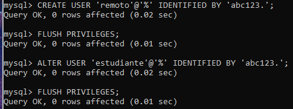

<!-- Salto de Página -->

<!---------------- PÁGINA 45 ---------------->

<h1>Configuración Parámetros Destacables</h1>

<h5 class="margen-superior-interior">Configuración Cliente MySQL Workbench</h5>

La configuración en MySQL Workbench es muy sencilla. En el campo Hostname será necesario colocar la Dirección IP donde está ubicado el equipo que contiene el Servidor MySQL Workbench, así como el puerto de escucha. También, pondremos el nombre del usuario con capacidad para acceder de manera remota.

  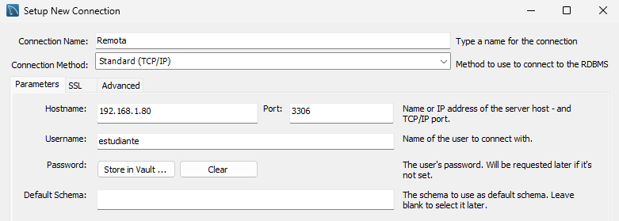

  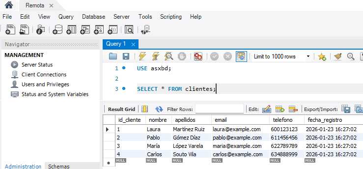

<!-- Salto de Página -->

<!---------------- PÁGINA 46 ---------------->

<h1>Configuración Parámetros Destacables</h1>

<h5 class="margen-superior-interior">Establecimiento de Conexiones de Acceso desde la Consola</h5>

Para acceder desde una consola se pueden utilizar diferentes opciones:

<ol class="ol-sin-romanos">
  <li>Host del Servidor: --host / -h</li>
  <li>Puerto de Acceso: --port -P</li>
  <li>Contraseña: --password / -p</li>
  <li>Usuario: --user / -u</li>
</ol>

  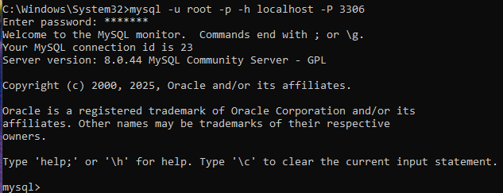

<!-- Salto de Página -->

<!---------------- PÁGINA 47 ---------------->

<h1>Configuración Parámetros Destacables</h1>

<h4 id="politica">Política de Contraseñas</h4>

<h5>Caducidad de la Contraseña</h5>

En el Fichero de Configuración y a través de la opción default-password-lifetime se puede establecer una caducidad para las contraseñas de usuario. Si el valor es '0', estas nunca caducarán.

  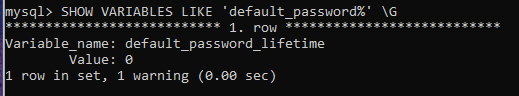

Además, desde un Cliente MySQL podemos asignar una caducidad a un usuario concreto con la orden: ALTER USER 'usuario'@'host' PASSWORD EXPIRE INTERVAL 90 DAY;.

  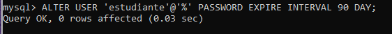

<h5>Acceso con Contraseña Caducada</h5>

En el Fichero de Configuración y a través de la opción disconnect_on_expired_password se puede permitir que un usuario se conecte cuando su contraseña está caducada. El objetivo es que la renueve tras su conexión.

<ol class="ol-sin-romanos">
  <li>Valor 0: Permite conexión</li>
  <li>Valor 1: NO permite conexión</li>
</ol>

<h5>Reutilización de Contraseñas</h5>

En el Fichero de Configuración y a través de la opción password_history se puede habilitar/deshabilitar la reutilización de contraseñas.

<ol class="ol-sin-romanos">
  <li>Valor 0: Permite repetir contraseñas</li>
  <li>Valor 1: NO permite repetir contraseñas</li>
</ol>

<!-- Salto de Página -->

<!---------------- PÁGINA 48 ---------------->

<h1>Configuración Parámetros Destacables</h1>

<h5 class="margen-superior-interior">Intervalo de días para poder Reutilizar la Contraseña</h5>

En el Fichero de Configuración y a través de la opción password_rescue_interval se puede establecer el número de días que tienen que pasar para poder volver a usar una contraseña anterior.

<h5>Petición de Contraseña Actual para Establecer una Nueva Contraseña</h5>

En el Fichero de Configuración y a través de la opción password_require_current se puede habilitar/deshabilitar la petición de la contraseña actual para establcer una nueva.

<ol class="ol-sin-romanos">
  <li>Valor OFF: Desactivado</li>
  <li>Valor ON: Ativado</li>
</ol>

  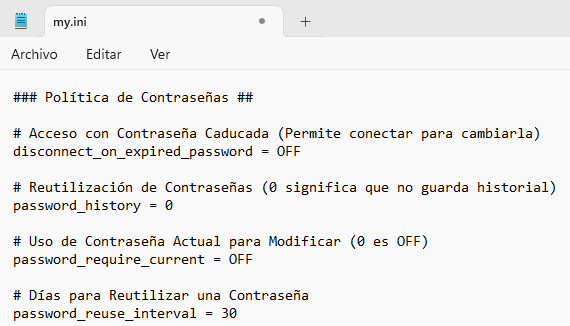

  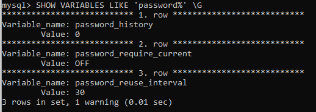

<!-- Salto de Página -->

<!---------------- PÁGINA 49 ---------------->

<h1 id="diccionario">Estructura del Diccionario de Datos</h1>

Los Metadatos muestran la informacion de los datos almacenados en el Servidor MySQL (nombres de las Bases de Datos, nombres de las Tablas, Tipos de Datos, Permisos de Accceso, ...).

Toda esta información se puede ver a través de las múltiples posibilidades de la orden SHOW, pero también se puede acceder a ella cosultando la Bases de Datos INFORMATION_SCHEMA.

<h4>Base de Datos INFORMATION_SCHEMA</h4>

Está constituida con acceso de Sólo Lectura (Consultas), autorizando de esta manera que los usuarios de la Base de Datos tengan acceso sólamente a las filas permitidas.

<h5>Ventajas</h5>

<ol class="ol-sin-romanos">
  <li>Datos almacenados en Tablas</li>
  <li>Consultas con la sentencia SELECT</li>
  <li>Gran flexibilidad en consultas de metados</li>
  <li>Facilita la migración desde otras Bases de Datos</li>
</ol>

<h5>Ver Bases de Datos almacenadas en el Servidor</h5>

SELECT SCHEMA_NAME FROM INFORMATION_SCHEMA.SCHEMATA;

<ol class="ol-sin-romanos">
  <li>SCHEMA_NAME: Columna</li>
  <li>INFORMATION_SCHEMA: Base de Datos</li>
  <li>SCHEMATA: Tabla</li>
</ol>

  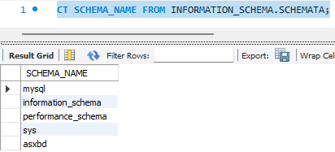

Esto equivale a la orden: SHOW DATABASES;

<!-- Salto de Página -->

<!---------------- PÁGINA 50 ---------------->

<h1>Estructura del Diccionario de Datos</h1>

<h5 class="margen-superior-interior">Ver Todas las Tablas y Columnas de INFORMATION_SCHEMA</h5>

SHOW TABLES FROM INFORMATION_SCHEMA;

  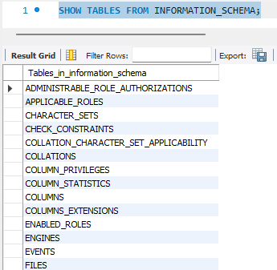

Ejemplo Mostrar Tablas de una Base de Datos: SELECT * FROM INFORMATION_SCHEMA.TABLES WHERE TABLE_SCHEMA = "asxbd";

<ol class="ol-sin-romanos">
  <li>*: Columna (Todas)</li>
  <li>INFORMATION_SCHEMA: Base de Datos</li>
  <li>TABLES: Tabla</li>
  <li>TABLE_SCHEMA: Columna (asxbd)</li>
</ol>

  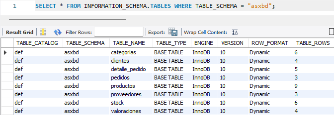

<!-- Salto de Página -->

<!---------------- PÁGINA 51 ---------------->

<h1>Estructura del Diccionario de Datos</h1>

Ejemplo Mostrar Columnas de una Tabla de una Base de Datos: SELECT * FROM INFORMATION_SCHEMA.COLUMNS WHERE TABLE_SCHEMA = "asxbd";

<ol class="ol-sin-romanos">
  <li>*: Columna (Todas)</li>
  <li>INFORMATION_SCHEMA: Base de Datos</li>
  <li>COLUMNS: Tabla</li>
  <li>TABLE_NAME: Columna (clientes)</li>
</ol>

  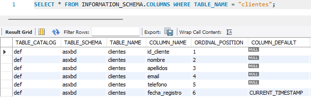

<h5>Relaciones de Equivalencia más destacadas: SHOW - INFORMATION_SCHEMA</h5>

  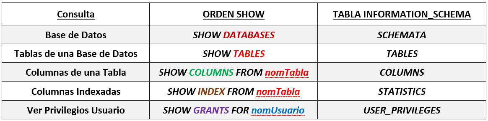

<!-- Salto de Página -->

<!---------------- PÁGINA 52 ---------------->

<h1 id="ficheroslog">Ficheros Log</h1>

Por defecto todos los Ficheros de Registro (Log) se almacenan en el directorio Data. Esta ruta se puede modificar tanto en el Fichero de Configuración ("my.ini" en Windows y "my.cnf" en Linux), como en la Línea de Comandos.

La opcion más recomendable es realizarlo a través del Fichero de Configuración, pero si se hace desde la Línea de Comandos hay que tener en cuenta que esto sólo estará permitido si el Servidor MySQL no está instalado como servicio del Sistema Operativo desde MySQL Installer.

<h5>Opciones de Configuración</h5>

<ol class="ol-sin-romanos">
  <li>Activar Registro de Consultas: general_log=1</li>
  <li>Registro de Consultas: general_log_file="ruta"</li>
  <li>Activar Registro Consultas Lentas: slow_query_log=1</li>
  <li>Registro Consultas Lentas: slow_query_log_file="ruta"</li>
  <li>Registro de Errores: log_error="ruta"</li>
  <li>Registro Binario (Operaciones modificación): log-bin="ruta"</li>
</ol>

<h5>Formato de los Ficheros Log</h5>

Además, en el Fichero de Configuración podemos activar un el formato corto o resumido asignándole a la opción el valor "1":

<ol class="ol-sin-romanos">
  <li>Formato Resumido: log_short_format</li>
  <li>Formato Largo: log_long_format</li>
</ol>

<h5>Limpieza de Contenido de los Ficheros Log</h5>

Cuando se realice algún cambio en las rutas o cuando se desee reiniciar el contenido de los Ficheros Log se recomienda introducir en el Servidor MySQL la orden: FLUSH LOGS;

<h5>Recomendaciones</h5>

<ol class="ol-sin-romanos">
  <li>Activar los Registros y Configurar las Rutas en el Fichero de Configuración</li>
  <li>Habilitar los Ficheros Log para que se inicien con el Servidor</li>
  <li>Almacenar los Ficheros Logs en una ruta diferente a la de los Datos</li>
</ol>

<!-- Salto de Página -->

<!---------------- PÁGINA 53 ---------------->

<h1 id="ficheroslog">Ficheros Log</h1>

<h5>Configuración Realizada</h5>

A la hora de realizar la configuración de las nuevas rutas es importante tener en cuenta varias cosas:

<ol class="ol-sin-romanos">
  <li>Los directorios de las rutas deben estar creados con anterioridad</li>
  <li>El usuario NT SERVICE\MySQL debe contar con permisos y control total en esos directorios</li>
</ol>

  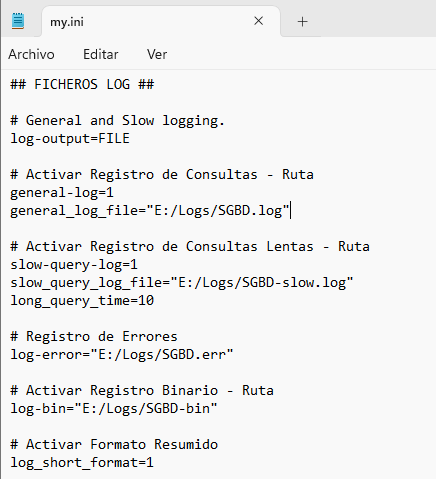

<!-- Salto de Página -->

<!---------------- PÁGINA 54 ---------------->

<h1 id="documentacion">Documentación de la Instalación</h1>

<h5 class="margen-superior-interior">Copia de Seguridad Fichero de Configuración</h5>

Cuando se finalice la configuración, será de gran utilidad realizar una Copia de Seguridad de los Ficheros de Configuración. Se recomienda que esta copia se aloje en otros discos o medios por si se requiere un rescate de esa documentación.

<h5>Lista de Valores de las Variables</h5>

Otra buena práctica consistirá en realizar una extracción de los valores de las variables (de sesión y globales) que utiliza el Servidor MySQL.

  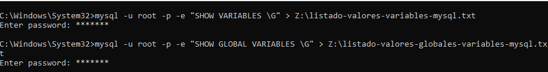

<h5 class="margen-superior-interior">Enlaces de Documentación Configuración</h5>

<ol class="ol-sin-romanos margen-superior-interior">
  <li class="purple"><a href="documentos-backup/my.ini" target="_blank">Copia de Seguridad de la Configuración</a></li>
  <li class="purple"><a href="documentos-backup/listado-valores-variables-mysql.txt" target="_blank">Listado Valores de Sesión de las Variables</a></li>
  <li class="purple"><a href="documentos-backup/listado-valores-globales-variables-mysql.txt" target="_blank">Listado Valores Globales de las Variables</a></li>
</ol>

<!-- Salto de Página -->

<!---------------- PÁGINA 55 ---------------->

<h1 id="resumen">Resumen Variables más Importantes</h1>

  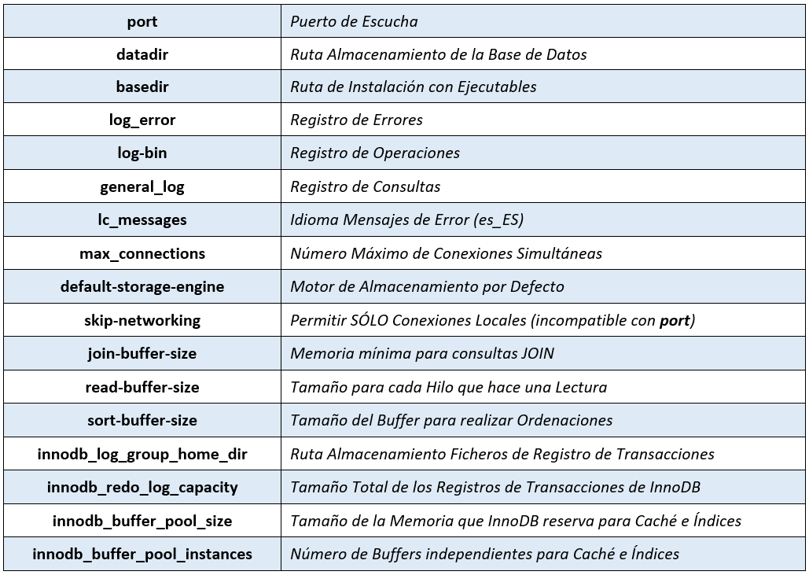

<!-- Salto de Página -->

<!---------------- PÁGINA 56 ---------------->

<h1 id="usuarios">Consulta de Usuarios y Privilegios</h1>

  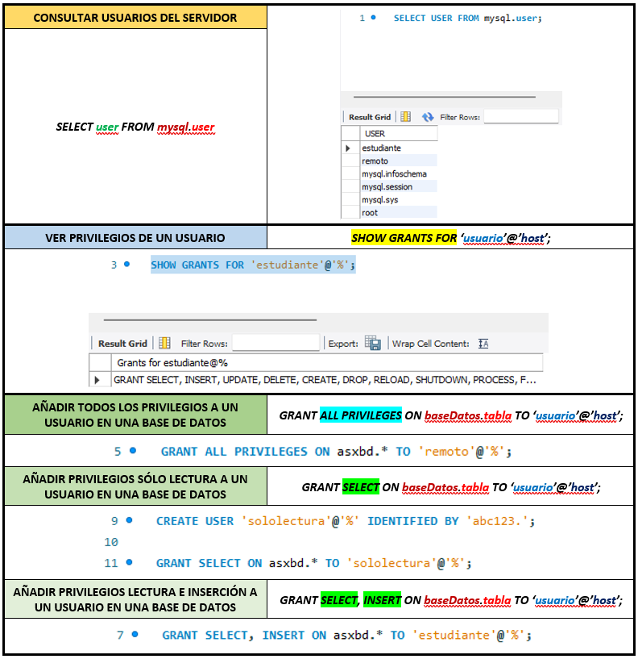

