<!---------------- PÁGINA 1 ---------------->

<!-- Título Principal (** Texto en Negrita **) -->
  <!-- Los Títulos Principales incorporan 
  una línea debajo que ocupa todo el ancho -->
# **2º ASIR - ASXBD**

<!-- Imagen del IES Lois Peña Novo -->

  

<!-- Subtítulo -->
## VÍCTOR ÁLVAREZ FERNÁNDEZ

<!-- Subapartados -->

  <h3 class="titulos-subapartados">Unidad:</h3>
    <h3 class="texto-subapartados">Unidad 2 - Configuración de un SGBD</h3>
  <h3 class="titulos-subapartados">Práctica:</h3>
    <h3 class="texto-subapartados">P21-Configuración-MySQL</h3>
  <h3 class="titulos-subapartados">Fecha:</h3>
    <h3 class="texto-subapartados">23 de Enero de 2026</h3>

<footer>
  <h6>Víctor Álvarez Fernández - ASXBD - 2º ASIR</h6>
</footer>

<!-- Salto de Página -->

<!---------------- PÁGINA 2 ---------------->

<!-- Contiene anclajes a los diferentes ejercicios (están en siguientes páginas) -->
# **Índice**

<ul class="indice">
  <li><a href="#procesos">Procesos y Servicios</a>
    <ul>
      <li><a href="#cierre">Proceso de Cierre</a></li>
      <li><a href="#inicio">Proceso de Inicio</a></li>
      <li><a href="#servicios">Servicios que MySQL proporciona</a>
        <ul>
          <li><a href="#clientemysql">Cliente mysql</a></li>
          <li><a href="#mysqladmin">Utilidad mysqladmin (Administrador)</a></li>
          <li><a href="#mysqlcheck">Utilidad mysqlcheck (Chequeador)</a></li>
          <li><a href="#mysqldump">Utilidad mysqldump (Backup Secuencial)</a></li>
          <li><a href="#mysqlpump">Utilidad mysqlpump (Backup Multi-Hilo)</a></li>
          <li><a href="#mysqlimport">Utilidad mysqlimport (Importador)</a></li>
          <li><a href="#mysqlshow">Utilidad mysqlshow (Información)</a></li>
          <li><a href="#mysqlslap">Utilidad mysqlslap (Diagnóstico)</a></li>
        </ul>
      </li>
    </ul>
  </li>
  <li><a href="#configuracion">Configuración del Servidor</a>
    <ul>
      <li><a href="#lineacomandos">Uso de Opciones en Línea de Comandos</a></li>
      <li><a href="#ficherosconfiguracion">Uso de los Ficheros de Configuración</a></li>
      <li><a href="#variablesentorno">Uso de Variables de Entorno</a></li>
      <li><a href="#opcionesmysqld">Opciones Servidor mysqld</a></li>
      <li><a href="#modossql">Modos SQL del Servidor</a></li>
      <li><a href="#variablessistema">Variables de Sistema</a></li>
      <li><a href="#variablesestado">Variables de Estado</a></li>
    </ul>
  </li>
  <li><a href="#parametrosdestacables">Configuración Parámetros Destacables</a></li>
</ul>

<!-- Salto de Página -->

<!---------------- PÁGINA 3 ---------------->

<h1 id="procesos">Procesos y Servicios SGBD</h1>

Los procesos más importantes en un Sistema Gestor de Bases de Datos (SGBD) son los de inicio y cierre (parada).

<h4 id="cierre">Proceso de Cierre</h4>

<h5>1º/ Inicio del Proceso de Cierre</h5>

El proceso de cierre 'seguro' se puede ralizar de varias maneras:

<ol class="ol-sin-padding-sup-inf">
  <li>Utilidad mysqladmin: ejecutando la utilidad mysqladmin desde una consola (válido tanto para Linux como para Windows)</li>
  <li>Realizando una parada del Servicio: 
    <ol>
      <li>S.O. Windows: net stop MySQL80 o desde la Consola de Servicios</li>
      <li>S.O. Linux: systemctl stop mysql</li>
    </ol>
  </li>
  <li>Cliente MySQL Workbench: pulsando dentro del menú INSTANCE en Startup/Shutdown (esta opción es menos recomendable, porque aunque ejecutemos el cliente como administrador, este a veces se queda "trabado" y no procede al cierre)</li>
  </ol>

  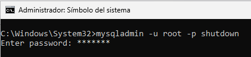
  
I

  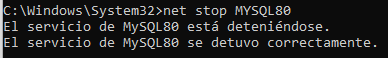
  
II

  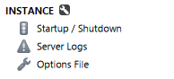
  
III

<h5 class="margen-superior-interior">2º/ Creación de Subproceso de Apagado</h5>

El subproceso de apagado es necesario si el cierre se hace desde el Cliente MySQL Workbench o desde la utilidad mysqladmin (línea de comandos). Todo esto se realiza de manera automática y no se requiere ninguna configuración adicional.

<!-- Salto de Página -->

<!---------------- PÁGINA 4 ---------------->

<h1>Procesos y Servicios SGBD</h1>

<h5 class="margen-superior-interior">3º/ Servidor no acepta más conexiones</h5>

Cuando se realiza el proceso de cierre, el Servidor deja de aceptar conexiones: Cierra los puertos (TCP/IP), los sockets (si estamos en un S.O. Linux), las tuberías (si estamos en un S.O. Windows) y la memoria compartida.

<h5>4º/ Servidor cancela las conexiones con los Clientes</h5>

Cualquier subproceso asociado pasa al estado de "muerto".

<ol class="ol-sin-padding-sup-inf">
  <li>Transacciones Abiertas: se cancelan y se deshacen para no generar conflictos.</li>
  <li>Procesos UPDATE o INSERT: se realiza una actualización parcial, hasta donde le haya dado tiempo a realizar la última inserción o actualización.</li>
  <li>Parada de un Maestro: se realiza el mismo tratamiento tanto a los procesos asociados al maestro, como a los esclavos.</li>
  <li>Parada de un Esclavo (Servidor Replicación): 
    <ol>
      <li>Se paran los subprocesos de E/S y SQL</li>
      <li>Se marcan como "muertos" los subprocesos en el Cliente</li>
      <li>Se permite la finalización de la Consulta SQL</li>
      <li>Se cancelan y deshacen las Transacciones Abiertas</li>
    </ol>
  </li>
</ol>

<h5 class="margen-superior-interior red">VER LISTA DE PROCESOS</h5>

Para ver la lista de procesos bastará con utilizar dentro del servidor la orden SHOW PROCESSLIST;.

Otra alternativa es el uso de la utilidad mysqladmin -u root -p proc en la línea de comandos. El resultado en ambos casos será el mismo.

  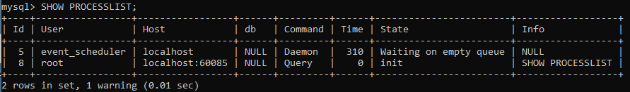

<!-- Salto de Página -->

<!---------------- PÁGINA 5 ---------------->

<h1>Procesos y Servicios SGBD</h1>

<h4 id="inicio" class="margen-superior-interior">Proceso de Inicio</h4>

El proceso para iniciar el servicio asociado a MySQL se puede realizar desde:

<ol class="ol-sin-padding-sup-inf">
  <li>Línea de Comandos: 
    <ol>
      <li>S.O. Windows: net start MySQL80 o desde la Consola de Servicios</li>
      <li>S.O. Linux: systemctl start mysql</li>
    </ol>
  </li>
  <li>Reiniciando / Iniciando el equipo que acoge el Servidor MySQL.</li>
</ol>

  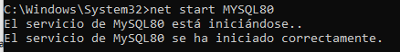

<h4 id="servicios" class="margen-superior-interior">Servicios que MySQL proporciona</h4>

<h5 id="clientemysql" class="red">Cliente mysql</h5>

Permite la ejecución de diferentes maneras:

<ol class="ol-sin-padding-sup-inf">
  <li>Interactiva: utilizando la opción -e para ejecutar una orden: mysql -u root -p -e "SELECT * FROM asxbd.clientes;"</li>
  <li>Desde un fichero: mysql -u root -p < fichero-prueba1.sql"</li>
</ol>

  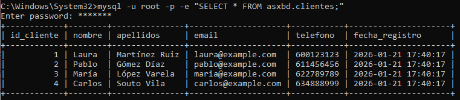
  
I

  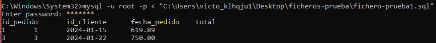
  
II

  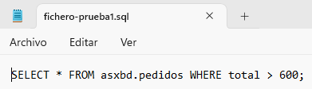

<!-- Salto de Página -->

<!---------------- PÁGINA 6 ---------------->

<h1>Procesos y Servicios SGBD</h1>

<h5 id="mysqladmin" class="red margen-superior-interior">Utilidad mysqladmin (Administrador MySQL)</h5>

Esta utilidad permite desde la línea de comandos:

<ol class="ol-sin-padding-sup-inf">
  <li>Crear / Borrar Bases de Datos: mysqladmin -u root -p CREATE prueba | mysqladmin -u root -p DROP prueba</li>
  <li>Recargar Permisos: mysqladmin -u root -p FLUSH-PRIVILEGES</li>
  <li>Volcar Tablas a Disco: mysqladmin -u root -p FLUSH-TABLES</li>
  <li>Volcar Ficheros Log: mysqladmin -u root -p FLUSH-LOG</li>
  <li>Consultar la Versión Instalada: mysqladmin -u root -p VERSION</li>
  <li>Ver los Subprocesos: mysqladmin -u root -p PROCESSLIST</li>
  <li>Ver el estado del Servidor: mysqladmin -u root -p STATUS</li>
  <li>Apagar el Servidor: mysqladmin -u root -p SHUTDOWN</li>
</ol>

  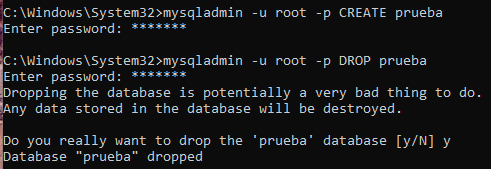
  
I

  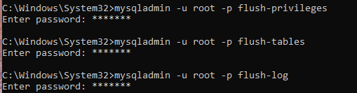
  
II

  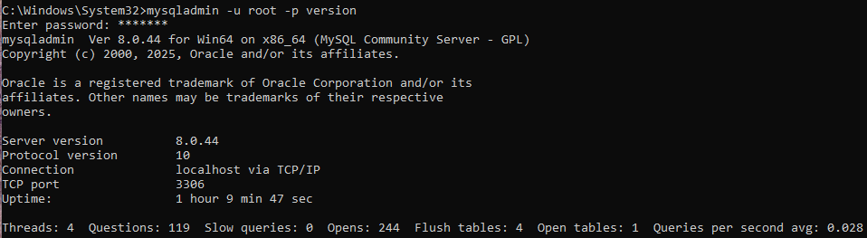
  
V

<!-- Salto de Página -->

<!---------------- PÁGINA 7 ---------------->

<h1>Procesos y Servicios SGBD</h1>

  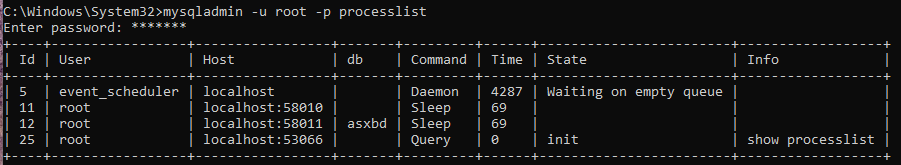
  
VI

  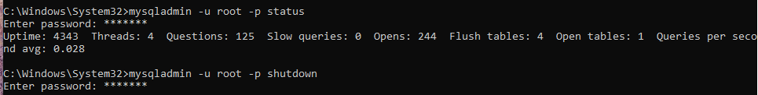
  
VII

<h5 id="mysqlcheck" class="red margen-superior-interior">Utilidad mysqlcheck (Chequeador MySQL)</h5>

<ol class="ol-sin-padding-sup-inf">
  <li>Verifica Tablas buscando errores: mysqlcheck -u root -p -c asxbd</li>
  <li>Analiza Tablas: mysqlcheck -u root -p -a asxbd</li>
  <li>Repara Tablas (no habilitada en InnoDB)</li>
  <li>Optimiza Tablas (no habilitada en InnoDB)</li>
</ol>

  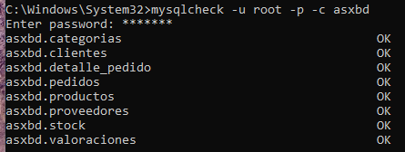
  
I

  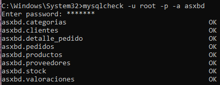
  
II

<!-- Salto de Página -->

<!---------------- PÁGINA 8 ---------------->

<h1>Procesos y Servicios SGBD</h1>

<h5 id="mysqldump" class="red margen-superior-interior">Utilidad mysqldump (Backup Secuencial)</h5>

Trabaja de forma secuencial (un solo hilo). Esto significa que procesa una tabla detrás de otra. Si tenemos una tabla con mucha información, todas las demás tendrán que esperar su turno.

<ol class="ol-sin-padding-sup-inf">
  <li>Backup Esquema y Datos: mysqldump -u root -p asxbd > esquema-datos.sql</li>
  <li>Backup Sólo del Esquema: mysqldump -u root -p -d asxbd > esquema.sql</li>
  <li>Backup Sólo de los Datos: mysqldump -u root -p -t asxbd > datos.sql</li>
</ol>

  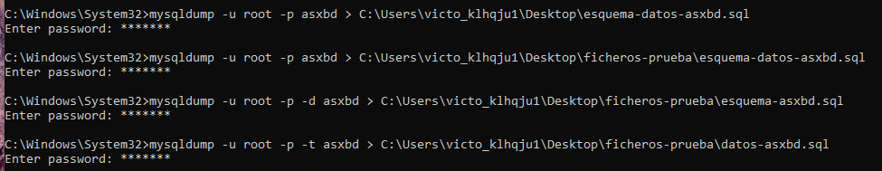

<h5 id="mysqlpump" class="red margen-superior-interior">Utilidad mysqlpump (Backup Multi-Hilo)</h5>

Es multihilo, lo que se traduce en que realiza el volcado de varias tablas en paralelo, reduciendo drásticamente el tiempo de exportación en servidores con muchos núcleos de CPU.

Su filtro es mucho más potente para realizar backups personalizados. También, permite comprimir la salida (output) mientras se genera, ahorrando tiempo de escritura en disco.

mysqlpump -u root -p asxbd > backup-pump.sql

  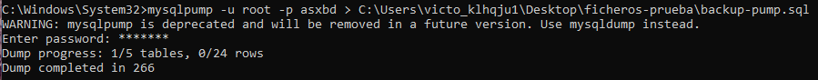

Antes de comenzar el proceso de backup, nos hace una advertencia para decirnos que Oracle dejará pronto de dar soporte a esta utilidad para sustituirla por MySQL Shell.

<!-- Salto de Página -->

<!---------------- PÁGINA 9 ---------------->

<h1>Procesos y Servicios SGBD</h1>

<h5 id="mysqlimport" class="red margen-superior-interior">Utilidad mysqlimport (Importador de Datos)</h5>

<ol class="ol-sin-romanos">
  <li>El fichero tiene que llamarse igual que la tabla donde se insertarán los datos.</li>
  <li>El fichero tiene que estar almacenado en la ruta UPLOADS del Servidor MySQL.</li>
  <li>Debe estar habilitada la directiva local_infile=1 en el Fichero de Configuración de Opciones (Sección [mysqld]).</li>
</ol>

Cuando se habilita la directiva local_infile=1, es recomendable tener los Clientes cerrados (MySQL Workbench, MySQL Shell o el cliente MySQL a través de la Línea de Comandos).

  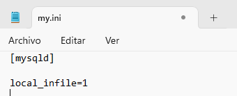

También, será necesario ejecutar dentro de uno de los Clientes MySQL la orden SET GLOBAL local_infile = 1;.

  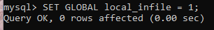

Realizamos la importación: mysqlimport -u root -p --local --fields-terminated-by="," --lines-terminated-by="\r\n" --columns=nombre,apellidos,email,telefono asxbd "C:\ProgramData\MySQL\MySQL Server 8.0\Uploads\clientes.txt".

  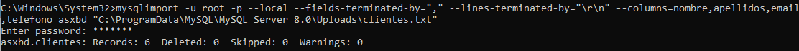

Para poder hacer la importación de manera satisfactoria, he tenido que realizar una labor de investigación que me ha llevado a incluir las opciones --lines-terminated-by="\r\n" (mueve el cursor al principio de la línea y baja de línea), --fields-terminated-by="," (indica el separador de campos del fichero) y --columns= (indica los nombre de las columnas de la tabla).

<!-- Salto de Página -->

<!---------------- PÁGINA 10 ---------------->

<h1>Procesos y Servicios SGBD</h1>

  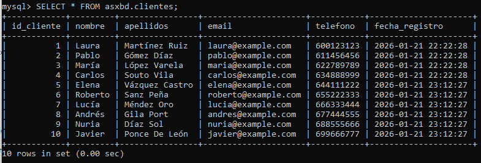

<h5 id="mysqlshow" class="red margen-superior-interior">Utilidad mysqlshow (Información BD)</h5>

Muestra información sobre Bases de Datos, Tablas, Columnas, Índices, ...

Si nuestra intención es ver las bases de datos de nuestro Servidor MySQL, ejecutamos el siguiente comando: mysqlshow -u root -p .

  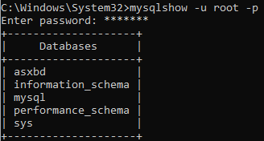

Para el resto de posibilidades la sintaxis es jerárquica: base de datos - tabla. Por ejemplo, para ver la base de datos asxbd: mysqlshow -u root -p asxbd.

  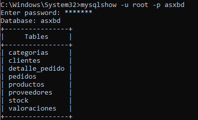

<!-- Salto de Página -->

<!---------------- PÁGINA 11 ---------------->

<h1>Procesos y Servicios SGBD</h1>

Vamos a ver ahora la tabla stock de la base de datos asxbd: mysqlshow -u root -p asxbd stock.

  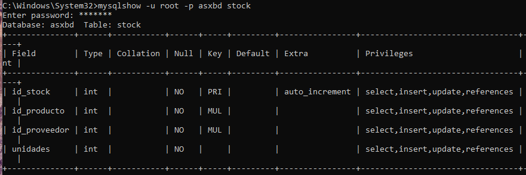

Si nuestra intención es ver los índices creados en una tabla se añade la opción -k. Por ejemplo: mysqlshow -u root -p -k asxbd clientes.

<h5 id="mysqlslap" class="red margen-superior-interior">Utilidad mysqlslap (Diagnóstico)</h5>

Es un programa de diagnóstico, que emula la carga de datos desde diferentes clientes y con múltiples interacciones desde cada uno de ellos.

Ejemplo 1: Simulación de la creación de tablas, inserción de contenido y la realización de consultas por parte de 50 clientes, cada uno con 200 interacciones. mysqlslap -u root -p --delimiter=";" --create="CREATE TABLE a (b INT); INSERT INTO a VALUES (23)" --query="SELECT * FROM a" --concurrency=50 --iterations=200.

  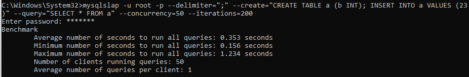

<!-- Salto de Página -->

<!---------------- PÁGINA 12 ---------------->

<h1>Procesos y Servicios SGBD</h1>

Ejemplo 2: Simulación de la creación de una tabla con 2 columnas de tipo numérico y 3 columnas de tipo carácter. El emulador autogenerará el contenido. La concurrencia será de 5 clientes y 200 interacciones/cliente. mysqlslap -u root -p --number-int-cols=2 --number-char-cols=3 --auto-generate-sql --concurrency=5 --iterations=20.

  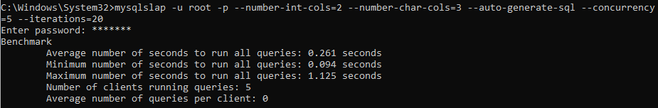

Ejemplo 3: Simulación de la carga de contenido desde dos ficheros sql con instrucciones de creación y consulta respectivamente. mysqlslap -u root -p --delimiter=";" --create=C:\Users\victo_klhqju1\Desktop\ficheros-prueba\create.sql --query=C:\Users\victo_klhqju1\Desktop\ficheros-prueba\query.sql --concurrency=5 --iterations=5.

  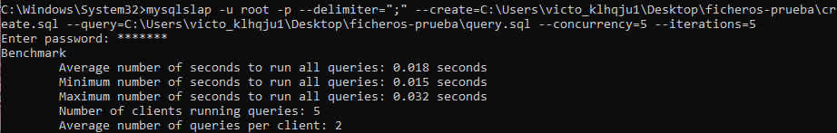

Resumen de las Opciones más utilizadas

<ol class="ol-sin-romanos">
  <li>--create: se utiliza para añadir o actualizar contenido de manera directa o a través de un fichero.</li>
  <li>--query: se utiliza para realizar consultas de manera directa o a través de un fichero.</li>
  <li>--delimiter: indica el delimitador que se utilizará para crear o actualizar el contenido.</li>
  <li>--auto-generate-sql: se utiliza para autogenerar el contenido. Será necesario complementarlo con los tipos de datos que se desean.</li>
  <li>--number-int-cols: indica el número de datos de tipo numérico.</li>
   <li>--number-char-cols: indica el número de datos de tipo carácer.</li>
  <li>--concurrency: indica el número de clientes que concurrirán.</li>
  <li>--iterations: indica el número de interacciones por cliente.</li>
</ol>

<!-- Salto de Página -->

<!---------------- PÁGINA 13 ---------------->

<h1 id="configuracion">Configuración del Servidor</h1>

La Configuración del Servidor se puede realizar desde la Línea de Comandos, desde el Fichero de Configuración de Opciones del Servidor ("my.ini" en Windows y "my.cnf" en Linux) y por supuesto desde las Variables de Entorno.

<h5>Orden de Comprobación para el Inicio del Servicio MySQL</h5>

<ol class="ol-sin-romanos">
  <li>1º/ Variables de Entorno</li>
  <li>2º/ Fichero de Configuración de Opciones</li>
  <li>3º/ Línea de Comandos</li>
</ol>

<h5>Orden de Prioridad de los Métodos de Configuración</h5>

<ol class="ol-sin-romanos">
  <li>1º/ Línea de Comandos</li>
  <li>2º/ Ficheros de Configuración de Opciones</li>
  <li>3º/ Variables de Entorno</li>
</ol>

Recomendación: lo adecuado sería realizar la configuración en el Fichero de Configuración ("my.ini" o "my.cnf"). Si durante la sesión se requiere alguna modificación puntual, se debe acudir a la Línea de Comandos.

<h4 id="lineacomandos">Uso de Opciones en Línea de Comandos</h4>

<ol class="ol-sin-romanos">
  <li>Las opciones pueden comenzar por - o por -- (estas van seguidas de un = y el valor que se quiere asignar a dicha opción)</li>
  <li>Lista de opciones de un programa: nombrePrograma --help</li>
  <li>Valores relacionados con bytes: K (KB) - M (MB) - G (GB)</li>
  <li>Espaces: \b (Retroceso) - \t (Tabulador) - \n (Salto de Línea) - \r (Principio de Línea) - \\ (Barra) - \s (Espacio en Blanco) </li>
  <li>Opciones para Deshabilitar:
    <ol>
      <li>-disable: -disable-column-names</li>
      <li>-skip: -skip-networking</li>
      <li>Valor 0: flush-time=0</li>
    </ol>
  </li>
    <li>Opciones para Habilitar:
    <ol>
      <li>-enable: -enable-column-names</li>
      <li>Valor 1: flush-time=1</li>
    </ol>
  </li>
</ol>

<!-- Salto de Página -->

<!---------------- PÁGINA 14 ---------------->

<h1 id="configuracion">Configuración del Servidor</h1>

<ol class="ol-sin-romanos margen-superior-interior">
  <li>Prefijo --loose: se utiiza para evitar que el servidor de MySQL se detenga si no reconoce una opción</li>
</ol>

<h4 id="ficherosconfiguracion">Uso de Fichero de Configuración de Opciones</h4>

Este es el lugar donde se debe realizar la configuración principal del Servidor MySQL. En Windows, si no se ha modificado la ruta, podemos encontrarlo habitualmente en: C:\ProgramData\MySQL\MySQL Server 8.0\my.ini; y en Linux en /etc/mysql/my.cnf.

<ol class="ol-sin-romanos">
  <li>No usa prefijos iniciales: port = 3306</li>
  <li>[] indican el inicio de una sección y llevan dentro el nombre de un programa: [mysqld]</li>
  <li>Permite espacios alrededor del = cuando se va a asignar un valor: host = localhost</li>
  <li>Las opciones con nombres compuestos a las cuales se les asigna un valor utilizan _: max_connections = 255</li>
  <li>Las opciones activación/desactivación utilizan -: skip-networking</li>
  <li>Las líneas vacías y/o que utilicen # se ignoran: # socket=MySQL</li>
</ol>

<h5>Inclusión de Ficheros de Configuración dentro de otros</h5>

MySQL permite incluir líneas dentro de los ficheros de comunicación que llamen a otros ficheros o directorios para implementar otras opciones.

<ol class="ol-sin-romanos">
  <li>Llamamiento a Ficheros (!include rutaFichero): !include /home/alumno/miconf.cnf</li>
  <li>Llamamiento a Directorios (!include rutaDirectorio): !include /home/alumno/configuraciones/</li>
</ol>

<h5>Otras Opciones en Línea de Comandos</h>

<ol class="ol-sin-romanos">
  <li>Indicarle a un Programa que no lea la configuración por defecto (--no-defaults): mysqladmin --no-defaults</li>
  <li>Indicarle a un Programa que use un Fichero de Configuración Concreto (--default-file="ruta"): mysqladmin --defaults-file=C:\ProgramData\MySQL\MySQL Server 8.0\configuracion.ini</li>
  <li>Impresión de Valores por Defecto: mysql --print-defaults</li>
</ol>

<!-- Salto de Página -->

<!---------------- PÁGINA 15 ---------------->

<h1 id="configuracion">Configuración del Servidor</h1>

<h4 id="variablesentorno">Uso de Variables de Entorno</h4>

Las Variables de Entorno, aunque tienen menor prioridad que los Ficheros de Configuración y la Línea de Comandos; en el orden de comprobación cuando se inicia el Servidor MySQL son el 'primer espada'.

Es decir, si en los ficheros de configuración no se indica ningún valor, los que se cargarán serán los que aporten las Variables de Entorno.

Estos valores se pueden fijar de manera permanente o mientras el Servidor y/o Clientes estén activos.

  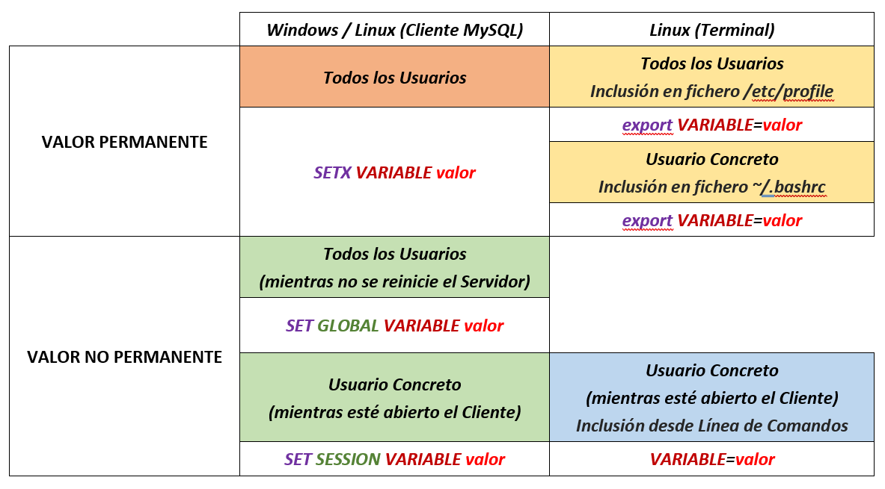

<h5 class="margen-superior-interior">Variables de Entorno más utilizadas en MySQL</h5>

<ol class="ol-sin-romanos">
  <li>MYSQL_HOST: Nombre del equipo que acoge el Servidor</li>
  <li>USER: Usuario que se conecta en el Cliente</li>
  <li>MYSQL_PWD: Contraseña del Cliente</li>
  <li>MYSQL_TCP_PORT: Puerto de Conexión</li>
  <li>PATH: Programas que usa MySQL</li>
</ol>

<!-- Salto de Página -->

<!---------------- PÁGINA 16 ---------------->

<h1 id="configuracion">Configuración del Servidor</h1>

<h4 id="opcionesmysqld">Opciones Servidor (mysqld)</h4>

El servidor (mysqld) lee las opciones introducidas desde la Línea de Comandos, las habilitadas en los Ficheros de Configuración y por supuesto las establecidas en las Variables.

En lo referente a los ficheros de configuración, se centra únicamente en las secciones [mysqld] y [server].

Si queremos ver una lista de las Variables con las que trabaja nuestro Servidor MySQL, basta con acceder desde un cliente y teclear la orden: SHOW VARIABLES \G;

  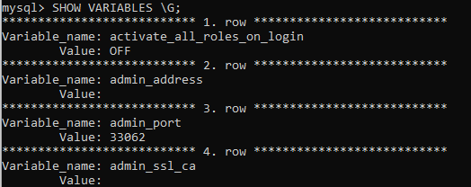

<h5 class="margen-superior-interior">Opciones de Configuración para mysqld</h5>

Las opciones introducidas desde la Línea de Comandos son temporales y se realizan de manera muy puntual para obtener un resultado durante un periodo concreto.

<ol class="ol-sin-romanos">
  <li>Ruta de Instalación: --basedir="ruta"</li>
  <li>Ruta de Almacenaje BDs: --datadir="ruta"</li>
  <li>Motor de Almacenamiento por Defecto: --default-storage-engine="tipo"</li>
  <li>Escritura en Disco de todos los Datos de cada sentencia SQL: --flush</li>
  <li>Lista de Tareas para Ejecutar al Arrancar/Reiniciar el Servidor: --init-file="rutaFichero"
    <ol>
      <li class="cursiva">Útil para insertar datos en una tabla</li>
      <li class="cursiva">Cambiar contraseña del usuario "root"</li>
    </ol>
  </li>
</ol>

<!-- Salto de Página -->

<!---------------- PÁGINA 17 ---------------->

<h1 id="configuracion">Configuración del Servidor</h1>

<ol class="ol-sin-romanos margen-superior-interior">
  <li>Idioma de los Mensajes de Error: --lc-messages="idioma" (es_ES)</li>
  <li>Puerto de Escucha: --port="puerto"</li>
  <li>Restricción para crear usuarios: --safe-user-create</li>
  <li>Desactivar Tablas de Permisos (útil para cambiar contraseña al root): --skip-grant-tables</li>
  <li>Deshabilitar Escucha de Puerto: --skip-networking</li>
  <li>Establecer Ruta al Socket (Linux): --socket="ruta"</li>
  <li>Establecer una Ruta para las Tablas Temporales: --temp-dir="ruta"</li>
  <li>Permitir que se ejecute el Servidor MySQL como el usuario del S.O. (Sólo Linux): --user="usuario"</li>
  <li>Habilitar Importación Datos Masivos desde un Fichero: --local-infile</li>
</ol>

Ejemplo Cambio de Idioma Mensajes de Error: Accedemos al Fichero de Configuración e incluímos en la sección [mysqld] la opción lc-messages=es_ES para establecer el idioma español, ya que predefinidamente está en inglés.

  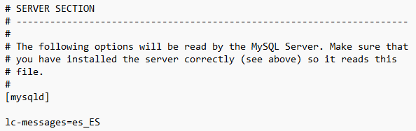

  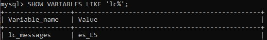

<!-- Salto de Página -->

<!---------------- PÁGINA 18 ---------------->

<h1 id="configuracion">Configuración del Servidor</h1>

<h4 id="modossql">Los Modos SQL del Servidor</h4>

Definen el tipo de sintaxis que debe usar el Servidor MySQL. Esta característica permite que MySQL se pueda usar en entornos diferentes. Es decir, puede hacer compatible MySQL con otros entornos.

<ol class="ol-sin-romanos">
  <li>El servidor puede trabajar en diferentes modos</li>
  <li>El servidor permite hacer combinaciones de varios modos</li>
  <li>El servidor permite que cada cliente tenga su propia configuración</li>
</ol>

Los modos se puede establecer a través de la opción --sql-mode="modos" en la Línea de Comandos, sql-mode = "modos" en el Fichero de Configuración o con el comando SET [SESSION|GLOBAL] sql_mode="modos"; en las Variables.

Para poder ver los modos que están activos en el Servidor MySQL se puede teclear la sentencia SHOW VARIABLES LIKE 'sql_mode'.

  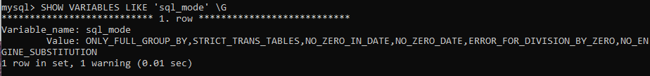

<h4 id="variablessistema">Variables del Sistema del Servidor</h4>

Las Variables del Sistema del Servidor son el lugar donde el Servidor MySQL (mysqld) almacena la configuración. Los nombres de estas opciones suelen coincidir tanto en la Línea de Comandos, como en los Ficheros de Configuración, e incluso en las Variables; pero no siempre es así.

Por ejemplo, el Motor de Almacenamiento se puede asignar a través de las opciones --default-storage-engine (Línea de Comandos), default_storage_engine (Ficheros de Configuración) y default_storage_engine (Variable).

  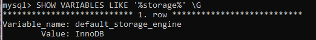

<!-- Salto de Página -->

<!---------------- PÁGINA 19 ---------------->

<h1 id="configuracion">Configuración del Servidor</h1>

<h5 class="margen-superior-interior">Variables Dinámicas</h5>

Como ya vimos anteriormente, la modificación de los valores de la variables se puede realizar de manera distinta en Windows y en Linux. Linux ofrece la posibilidad de modificar el valor desde la propia Línea de Comandos sin tener que acceder a un Cliente MySQL, mientras que en Windows esta operación sólo se puede realizar desde un Cliente MySQL con la instrucción SET [SESSION|GLOBAL] VARIABLE = valor;

Esta instrucción no permite que se añadan sufijos en el caso de tener que introducir cantidades para referirnos a KB, MB o GB; teniendo que expresar estas cantidades en bytes o utilizando múltiplos para alcanzar el resultado deseado.

Ejemplo Asignación Tamaño del Buffer de Lectura: si queremos establecer en la variable read_buffer_size la cantidad de 2MB, tendremos que expresarla en bytes: 2*1024*1024. El resultado de la orden sería: SET GLOBAL read_buffer_size=2*1024*1024;

<h5>Tipos de Variables Dinámicas</h5>

<ol class="ol-sin-romanos">
  <li>Globales: afectan al comportamiento general del Servidor MySQL.
    <ol>
      <li>Obtienen los valores en el Proceso de Inicio del servicio</li>
      <li>Para modificar estos valores se requiere tener privilegios</li>
      <li>Los cambios afectarán a todos los Clientes</li>
      <li>Los nuevos valores tendrán efecto en los Clientes que ya estaban conectados cuando se abra una nueva sesión</li>
    </ol>
  </li>
  <li>Sesión: afectan al comportamiento del Cliente que se conecta.
    <ol>
      <li>Obtienen los valores de las Variables Globales</li>
      <li>No se requieren permisos especiales para su modificación</li>
      <li>Los nuevos valores tendrán efecto inmediato en todos los Clientes</li>
    </ol>
  </li>
</ol>

Si cuando se introduce la orden en el Cliente MySQL no se indica el tipo de variable, por defecto se entiende que es de 'SESSION'.

Valor Default: muchas variables permiten su uso volver a los valores por defecto.

<!-- Salto de Página -->

<!---------------- PÁGINA 20 ---------------->

<h1 id="configuracion">Configuración del Servidor</h1>

<h5 class="margen-superior-interior">Orden de Lectura Variables Globales</h5>

<ol class="ol-sin-romanos">
  <li>1º/ Valor por Defecto (Inicio del Servicio)</li>
  <li>2º/ Valor establecido en el fichero de configuración</li>
  <li>3º/ Valor introducido por Línea de Comandos</li>
  <li>4º/ Valor modificado con la orden SET GLOBAL</li>
</ol>

<h5>Prioridad Variables Globales</h5>

<ol class="ol-sin-romanos">
  <li>1º/ Valor modificado con la orden SET GLOBAL</li>
  <li>2º/ Valor introducido por Línea de Comandos</li>
  <li>3º/ Valor establecido en el fichero de configuración</li>
  <li>4º/ Valor por Defecto (Inicio del Servicio)</li>
</ol>

<h5 class="margen-superior-interior">Orden de Lectura Variables de Sesión</h5>

<ol class="ol-sin-romanos">
  <li>1º/ Valor de la Variable Global</li>
  <li>2º/ Valor modificado con la orden SET SESSION</li>
</ol>

<h5>Prioridad Variables de Sesión</h5>

<ol class="ol-sin-romanos">
  <li>1º/ Valor modificado con la orden SET SESSION</li>
  <li>2º/ Valor de la Variable Global</li>
</ol>

<h5 class="margen-superior-interior">Valores Máximos</h5>

Se pueden utilizar en variables que permitan modificación en tiempo de ejecucion, aplicando en ellas el prefijo --maximum.

Ejemplo: --maximum-net-buffer-length

Esta variable controla el tamaño máximo del buffer que MySQL utiliza para enviar y recibir datos a través de la red.

  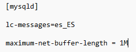

<!-- Salto de Página -->

<!---------------- PÁGINA 21 ---------------->

<h1 id="configuracion">Configuración del Servidor</h1>

<h4 id="variablesestado">Variables de Estado del Servidor</h4>

Estas variables proporcionan información del estado del Servidor MySQL. Hay dos tipos: de Sesión y Globales.

  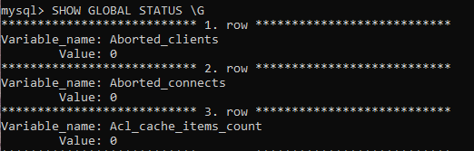

Orden FLUSH STATUS;: es una herramienta fundamental para la depuración de rendimiento. Su función es resetar los contadores de las variables de etado, permitiendo iniciar las mediciones desde cero.

  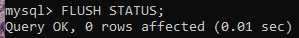

<h4 class="margen-superior-interior">Conclusiones de la Gestión del Servidor MySQL (mysqld)</h4>

En entornos Windows, la gestión del servidor MySQL se realiza de forma óptima a través del servicio MYSQL80, lo que impide la ejecución directa del comando mysqld desde la línea de comando.

Por este motivo, la metodología adecuada para aplicar configuraciones permanentes se debe realizar en el Fichero de Configuración, donde se permite el uso de múltiplos (K, M, G) y prefijos como maximum para limitar recursos.

Para modificaciones temporales sin reinicio, se debe emplear el comando SET desde el cliente MySQL: el nivel GLOBAL afecta a todas las conexiones futuras, mientras que el nivel SESSION permite realizar ajustes temporales en el usuario actual.

<!-- Salto de Página -->

<!---------------- PÁGINA 22 ---------------->

<h1 id="configuracion">Configuración del Servidor</h1>

<h4>Variables: Distinción y Usos</h4>

La administración de un Servidor de MySQL requiere distinguir cuatro categorías de variables según su naturaleza y propósito.

En primer lugar, las Variables de Entorno, que pertenecen al sistema operativo y configuran el contexto previo al inicio del programa.

Una vez en ejecución, el motor utiliza Variables de Sistema para realizar ajustes, las cuales se dividen en estáticas (ejemplos: basedir, port, ...) que exigen un reinicio para su aplicación; y dinámicas, que permiten ajustes en caliente mediante comandos SET a nivel Global o de Sesión.

Por último, existen las Variables de Estado, que a diferencia de las anteriores son indicadores de solo lectura que actúan como contadores en tiempo real para la monitorización del rendimiento.

<!-- Salto de Página -->

<!---------------- PÁGINA 23 ---------------->

<h1 id="parametrosdestacables">Configuración Parámetros Destacables</h1>

