<!---------------- PÁGINA 1 ---------------->

<!-- Título Principal (** Texto en Negrita **) -->
  <!-- Los Títulos Principales incorporan 
  una línea debajo que ocupa todo el ancho -->
# **2º ASIR - ASXBD**

<!-- Imagen del IES Lois Peña Novo -->

  

<!-- Subtítulo -->
## VÍCTOR ÁLVAREZ FERNÁNDEZ

<!-- Subapartados -->

  <h3 class="titulos-subapartados">Unidad:</h3>
    <h3 class="texto-subapartados">Unidad 3 - Acceso a la Información</h3>
  <h3 class="titulos-subapartados">Práctica:</h3>
    <h3 class="texto-subapartados">P31-Acceso-Información</h3>
  <h3 class="titulos-subapartados">Fecha:</h3>
    <h3 class="texto-subapartados">11 de Febrero de 2026</h3>

<footer>
  <h6>Víctor Álvarez Fernández - ASXBD - 2º ASIR</h6>
</footer>

<!-- Salto de Página -->

<!---------------- PÁGINA 2 ---------------->

<!-- Contiene anclajes a los diferentes ejercicios (están en siguientes páginas) -->
# **Índice**

<ol class="indice">
  <li><a href="#caracteristicas">Características de Seguridad</a></li>
  <li><a href="#interna">Seguridad Interna</a></li>
  <li><a href="#externa">Seguridad Externa</a>
    <ul>  
      <li><a href="#vistas">Vistas</a>
        <ul>
          <li><a href="#creacion">Creación</a></li>
          <li><a href="#restricciones">Restricciones</a>
          <li><a href="#check">Verificaciones</a>
          <li><a href="#with">Claúsula de Seguridad</a>
          <li><a href="#algorithm">Claúsula Algorithm</a>
          <li><a href="#modificacion-borrado">Modificación y Borrado</a>
          <li><a href="#esquema">Esquema de Creación</a>
          <li><a href="#workbench">Creación en MySQL Workbench</a>
          <li><a href="#operaciones">Operaciones Autorizadas</a>
          <li><a href="#semantica">Restricciones Semánticas y Sintácticas</a>
        </ul>
      </li>
      <li><a href="#sinonimos">Sinónimos</a></li>
      <li><a href="#cifrado">Técnicas de Cifrado</a></li>
      <li><a href="#autorizaciones">Gestión de Autorizaciones</a>
        <ul>
          <li><a href="#bdmysql">Base de Datos mysql</a></li>
          <li><a href="#usuario">Cuentas de Usuario</a>
          <li><a href="#privilegios">Sentencias para Mostrar Privilegios</a>
          <li><a href="#derechos-privilegios">Tipos de Derechos / Privilegios</a>
          <li><a href="#permisos">Asignación / Revocado de Permisos</a>
          <li><a href="#limitaciones">Limitación de Recursos</a>
          <li><a href="#roles">Roles</a>
          <li><a href="#autenticacion">Mecanismos de Autenticación</a>
        </ul>
      </li>
    </ul>
  </li>
</ol>

<!-- Salto de Página -->

<!---------------- PÁGINA 3 ---------------->

<h1 id="caracteristicas">Características de Seguridad</h1>

La persona administradora de la SGBD tratará de proteger el acceso al directorio de datos y al servidor.

<h4>Seguridad Interna</h4>

Trata de bloquear una instalación para impedir que accedan persona no autorizadas en local.

<h5>Ataques Posibles: Sistema de Ficheros</h5>

<ol class="ol-sin-romanos">
  <li>Copias / Eliminación de Tablas</li>
  <li>Lecturas de Información Delicada</li>
</ol>

<h4>Seguridad Externa</h4>

Se centra en problemas que pueden surgir con clientes que se conectan en remoto. Sus objetivos son establecer Políticas de Acceso a la Base de Datos a través de sentencias y Configurar el Servidor para que admita conexiones seguras a través de los protocolos SSL/TLS.

<ol class="ol-sin-romanos">
  <li>Conceder Permisos: GRANT</li>
  <li>Retirar Permisos: REVOKE</li>
</ol>

<h4>Control de Integridad</h4>

El administrador es el responsable de: 

<ol class="ol-sin-romanos">
  <li>Crear Vistas: CREATE VIEW</li>
  <li>Gestión de Transacciones</li>
  <li>Acceso Concurrente:
    <ol>
      <li>BEGIN WORK</li>
      <li>COMMIT / ROLLBACK</li>
      <li>LOCK TABLE</li>
    </ol>
  </li>
</ol>

<!-- Salto de Página -->

<!---------------- PÁGINA 4 ---------------->

<h1 id="interna">Seguridad Interna</h1>

<h4>Recomendaciones</h4>

<ol class="ol-sin-romanos">
  <li>Crear un usuario en la instalación para que se ejectute en el servidor. NO debe ser "root"</li>
  <li>Cambiar el propietario del directorio de datos (Data)</li>
  <li>Asignar una contraseña al usuario "root" de MySQL</li>
</ol>

<h4>Protección Socket en GNU/Linux</h4>

<ol class="ol-sin-romanos">
  <li>Proteger el directorio por defecto /tmp/mysql.sock para que sólo puedan borrar ficheros los propietarios. Para ello se debe establecer el "StickyBit" en el directorio /tmp con el comando chmod +t /tmp</li>
  <li>Cambiar la ruta del fichero socket. Se realiza actualizando la sección [mysqld] del fichero de configuración my.cnf, con la directiva socket = /path/to/socket</li>
</ol>

<h4>Protección Ficheros de Opciones de MySQL en GNU/Linux</h4>

Estos ficheros SÓLO deben estar accesibles para el administrador y el propietario.

<!-- Salto de Página -->

<!---------------- PÁGINA 5 ---------------->

<h1 id="externa">Seguridad Externa: Vistas</h1>

Una vista es una tabla "virtual" que es percibida por los usuarios y que permite recoger datos de una o de varias tablas.

<ol class="ol-sin-romanos">
  <li>Información siempre actualizada (no se almacena en disco)</li>
  <li>Se puede crear una vista partiendo de una tabla o de otras vistas</li>
</ol>

<h5>¿Por qué destacan?</h5>

<ol class="ol-sin-romanos">
  <li>Confidencialidad: sólo muestran datos concretos y no permiten el acceso a ciertas columnas</li>
  <li>Integridad Referencial y de Cuentas de Usuario: CHECK (compila, pero no ejectua)</li>
  <li>Integridad del Dominio: no permite visualizar/actualizar más que los datos que pertecen a un dominio. Ejemplo: Clientes cuya población sea Lugo</li>
  <li>Flexibilidad: factila la resolución de sentencias no soportadas por las consultas SELECT</li>
</ol>

<h4 id="creacion">Creación de Vistas</h4>

Sintaxis: CREATE VIEW nomVista [columnas_virtuales] AS sentencia_SELECT [WITH [CASCADE|LOCAL] CHECK OPTION]

Por defecto, las vistas se crean en la Base de Datos que está seleccionada en ese momento. Por ello, para crear una vista en otra Base de Datos se recomienda preceder el nombre de la Base de Datos antes del nombre de la vista, para no tener que entrar y salir en la Base de Datos deseada. Ejemplo: asxbd.nomVista.

En uno de los próximos ejemplos que mostramos, se ha creado la vista descuentos que cuenta con las columnas 'virtuales' producto y precio que tienen una relación 1:1 con las columnas nombre y "precio*0.7" extraídas de la consulta realizada sobre la tabla productos. Este ejemplo es ideal para demostrar la importancia de las vistas, que permiten agilizar las consultas y/o mejorar la información contenida en las tablas.

<!-- Salto de Página -->

<!---------------- PÁGINA 6 ---------------->

<h1>Seguridad Externa: Vistas</h1>

<h4>Tipos de Vistas</h4>

<h5>Referidas a Tablas Base</h5>

  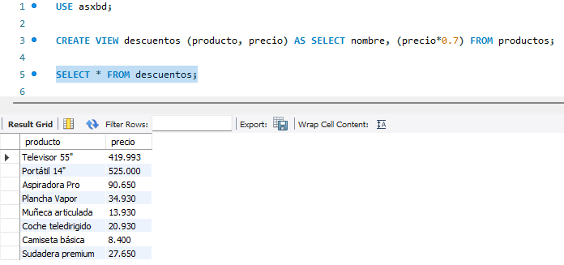

<h5>Referidas a otras Vistas</h5>

  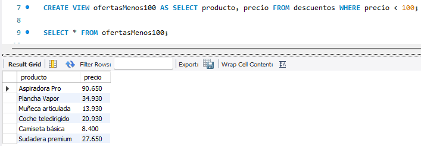

<!-- Salto de Página -->

<!---------------- PÁGINA 7 ---------------->

<h1>Seguridad Externa: Vistas</h1>

<h5>Uso de JOINs</h5>

  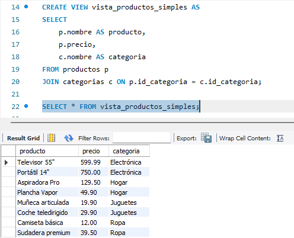

<h5>Uso de SubConsultas</h5>

  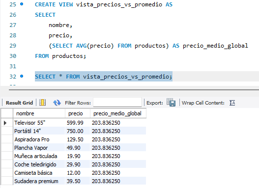

<!-- Salto de Página -->

<!---------------- PÁGINA 8 ---------------->

<h1>Seguridad Externa: Vistas</h1>

<h4 id="restricciones">Restricciones de las Vistas</h4>

<ol class="ol-sin-romanos">
  <li>La setencia SELECT no puede referirse a variables de sistema ni cuentas de usuario</li>
  <li>La sentencia SELECT no puede hacer referencia a tablas temporales</li>
  <li>Las vistas no se pueden asociar disparadores</li>
  <li>Si la definición se encuentra en un procedimiento almacenado, no puede hacer referencia a parámetros o variables locales del procedimiento</li>
  <li>Todas las tablas/vistas mencionadas en la sentencia SELECT deben existir</li>
</ol>

<h4 id="check">Verificar Borrado de Tablas y/o Vistas</h4>

Utilizando la sentencia CHECK TABLE se puede comprobar si una vista está OK, dañada o si no existe.

  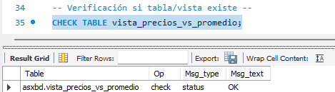

  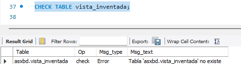

<!-- Salto de Página -->

<!---------------- PÁGINA 9 ---------------->

<h1>Seguridad Externa: Vistas</h1>

<h4 id="with">Claúsula WITH CHECK OPTION</h4>

Esta cláusula es muy útil porque impedirá que se inserten o modifiquen datos que no cumplan con el filtro (WHERE) de la propia vista.

  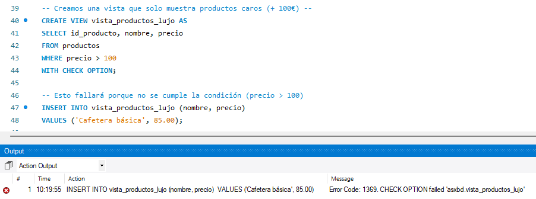

<h5>Opciones</h5>

Si utilizamos WITH CASCADED CHECK OPTION, se comprobarán las condiciones de todas las vistas que intervienen en la actual. También se podría escribir WITH CHECK OPTION, ya que CASCADED es la opción por defecto de esta claúsula.

  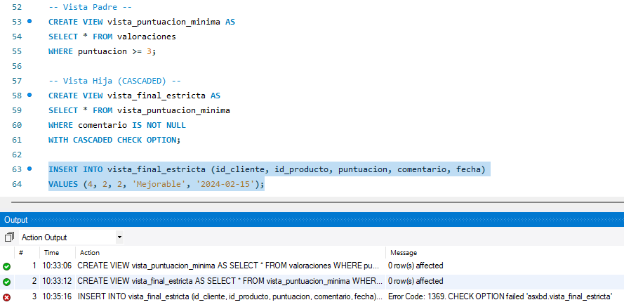

<!-- Salto de Página -->

<!---------------- PÁGINA 10 ---------------->

<h1>Seguridad Externa: Vistas</h1>

Si tan sólo se busca comprobar la condición en la vista actual sin acudir a sus "padres" o "abuelos", se utiliza WITH LOCAL CHECK OPTION.

  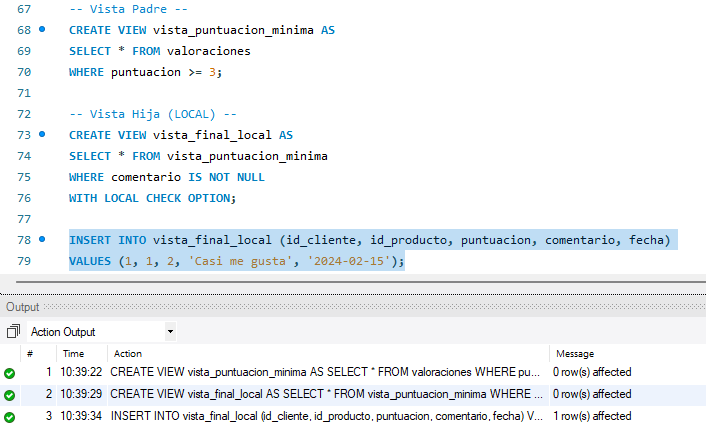

<!-- Salto de Página -->

<!---------------- PÁGINA 11 ---------------->

<h1>Seguridad Externa: Vistas</h1>

<h4 id="algorithm">Claúsula ALGORITHM</h4>

Esta claúsula afecta al algoritmo de procesamiento de las vistas.

<h5>Opciones</h5>

MERGE: es el valor predefinido de esta claúsula (podría obviarse). Este algoritmo es el más eficiente porque, en lugar de crear una tabla temporal, "fusiona" la definición de la vista directamente con la consulta lanzada, permitiendo que sea actualizable. Incluso con el motor de almacenamiento InnoDB, que es el más habitual, no es necesario indicar la claúsula ALGORITHM si lo que se quiere es optar por su valor MERCE.

  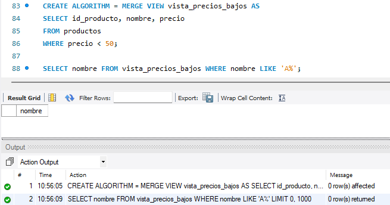

<!-- Salto de Página -->

<!---------------- PÁGINA 12 ---------------->

<h1>Seguridad Externa: Vistas</h1>

TEMPTABLE: este valor indica que se deben usar tabla temporales para la creación de la vista. Su uso es necesario cuando se aplican agrupaciones (GROUP BY y HAVING), funciones de agregado (SUM(), MIN(), COUNT(), AVG(),...) o cuando se quieren eliminar duplicados (DISTINCT).

  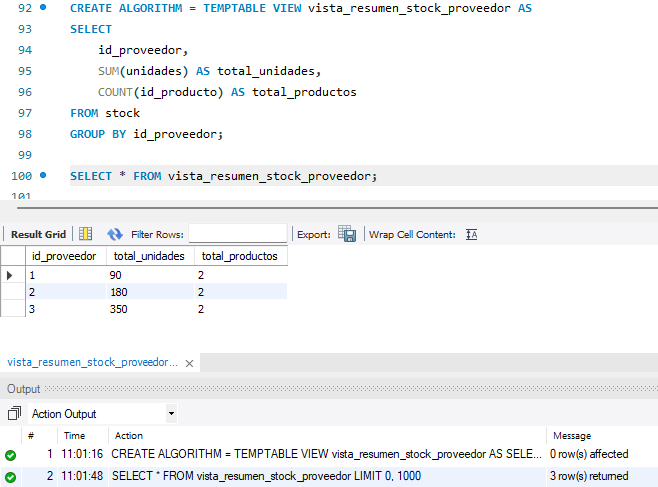

<!-- Salto de Página -->

<!---------------- PÁGINA 13 ---------------->

<h1>Seguridad Externa: Vistas</h1>

<h4 id="modificacion-borrado">Modificación y Borrado de Vistas</h4>

<h5>Modificación de Vistas</h5>

Sintaxis: ALTER VIEW nomVista [columnas_virtuales] AS sentencia_SELECT [WITH [CASCADE|LOCAL] CHECK OPTION]

  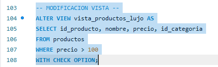

<h5>Borrado de Vistas</h5>

Sintaxis: DROP VIEW [IF EXISTS] nomVista

  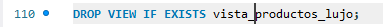

<h4 class="margen-superior-interior" id="esquema">Mostrar Esquema de Creación de una Vista</h4>

Sintaxis: SHOW CREATE VIEW nomVista

  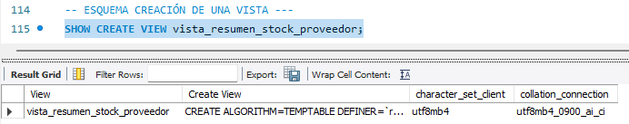

<!-- Salto de Página -->

<!---------------- PÁGINA 14 ---------------->

<h1>Seguridad Externa: Vistas</h1>

<h4 id="workbench">Creación de Vistas en MySQL Workbench</h4>

Para crear una vista de forma gráfica en MySQL Workbench, habrá que dirigirse al panel Schemas en la barra lateral izquierda, desplegar la base de datos deseada y hacer clic derecho sobre la sección Views para seleccionar la opción "Create View...". Se abrirá una nueva pestaña con un editor donde se podrá redactar la consulta SELECT que definirá la vista. Una vez escrita la consulta, al pulsar el botón "Apply" en la esquina inferior derecha, Workbench generará automáticamente el script SQL correspondiente.

  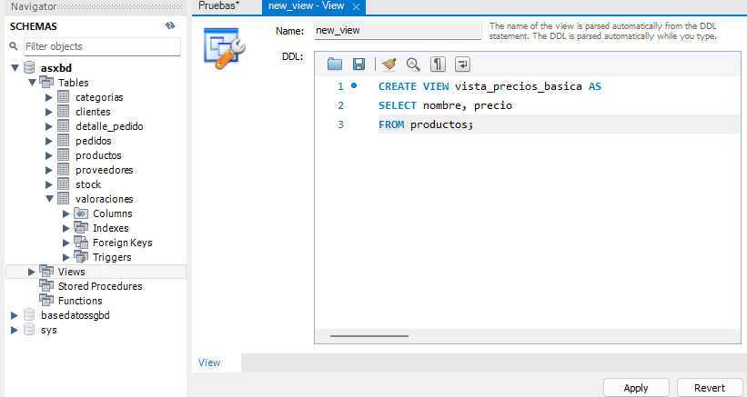

<!-- Salto de Página -->

<!---------------- PÁGINA 15 ---------------->

<h1>Seguridad Externa: Vistas</h1>

En el proceso de creación será necesario seleccionar el Algoritmo y el Tipo de Concurrencia, aunque los habitual es utilizar los valores por defecto ya que son los más modernos y eficientes.

Algorithm: se pueden seleccionar los valores Copy (operaciones sobre tabla temporal) o Inplace (reconstrucción de la tabla), siendo este último el utilizado por defecto.

Lock type (Concurrencia): se pueden elegir los valores Exclusive (bloqueo completo), Shared (bloque compartido - Sólo Lectura) o None (sin bloqueo - 100% concurrencia), que es la opción por defecto.

  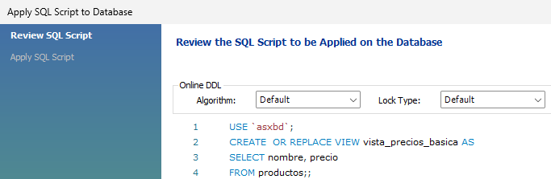

<h4 id="operaciones">Operaciones Autorizadas</h4>

<ol class="ol-sin-romanos">
  <li>Consultas: SELECT</li>
  <li>Inserciones: INSERT ... INTO ... VALUES</li>
  <li>Modificaciones: ALTER</li>
  <li>Borrados: DROP</li>
</ol>

<!-- Salto de Página -->

<!---------------- PÁGINA 16 ---------------->

<h1>Seguridad Externa: Vistas</h1>

<h4 id="semantica">Restricciones Semánticas y Sintácticas</h4>

<ol class="ol-sin-padding-sup-inf">
  <li>No se pueden actualizar/cargar datos en vistas que contengan agrupaciones (GROUP BY), funciones de agregado ni uniones (UNION). Estas vistas serán de Sólo Lectura y utilizan tablas temporales (algoritmo TEMPTABLE).</li>
  <li>No se pueden actualizar/cargar datos en vistas que contienen columnas que no están en la tabla "física". Es decir, no se podrían cargar datos en vistas que contienen columnas que están asociadas a operaciones aritméticas.</li>
  <li>No se pueden actualizar/cargar datos si no se conocen las columnas de la tabla física. Un vista puede filtrar sólo dos columnas y la tabla física contener muchas más.</li>
</ol>

<!-- Salto de Página -->

<!---------------- PÁGINA 17 ---------------->

<h1 id="sinonimos">Seguridad Externa: Sinónimos</h1>

Un sinónimo es un objeto de la Base de Datos, cuya función es proporcionar un nombre alternativo a otro objeto (local o remoto) para facilitar su localización. Además, proporciona una capa de protección al cliente antes posibles cambios que realicen en el nombre o ubicación del objeto base. Su utilidad queda demostrada cuando una tabla cambia de Base de Datos o cuando cambia de Servidor.

<h5>Ventajas para una Aplicación Cliente:</h5>

<ol class="ol-sin-romanos">
  <li>No requiere menciones complejas para acceder a objetos concretos</li>
  <li>No requiere modificaciones si hay cambios de ubicación</li>
</ol>

<h5>Creación de Sinónimos</h5>

En MySQL no existe ninguna sentencia para crear sinónimos, por lo que estos se deben generar con un procedimiento almacenado en la Base de Datos "sys" que se genera con la instalación del propio Servidor MySQL. Además, este tipo de sinómimos sólo pueden referirse a Bases de Datos.

Para utilizar este procedimiento es necesario utilizar la sentencia CALL (Llamada)

<ol class="ol-sin-romanos">
  <li>sys: Base de Datos que almacena el procedimiento</li>
  <li>create_synonym_db(): Procedimiento Almacenado</li>
  <li>INFORMATION_SCHEMA: Objeto que deseamos 'sinonimar'</li>
  <li>info: nombre del sinónimo que deseamos crear</li>
</ol>

  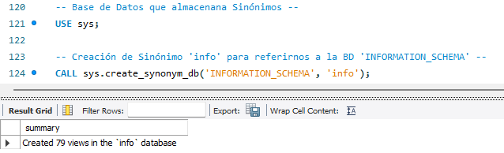

<!-- Salto de Página -->

<!---------------- PÁGINA 18 ---------------->

<h1>Seguridad Externa: Sinónimos</h1>

<h5>Ver Sinónimos Creados</h5>

Los sinónimos se pueden ver con si fueran una Base de Datos con la sentencia: SHOW DATABASES;

  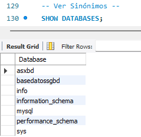

<h5>Ver Tablas de un Sinónimo</h5>

Para ver las tablas de un sinónimo, lo hacemos como si consultaramos la tabla de una Base de Datos: SHOW TABLES FROM bd;

  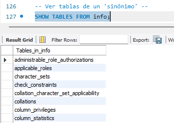

<!-- Salto de Página -->

<!---------------- PÁGINA 19 ---------------->

<h1>Seguridad Externa: Sinónimos</h1>

<h5>Ver Vista de un Sinónimo</h5>

Las vistas de un sinónimo se pueden ver con: SHOW FULL TABLES FROM nomSinonimo;

  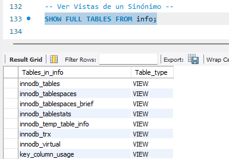

<!-- Salto de Página -->

<!---------------- PÁGINA 20 ---------------->

<h1 id="cifrado">Seguridad Externa: Técnicas de Cifrado</h1>

La encriptación protege los datos que viajan por Internet.

<h4>Variables que controlan el cifrado en MySQL</h4>

Controlan la encriptaión de los ficheros log de transacciones en TableSpace encriptados. Los valores que pueden tomar son booleanos (ON/OFF). De manera predeterminada vienen configurados en OFF por lo que será necesario activarlos para comenzar con la encriptación. La encriptación sólo afectará a los nuevos registros y segmentos a partir del cambio, y nunca a los anteriores.

<ol class="ol-sin-romanos">
  <li>innodb_redo_log_encrypt</li>
  <li>innodb_undo_log_encrypt</li>
  <li>binlog_encryption</li>
</ol>

<h4>Funciones relacionadas con la encriptación</h4>

<h5>Técnicas de Cifrado Simétrico (HASH)</h5>

<ol class="ol-sin-romanos">
  <li>SHA2('texto', longitud de la huella digital)</li>
  <li>AES_ENCRYPT('texto', 'clave'): la más recomendable</li>
</ol>

  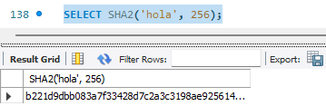

  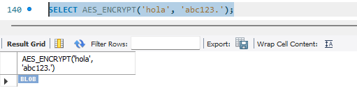

<!-- Salto de Página -->

<!---------------- PÁGINA 21 ---------------->

<h1>Seguridad Externa: Técnicas de Cifrado</h1>

<h5>Técnicas de Cifrado Asimétrico (Claves)</h5>

El proceso consistiría en crear una clave privada, posteriormente una clave pública a través de la clave privada, y para finalizar realizando la encriptación con la clave pública.

<ol class="ol-sin-romanos">
  <li>CREATE_ASYMETRIC_PRIV_KEY('método', longitud de la huella digital): Crea una Clave Privada</li>
  <li>CREATE_ASYMETRIC_PUB_KEY('método', mención a la clave privada): Crea una Clave Pública</li>
  <li>ASYMETRIC_ENCRYPT('método', 'texto', mención a clave pública): Encripta texto plano usando clave/privada</li>
</ol>

<!-- Salto de Página -->

<!---------------- PÁGINA 22 ---------------->

<h1 id="autorizaciones">Seguridad Externa: Autorizaciones</h1>

El administrador de la Base de Datos tiene que establecer una Política de Accesos que indique las cuentas de usuario que tendrán acceso a la Base de Datos y los elementos de la Base de Dstos a lo que tendrá acceso cada una de las cuentas de usuario.

<h5>Tipos de Permisos</h5>

<ol class="ol-sin-romanos">
  <li>Nivel de Base de Datos</li>
  <li>Nivel de Tabla</li>
  <li>Nivel de Columna</li>
</ol>

<h5>Ver Privilegios</h5>

Para ver los privilegios con los que cuenta el Servidor MySQL, ejecutamos la sentencia: SHOW PRIVILEGES;.

  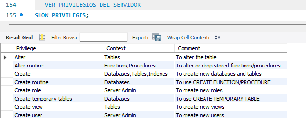

<!-- Salto de Página -->

<!---------------- PÁGINA 23 ---------------->

<h1>Seguridad Externa: Autorizaciones</h1>

<h4 id="bdmysql">Base de Datos mysql</h4>

Se crea de manera automática al instalar el Servidor MySQL y contiene las tablas que controlan el acceso al servidor.

<ol class="ol-sin-romanos">
  <li>user: información de las cuentas de usuario, equipos y contraseñas que pueden acceder al servidor. Contiene también los permisos gloables (se recomienda que estén desactivados)</li>
  <li>db: información de la bases de datos a las que pueden acceder los usuarios</li>
  <li>tables_priv: permisos de tablas concretas</li>
  <li>columns_priv: permisos de columnas concretas</li>
</ol>

  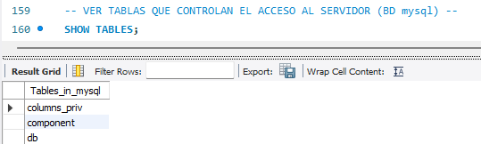

  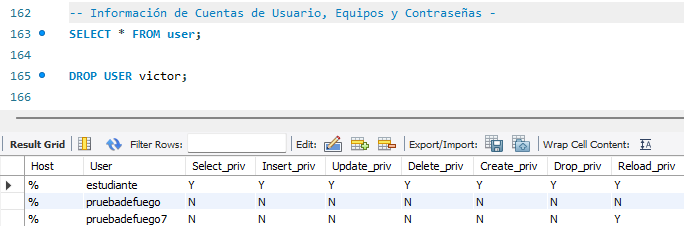

  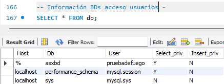

<!-- Salto de Página -->

<!---------------- PÁGINA 24 ---------------->

<h1>Seguridad Externa: Autorizaciones</h1>

<h5>Ver Columnas de la tabla mysql</h5>

Con la sentencia DESCRIBE user; se puede ver las columnas de la tabla mysql.

  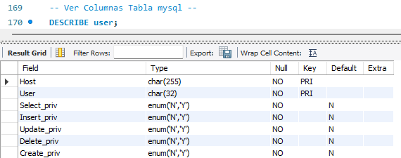

<!-- Salto de Página -->

<!---------------- PÁGINA 25 ---------------->

<h1>Seguridad Externa: Autorizaciones</h1>

<h4 id="usuario">Cuentas de Usuario</h4>

<h5>Creación de Cuentas de Usuario</h5>

Sintaxis: CREATE USER [IF NOT EXISTS] usuario [IDENTIFIED BY 'contraseña'] [WITH restriccion_recursos]

<h5>Eliminación de Cuentas de Usuario</h5>

Sintaxis: DROP USER [IF NOT EXISTS] usuario

  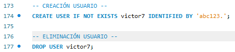

<h5>¿Qué debemos tener en cuenta?</h5>

<ol class="ol-sin-romanos">
  <li>Cuando se crea un usuario no se le añaden privilegios, por lo que sólo tendrá acceso al servidor</li>
  <li>Cuando se añade una contraseña, se recomiena que sea con un hash_string</li>
  <li>La claúsula WITH permite establecer restricciones como: MAX_USER_CONNECTIONS, MAX_QUERIES_PER_HOUR, ...</li>
</ol>

<h5>Modificación de Contraseñas</h5>

Sintaxis: ALTER USER 'usuario'@'host' IDENTIFIED BY 'nueva_contraseña'

Carga Privilegios en memoria: FLUSH PRIVILEGES;

  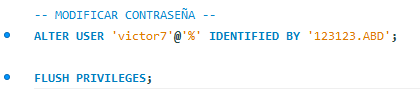

<!-- Salto de Página -->

<!---------------- PÁGINA 26 ---------------->

<h1>Seguridad Externa: Autorizaciones</h1>

<h5>Creación de Usuarios en MySQL Workbench</h5>

Para crear un usuario de forma gráfica en MySQL Workbench, será necesario dirigirse a la pestaña Administration del panel lateral izquierdo (Navigator) y seleccionar la opción Users and Privileges. Al hacer clic en el botón Add Account, se abrirá un formulario donde se podrá definir el nombre del usuario, el tipo de autenticación y la contraseña; posteriormente, en las pestañas superiores como Schema Privileges, se podrán asignar permisos específicos a bases de datos concretas simplemente seleccionando la base de datos y marcando los privilegios deseados (como SELECT o INSERT) antes de pulsar el botón Apply.

  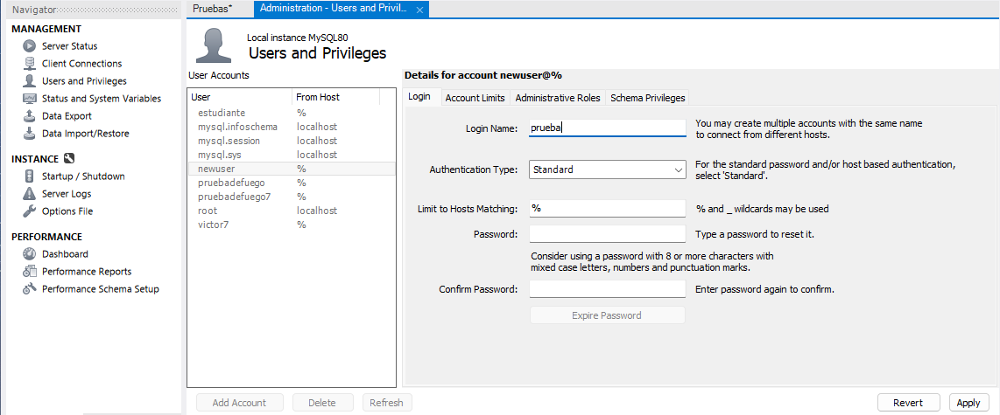

<!-- Salto de Página -->

<!---------------- PÁGINA 27 ---------------->

<h1>Seguridad Externa: Autorizaciones</h1>

<h4 id="privilegios">Sentencias para Mostrar Privilegios</h4>

<ol class="ol-sin-padding-sup-inf">
  <li>Información de un Usuario (host, contraseña y restricciones): SHOW CREATE USER usuario;</li>
  <li>Privilegios de un Usuarios: SHOW GRANTS usuario;</li>
  <li>Listado de Usuarios: SELECT user, host FROM mysql.user;</li>
  <li>Descripción de Privilegios: SHOW PRIVILEGES;</li>
</ol>

  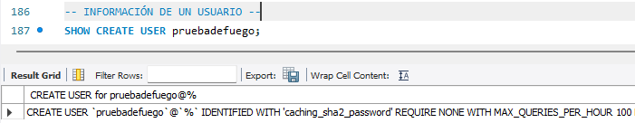
  
I

  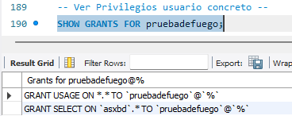
  
II

  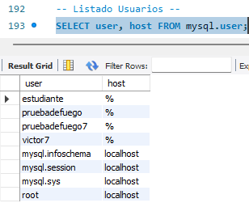
  
III

  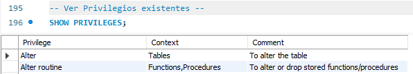
  
IV

<!-- Salto de Página -->

<!---------------- PÁGINA 28 ---------------->

<h1>Seguridad Externa: Autorizaciones</h1>

<h4 id="derechos-privilegios">Tipos de Privilegios</h4>

  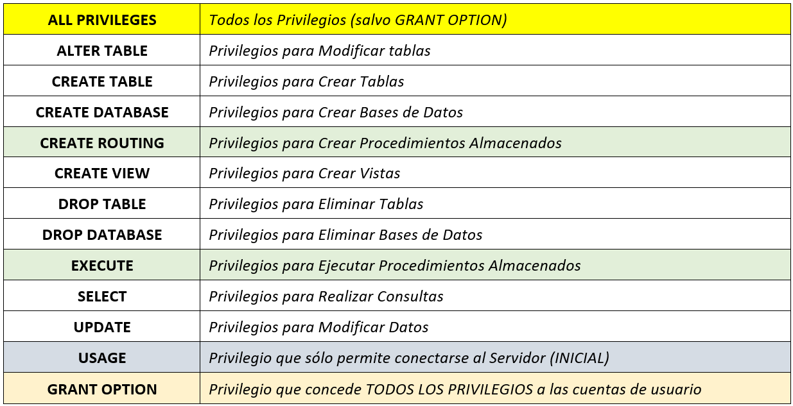

<h4 id="permisos">Asignación y Revocado de Permisos</h4>

<ol class="ol-sin-romanos">
  <li>Asignación de Permisos: GRANT privilegios ON objeto TO usuario;</li>
  <li>Asignación de Todos los Permisos: GRANT ALL PRIVILEGES ON objeto TO usuario;</li>
  <li>Revocación de Permisos: REVOKE privilegios ON objeto FROM usuario;</li>
  <li>Revocación de Todos los Permisos: GRANT ALL PRIVILEGES, GRANT OPTION FROM usuario;</li>
</ol>

  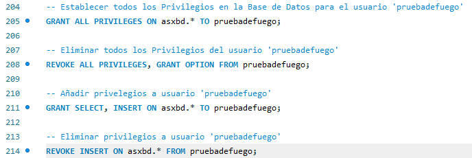

<!-- Salto de Página -->

<!---------------- PÁGINA 29 ---------------->

<h1>Seguridad Externa: Autorizaciones</h1>

<h5>Tipos de Objetos</h5>

  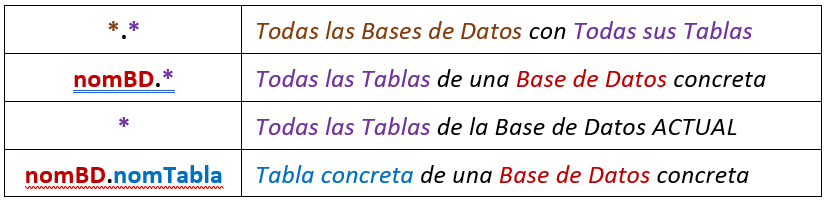

<h5>Recomendaciones</h5>

<ol class="ol-sin-romanos">
  <li>Por seguridad, NO se deben conceder privilegios de caracter global</li>
  <li>Se requiere especial atención al establecer privilegios en la Base de Datos mysql
    <ol>
      <li>ALTER: podría modificar tablas de privilegios</li>
      <li>DROP: podría eliminar todas las limitaciones existentes</li>
      <li>GRANT: podría concender privilegios a otros usuarios</li>
      <li>SHUTDOWN: podría provocar un apagado del Servidor</li>
    </ol>
  </li>
</ol>

<h4 id="limitaciones">Limitación de Recursos en Cuentas de Usuario</h4>

<h5>Creación de Cuenta</h5>

Sintaxis: CREATE USER 'usuario'@'host' WITH restricciones;

<h5>Modificación de Cuenta</h5>

Sintaxis: ALTER USER 'usuario'@'host' WITH restricciones;

<h5>Limitaciones más habituales</h5>

<ol class="ol-sin-romanos">
  <li>Máximo de Consultas por Hora: max_queries_per_hour</li>
  <li>Máximo de Cargas por Hora: max_updates_per_hour</li>
  <li>Máximo de Conexiones por Hora: max_connections_per_hour</li>
  <li>Máximo Conexiones Simultáneas: max_user_connections</li>
</ol>

  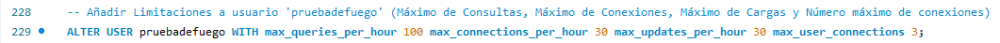

<!-- Salto de Página -->

<!---------------- PÁGINA 30 ---------------->

<h1>Seguridad Externa: Autorizaciones</h1>

<h4 id="roles">Roles</h4>

Un ROL en términos de los SGBD no es más que una colección de privilegios a los que se les asigna un nombre. Los roles se pueden asignar a cuentas de usuario para que cuenten con determinados privilegios.

<h5>Creación de un Rol</h5>

Sintaxis: CREATE ROL [IF NOT EXISTS] nomRol;

  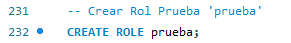

<h5>Agrupar Permisos en un Rol</h5>

Sintaxis: GRANT privilegios ON objeto TO nomRol;

  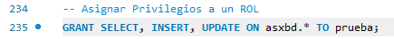

<h5>Ver Privilegios de un Rol</h5>

Sintaxis:  SHOW GRANTS FOR nomRol;

  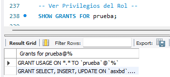

<h5>Eliminar Privilegios de un Rol</h5>

Sintaxis: REVOKE privilegios ON objeto FROM nomRol;

  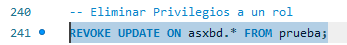

  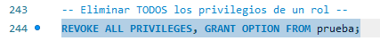

<!-- Salto de Página -->

<!---------------- PÁGINA 31 ---------------->

<h1>Seguridad Externa: Autorizaciones</h1>

<h5>Eliminar un Rol</h5>

Sintaxis: DROP ROL [IF EXISTS] nomRol;

  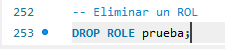

<h5>Asignar un Rol a una Cuenta de Usuario</h5>

Sintaxis: GRANT nomRol TO usuario;

  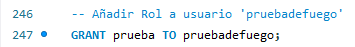

<h5>Establecer Roles por Defecto</h5>

Establecer un rol por defecto significa definir qué conjunto de privilegios se activarán automáticamente en el momento en que un usuario inicia sesión en el servidor. Por seguridad, MySQL asigna inicialmente el valor NONE por defecto; garantizando únicamente el acceso al Servidor.

Para establecer un rol por defecto será necesario el uso de la sentencia SET DEFAULT ROLE { NONE | ALL | 'nomRol' } TO usuario;

<ol class="ol-sin-romanos">
  <li>Privilegio Mínimo (Acceso): NONE</li>
  <li>Todos los Privilegios: ALL</li>
  <li>Nombre de un rol</li>
</ol>

  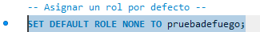

<!-- Salto de Página -->

<!---------------- PÁGINA 33 ---------------->

<h1>Seguridad Externa: Autorizaciones</h1>

<h4 id="autenticacion">Mecanismos de Autenticación de Cuentas de Usuario</h4>

Son los métodos utilizados por MySQL para cifrar contraseñas.

<h5>Opciones</h5>

<ol class="ol-sin-romanos">
  <li>Nativo (sin cifrar)</li>
  <li>sha256</li>
  <li>caching_sha2_password: recomendado</li>
</ol>

<h5>Modificar Método Autenticación de un Usuario</h5>

Sintaxis: ALTER USER 'usuario'@'host' IDENTIFIED WITH metodo_autenticacion BY 'contraseña';

  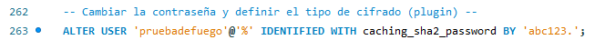

<h5>Consultar Método Autenticación Cuentas de Usuario</h5>

Sintaxis: SELECT USER user, plugin FROM mysql.user;

<ol class="ol-sin-romanos">
  <li>user: columna con nombre de usuario</li>
  <li>plugin: columna con método autenticación</li>
  <li>mysql: Base de Datos mysql (creada en la instalación del Servidor)</li>
  <li>user: Tabla de la Base de Datos mysql</li>
</ol>

  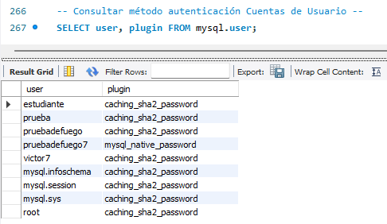

