<!---------------- PÁGINA 1 ---------------->

<!-- Título Principal (** Texto en Negrita **) -->
  <!-- Los Títulos Principales incorporan 
  una línea debajo que ocupa todo el ancho -->
# **2º ASIR - ASXBD**

<!-- Imagen del IES Lois Peña Novo -->

  

<!-- Subtítulo -->
## VÍCTOR ÁLVAREZ FERNÁNDEZ

<!-- Subapartados -->

  <h3 class="titulos-subapartados">Unidad:</h3>
    <h3 class="texto-subapartados">Unidad 4 - Automatización de Tareas</h3>
  <h3 class="titulos-subapartados">Práctica:</h3>
    <h3 class="texto-subapartados">P41-Automatizacion-Tareas</h3>
  <h3 class="titulos-subapartados">Fecha:</h3>
    <h3 class="texto-subapartados">18 de Febrero de 2026</h3>

<footer>
  <h6>Víctor Álvarez Fernández - ASXBD - 2º ASIR</h6>
</footer>

<!-- Salto de Página -->

<!---------------- PÁGINA 2 ---------------->

<!-- Contiene anclajes a los diferentes ejercicios (están en siguientes páginas) -->
# **Índice**

<ol class="indice">
  <li><a href="#herramientas">Herramientas para la Automatización</a></li>
  <li><a href="#rutinas">Rutinas: Funciones y Procedimientos</a>
    <ul>  
      <li><a href="#funciones">Funciones</a></li>
      <li><a href="#procedimientos">Procedimientos</a></li>
      <li><a href="#llamadas">Llamadas</a></li>
      <li><a href="#sentencias">Sentencias: SELECT y SELECT INTO</a></li>
      <li><a href="#otras">Otras Operaciones y Consultas</a></li>
      <li><a href="#parametros">Parámetros y Variables</a></li>
      <li><a href="#condicionales">Sentencias: Condicionales</a></li>
      <li><a href="#bucles">Sentencias: Bucles</a></li>
      <li><a href="#cursores">Cursores</a></li>
      <li><a href="#excepciones">Manejo de Excepciones</a></li>
    </ul>
  </li>
  <li><a href="#disparadores">Disparadores</a></li>
  <li><a href="#eventos">Eventos: Planificación de Tareas</a></li>
</ol>

<!-- Salto de Página -->

<!---------------- PÁGINA 3 ---------------->

<h1 id="herramientas">Herramientas para la Automatización</h1>

MySQL cuenta con dos posibles herramientas para la automatización de tareas, la primera de ellas cuenta con entorno gráfico y se llama MySQL Entreprise Monitor; la otra alternativa y la más recomendada porque implica tener un amplio conocimiento es basada en la programación a través de Procedimientos Almacenados.

Los Procedimientos Almacenados son secuencias de código que se almacenan del lado del Servidor y que aportan una serie de ventajas:

<ol class="ol-sin-romanos">
  <li>Permiten incluir de Instrucciones Compuestas (bucles, condicionales, ...)</li>
  <li>Reducen la sobrecarga de la red al estar almacenadas en el Servidor</li>
  <li>Permiten incluir cálculos complejos</li>
  <li>Permiten estandarizar operaciones de cálculo</li>
  <li>Proporcionan un mecanismo para procesar errores</li>
  <li>Cuentan con un control de acceso de datos sensibles mediante privilegios otorgados</li>
</ol>

<h4>Métodos de Ejecución</h4>

<ol class="ol-sin-romanos">
  <li>Funciones: devuelven el resultado de un cálculo y se usan en expresiones</li>
  <li>Procedimientos: se utilizan para realizar cálculos generales o generar conjuntos de resultados que se muestran al cliente</li>
  <li>Disparadores: se asocian a una tabla y se ejecutan cuando esta se modifica con los eventos INSERT, UPDATE y DELETE</li>
  <li>Eventos: se ejecutan en un momento concreto según su progración</li>
</ol>

<!-- Salto de Página -->

<!---------------- PÁGINA 4 ---------------->

<h1 id="rutinas">Rutinas: Funciones y Procedimientos</h1>

Conjunto de Comandos almacenados en el Servidor, que son llamados por los clientes.

<ol class="ol-sin-romanos">
  <li>Funciones: devuelven un sólo valor</li>
  <li>Procedimientos: pueden devolver varios valores o incluso ninguno</li>
</ol>

<h4 id="funciones">Funciones</h4>

Sintaxis: CREATE DEFINER = 'usuario'@'host' FUNCTION nomFuncion() SQL SECURITY {DEFINER | INVOKER} BEGIN sentencias; END

<h4 id="procedimientos">Procedimientos</h4>

Sintaxis: CREATE DEFINER = 'usuario'@'host' PROCEDURE nomProcedimiento() SQL SECURITY {DEFINER | INVOKER} BEGIN sentencias; END

<h5>Nivel de Seguridad</h5>

<ol class="ol-sin-romanos">
  <li>DEFINER: se ejecuta con los permisos del creador de la rutina</li>
  <li>INVOKER: se ejecuta con los permisos del cliente que lo invoca</li>
</ol>

Se recomienda que el usuario creador sea el administrador de la SGBD y que cuente con los permisos de Consultas (SELECT) y de Ejecución (EXECUTE) en todas las bases de datos y tablas del Servidor para mayor comodidad a la hora de crear las rutinas.

Si cuando se crea la rutina no se indica la claúsula SQL SECURITY, por defecto el valor de la misma será DEFINER.

Si en la rutina se utiliza el valor INVOKER, será necesario que el usuario que haga la llamada desde el lado del cliente cuente con permisos de Ejecución (EXECUTE) para poder ejecutarla.

<!-- Salto de Página -->

<!---------------- PÁGINA 5 ---------------->

<h1 id="rutinas">Rutinas: Funciones y Procedimientos</h1>

<h5>Uso de Delimitadores: DELIMITER</h5>

En MySQL, el carácter punto y coma (;) se utiliza por defecto para indicar el final de una sentencia. Sin embargo, al crear rutinas que contienen múltiples instrucciones en su interior, surge un conflicto: el servidor interpretaría el primer punto y coma interno como el final de toda la creación, dejando el código incompleto y generando un error de sintaxis. Para solucionar esto, se utiliza la instrucción DELIMITER $$. Esto le indica a MySQL que cambie temporalmente el símbolo de finalización por $$, permitiendo que todo el bloque de código se procese como una única unidad. Una vez definida la rutina, se emplea DELIMITER ; para restablecer el punto y coma como el delimitador estándar para las consultas habituales.

  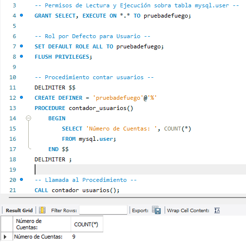

<h4 id="llamadas">Llamadas</h4>

<ol class="ol-sin-romanos">
  <li>Funciones: SELECT nomFuncion();</li>
  <li>Procedimientos: CALL nomProcedimiento();</li>
</ol>

<!-- Salto de Página -->

<!---------------- PÁGINA 6 ---------------->

<h1 id="rutinas">Rutinas: Funciones y Procedimientos</h1>

<h4 id="sentencias">Sentencias: SELECT y SELECT INTO</h4>

<h5>SELECT</h5>

<ol class="ol-sin-romanos">
  <li>Funciones: NO muestran el resultado en pantalla</li>
  <li>Procedimientos: Si muestran el resultado en pantalla</li>
</ol>

<h5>SELECT INTO</h5>

<ol class="ol-sin-romanos">
  <li>Funciones: almacena el resultado en una variable</li>
  <li>Procedimientos: almacena el resultado en una variable</li>
</ol>

  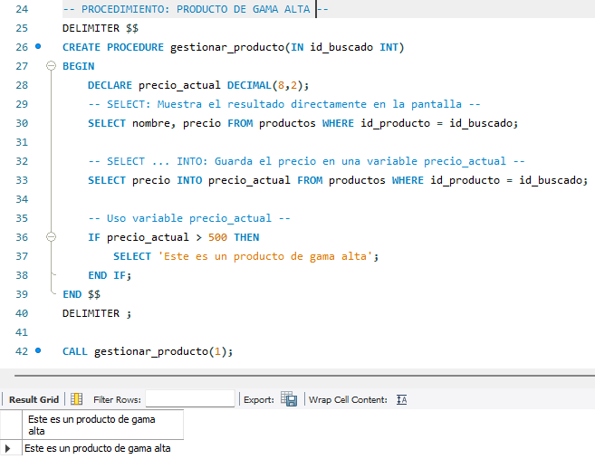

<!-- Salto de Página -->

<!---------------- PÁGINA 7 ---------------->

<h1 id="rutinas">Rutinas: Funciones y Procedimientos</h1>

<h4 id="otras">Otras Operaciones y Consultas</h4>

<h5>Eliminar una Rutina</h5>

Sintaxis: DROP {FUNCTION | PROCEDURE} [IF EXISTS] {nomFuncion | nomProcedimiento};

  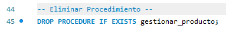

<h5>Consultar Rutinas Creada</h5>

Sintaxis: SHOW CREATE {FUNCTION | PROCEDURE} {nomFuncion | nomProcedimiento};

  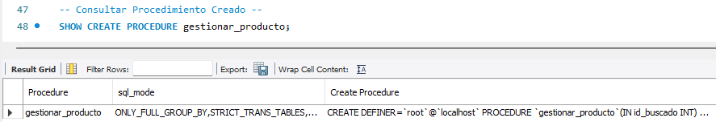

<h5>Consultar Estado de Todos los Procedimientos</h5>

Sintaxis: SHOW PROCEDURE STATUS;

  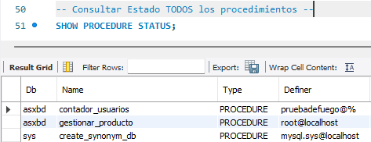

<!-- Salto de Página -->

<!---------------- PÁGINA 8 ---------------->

<h1 id="rutinas">Rutinas: Funciones y Procedimientos</h1>

<h5>Consultar Estado de un Procedimiento según un patrón</h5>

Sintaxis: SHOW PROCEDURE STATUS LIKE '';

  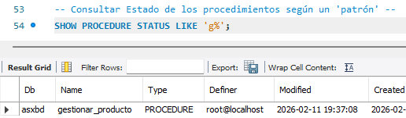

<h4 id="parámetros">Parámetros y Variables</h4>

<h5>Declaración de Variables: DECLARE</h5>

Crea una variable con el nombre y el tipo de dato indicado. Los datos pueden ser de tipo valor (INT, FLOAT, DECIMAL,... ) de tipo fecha (DATE, TIME, YEAR,... ) o de tipo cadena (CHAR, VARCHAR, TEXT, ...).

Sintaxis: DECLARE nomVariable tipo_dato;

Una variable se puede declarar con un valor por defecto (inicial o de arranque) que puede tener un valor concreto o uno nulo:

<ol class="ol-sin-padding-sup-inf">
  <li>Valor Concreto: DECLARE a INT DEFAULT 5;</li>
  <li>Valor NULL: DECLARE a INT DEFAULT;</li>
</ol>

<h5>Declaración de Variables: SET</h5>

Crea una variable utilizando el operador =.

Sintaxis: SET nomVariable = valorNumerico;

<!-- Salto de Página -->

<!---------------- PÁGINA 9 ---------------->

<h1 id="rutinas">Rutinas: Funciones y Procedimientos</h1>

<h5 id="parametros">Parámetros</h5>

Permiten pasar datos a las rutinas, e incluso devolverlos en el caso concreto de los procedimientos. Estos son los tipos de parámetros que se pueden utilizar:

<ol class="ol-sin-romanos">
  <li>IN: Parámetros de Entrada (por defecto)</li>
  <li>OUT: Parámetros de Salida (sólo en los Procedimientos). El procedimiento puede asignar valores a estos parámetros que son devueltos cuando se realiza una llamada.</li>
  <li>INOUT: Parámetros de Entrada/Salida (sólo en los Procedimientos). Permiten pasar valores, que podrán ser modificados.</li>
</ol>

Alcance de las Variables: no se puede ver el valor de una variable fuera del procedimiento salvo que el parámetro sea de tipo OUT o la variable sea de tipo sesión (@).

  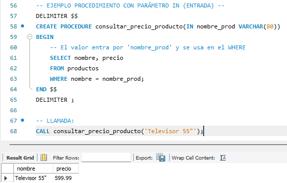

<!-- Salto de Página -->

<!---------------- PÁGINA 10 ---------------->

<h1 id="rutinas">Rutinas: Funciones y Procedimientos</h1>

  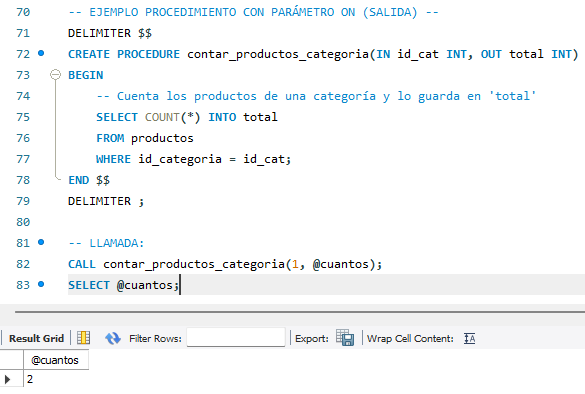

  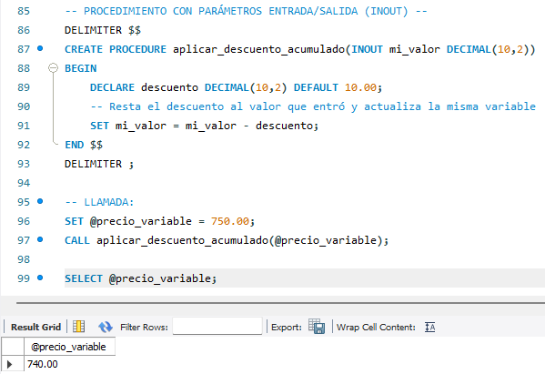

<!-- Salto de Página -->

<!---------------- PÁGINA 11 ---------------->

<h1 id="rutinas">Rutinas: Funciones y Procedimientos</h1>

<h4 id="condicionales">Condicionales</h4>

<h5>Condicional Simple: IF</h5>

Tiene solamente una condición.

  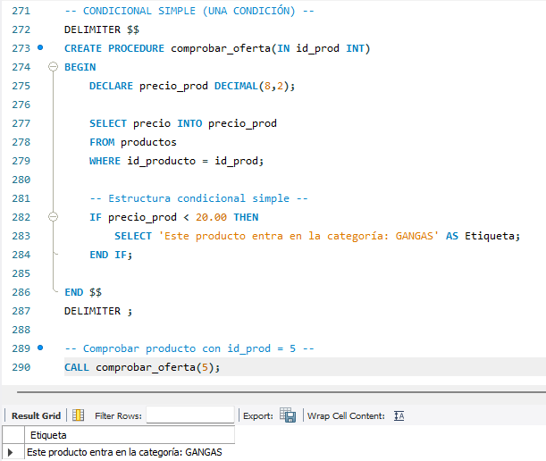

<!-- Salto de Página -->

<!---------------- PÁGINA 12 ---------------->

<h1 id="rutinas">Rutinas: Funciones y Procedimientos</h1>

<h5>Condicional Múltiple: IF - ELSEIF - ELSE</h5>

Puede tener varias condiciones. No se recomienda su uso con más de tres condiciones.

  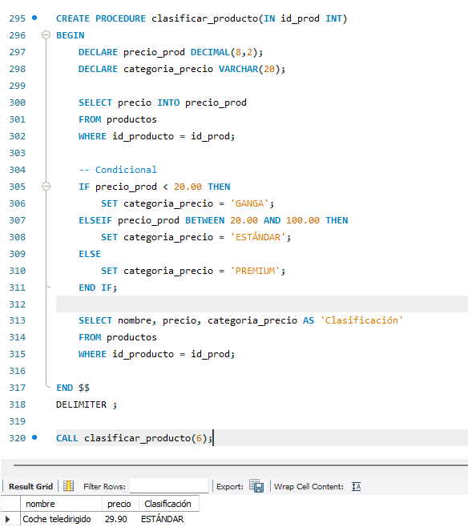

<!-- Salto de Página -->

<!---------------- PÁGINA 13 ---------------->

<h1 id="rutinas">Rutinas: Funciones y Procedimientos</h1>

<h5>Condicional Múltiple: CASE</h5>

Puede tener varias condiciones. Se recomienda su uso a partir de una cuarta condición.

  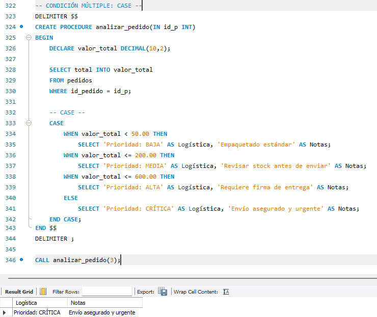

<!-- Salto de Página -->

<!---------------- PÁGINA 14 ---------------->

<h1 id="rutinas">Rutinas: Funciones y Procedimientos</h1>

<h4 id="bucles">Bucles</h4>

<h5>Bucle Simple: LOOP</h5>

El bucle se repite hasta que se ejecute la sentencia LEAVE.

  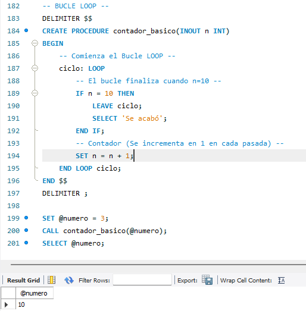

<!-- Salto de Página -->

<!---------------- PÁGINA 15 ---------------->

<h1 id="rutinas">Rutinas: Funciones y Procedimientos</h1>

<h5>Bucle con Condición: REPEAT - UNTIL</h5>

El bucle se repite hasta que se cumpla una condición.

  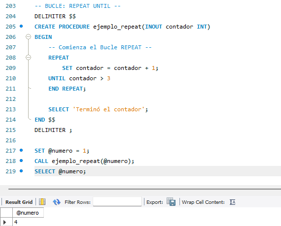

<!-- Salto de Página -->

<!---------------- PÁGINA 16 ---------------->

<h1 id="rutinas">Rutinas: Funciones y Procedimientos</h1>

<h5>Bucle con Condición: WHILE</h5>

El bucle se repite mientras se cumple una condición.

  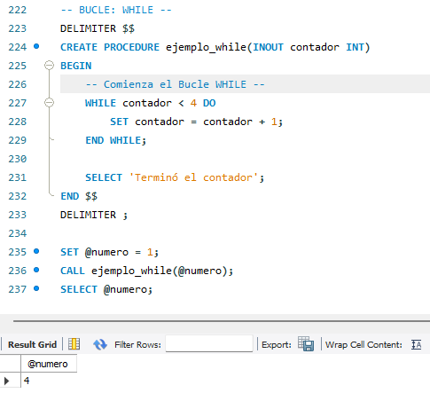

<!-- Salto de Página -->

<!---------------- PÁGINA 17 ---------------->

<h1 id="rutinas">Rutinas: Funciones y Procedimientos</h1>

<h4 id="cursores">Cursores</h4>

Los cursores son herramientas que permiten recorrer una tabla, fila por fila para extraer un resultado con una consulta (SELECT).

Sintaxis: DECLARE nomCursor CURSOR FOR sentencia_SELECT;

La declaración de los cursores se debe realizar tras la declaración de todas las variables que llevará la rutina.

<h5>Manipulación de Cursores</h5>

<ol class="ol-sin-romanos">
  <li>OPEN: Inicializa el conjunto de resultados asociados al cursor. OPEN nomCursor;</li>
  <li>FETCH: Extrae contenido de las filas (una o varias columnas). OPEN nomCursor INTO variable (columna);</li>
  <li>OPEN: Cierra el cursor. CLOSE nomCursor;</li>
</ol>

  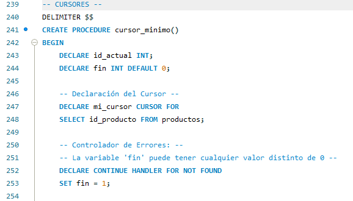

<!-- Salto de Página -->

<!---------------- PÁGINA 18 ---------------->

<h1 id="rutinas">Rutinas: Funciones y Procedimientos</h1>

  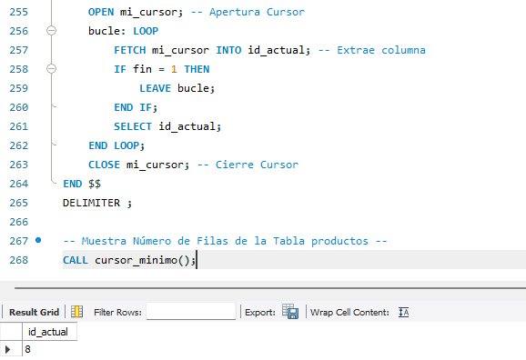

<!-- Salto de Página -->

<!---------------- PÁGINA 19 ---------------->

<h1 id="rutinas">Rutinas: Funciones y Procedimientos</h1>

<h4 id="excepciones">Manejo de Excepciones</h4>

Las excepciones permiten manejar situaciones NO deseadas que pueden producirse durante la ejecución de una rutina. Para ello, se utiliza la instrucción HANDLER. Esta instrucción se encarga de indicar a MySQL que hacer en caso de que se produzca un error.

Sintaxis: DECLARE tipo_actuacion HANDLER FOR condición acciones;

<h5>Tipos de Actuación</h5>

<ol class="ol-sin-romanos">
  <li>CONTINUE: se ejecuta el "plan B" y el procedimiento continua su curso</li>
  <li>EXIT: se ejecuta el "plan B" y el procedimiento finaliza inmediatamente</li>
</ol>

<h5>Condición</h5>

<ol class="ol-sin-romanos">
  <li>Código de Error de MySQL: código de MySQL que indica el tipo de error (Ej: 1062)</li>
  <li>SQLSTATE 'código': códigos de estado de MySQL que tienen un significado concreto. También, podemos encontrar dentro de esta gama los SQLEXCEPTION y SQLWARNING, siendo ambos muy habituales</li>
  <li>NOT FOUND: es la condición utilizada para indicar que el cursor llega al final y se desea volver al inicio</li>
</ol>

<!-- Salto de Página -->

<!---------------- PÁGINA 20 ---------------->

<h1 id="rutinas">Rutinas: Funciones y Procedimientos</h1>

<h5>Ejemplo Excepción con CONTINUE</h5>

  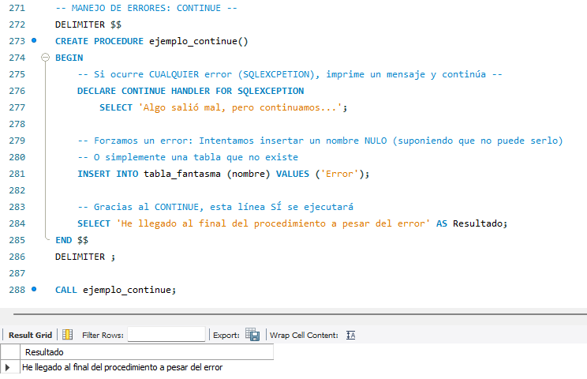

<!-- Salto de Página -->

<!---------------- PÁGINA 21 ---------------->

<h1 id="rutinas">Rutinas: Funciones y Procedimientos</h1>

<h5>Ejemplo Excepción con EXIT</h5>

  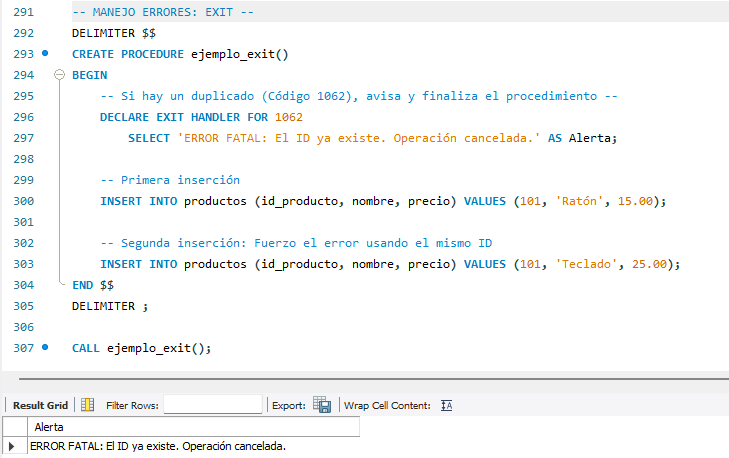

<!-- Salto de Página -->

<!---------------- PÁGINA 22 ---------------->

<h1 id="disparadores">Disparadores</h1>

Tipo especial de rutina almacenada que se activa cuando ocurre un evento de tipo INSERT, UPDATE o DELETE. Los disparadores (triggers) se almacenan en la Base de Datos en la que se definen.

<h4>Momento en el que actúa un Disparador</h4>

<ol class="ol-sin-romanos">
  <li>BEFORE (antes): es ideal para corregir datos antes de guardarlos</li>
  <li>AFTER (después): es muy útil para actualizar otras tablas o dejar un registro de incidencias</li>
</ol>

<h4>Eventos de un Disparador</h4>

<ol class="ol-sin-romanos">
  <li>INSERT: se utiliza para insertar datos en una tabla. Cuando se utiliza en un disparador permite el uso del calificador NEW para referirse a los nuevos datos a insertar en una columna.</li>
  <li>UPDATE: se utiliza para actualizar datos en una tabla. Cuando se utiliza en un disparador permiten el uso de los calificadores NEW para referirse a los posibles nuevos datos, y OLD para referirse a los datos actuales de la tabla.</li>
  <li>DELETE: se utiliza para eliminar datos de una tabla. Cuando se utiliza en un disparador permite el uso del calificador OLD para referirse a los datos actuales de la tabla.</li>
</ol>

Sintaxis: CREATE TRIGGER nomDisparador {BEFORE | AFTER} {INSERT | UPDATE | DELETE} ON nomTabla FOR EACH ROW  sentencia;

<!-- Salto de Página -->

<!---------------- PÁGINA 23 ---------------->

<h1 id="disparadores">Disparadores</h1>

<h5>Ejemplo de Disparador AFTER - UPDATE</h5>

  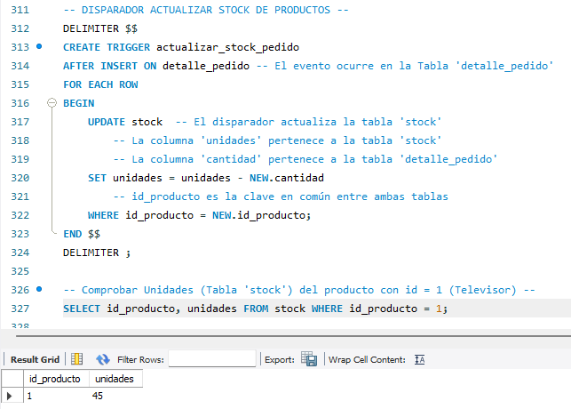

  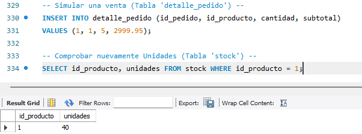

<!-- Salto de Página -->

<!---------------- PÁGINA 24 ---------------->

<h1 id="disparadores">Disparadores</h1>

<h5>Ejemplo de Disparador BEFORE - INSERT</h5>

  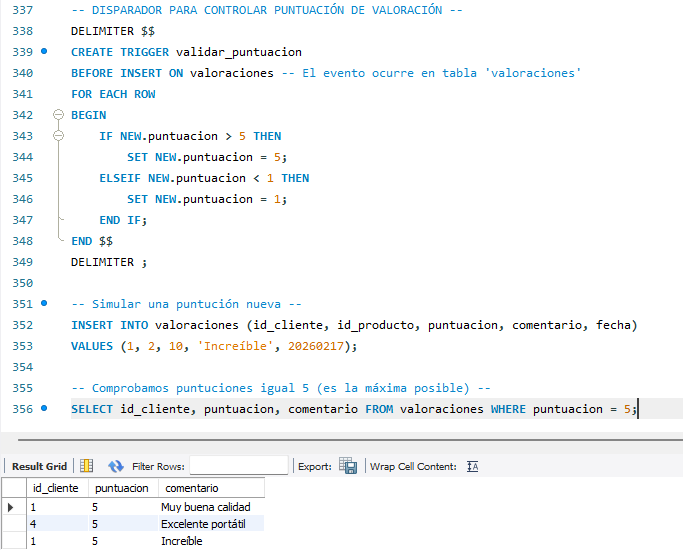

<!-- Salto de Página -->

<!---------------- PÁGINA 25 ---------------->

<h1 id="disparadores">Disparadores</h1>

<h5>Ejemplo de Disparador BEFORE - UPDATE (OLD - NEW)</h5>

  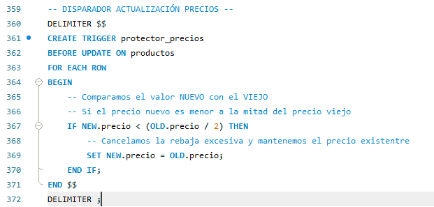

<!-- Salto de Página -->

<!---------------- PÁGINA 26 ---------------->

<h1 id="disparadores">Disparadores</h1>

<h5>Ejemplo de Disparador AFTER - DELETE</h5>

  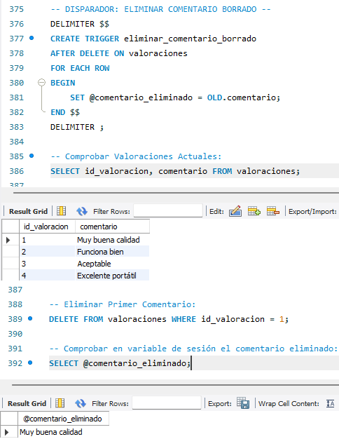

<!-- Salto de Página -->

<!---------------- PÁGINA 27 ---------------->

<h1 id="disparadores">Disparadores</h1>

<h5>Consultas Disparadores</h5>

Sintaxis: SHOW TRIGGERS;

  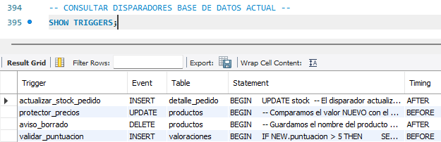

<h5>Eliminar Disparador</h5>

Sintaxis: DROP TRIGGER nomDisparador;

  

<!-- Salto de Página -->

<!---------------- PÁGINA 28 ---------------->

<h1 id="eventos">Eventos: Planificación de Tareas</h1>

Los eventos son tareas programadas que se ejecutan en un momento dado.

<h4>Comprobar Encendido del Planificador</h4>

Sintaxis: SHOW PROCESSLIST;

  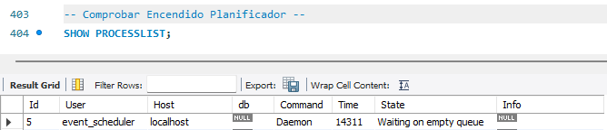

<h5>Activar / Desactivar el Planificador</h5>

El planificador se puede activar o desactivar de la misma manera que se activa una variable global de tipo booleana.

<ol class="ol-sin-romanos">
  <li>Encendido: SET GLOBAL event_scheduler = ON;</li>
  <li>Apagado: SET GLOBAL event_scheduler = OFF;</li>
</ol>

<h4>Crear un Evento de Planificación</h4>

Sintaxis: CREATE EVENT nomEvento ON SCHEDULE {AT | EVERY} DO sentencias;

<h4>Tipos de Planificación</h4>

<ol class="ol-sin-romanos">
  <li>AT: se ejecuta en una fecha y hora concreta</li>
  <li>EVERY: se ejecuta periódicamente (cada hora, día, semana, mes, ...)</li>
</ol>

<h5>Evento con Ejecución Concreta: AT</h5>

  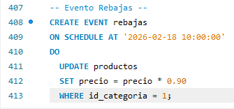

<!-- Salto de Página -->

<!---------------- PÁGINA 29 ---------------->

<h1 id="eventos">Eventos: Planificación de Tareas</h1>

<h5>Evento con Ejecución Periódica: EVERY</h5>

  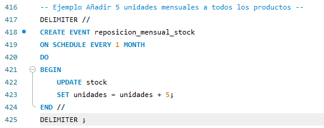

<h4>Ver todos los Eventos</h4>

Sintaxis: SHOW EVENTS;

  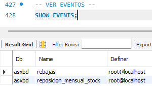

<h4>Modificar un Evento</h4>

Sintaxis: ALTER EVENT nomEvento ON SCHEDULE EVERY 2 MONTH;

  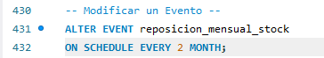

<h4>Eliminar un Evento</h4>

Sintaxis: DROP EVENT nomEvento;

  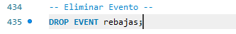

<!-- Salto de Página -->

<!---------------- PÁGINA 30 ---------------->

<h1 id="eventos">Eventos: Planificación de Tareas</h1>

<h4>Claúsulas</h4>

Cuando se crea un evento se pueden utilizar una serie de claúsulas que nos permitan establecer una fecha y/o hora de inicio (STARTS), una fecha y/o hora de fin (ENDS), e incluso una claúsula para almacenar el evento aunque este haya expirado (ON COMPLETION PRESERVE)

  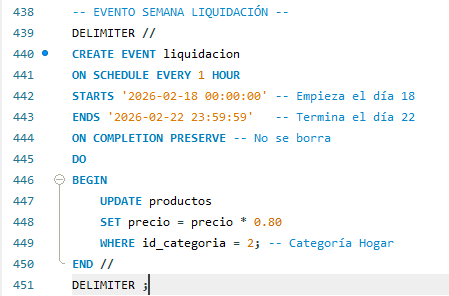

<h4>Desactivar o Activar Eventos (Tareas)</h4>

En un momento dado, se puede optar por desactivar o activar un evento (tarea) por una determinada situación.

Sintaxis Desactivar: ALTER EVENT nomEvento DISABLE;

Sintaxis Activar: ALTER EVENT nomEvento ENABLE;

  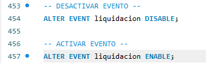

